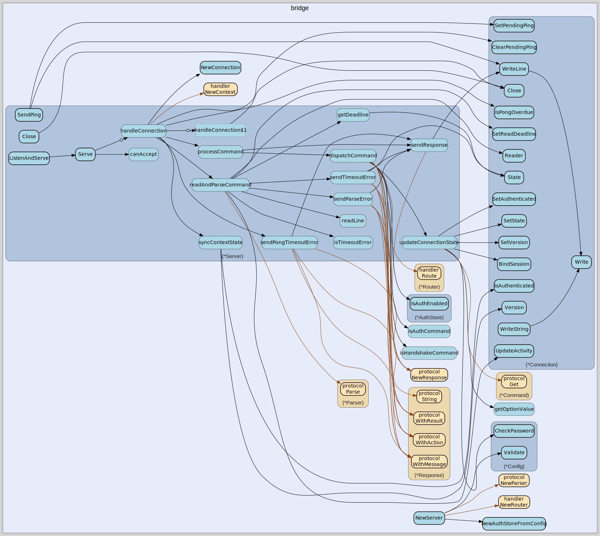

# bridge
--
    import "github.com/go-i2p/go-sam-bridge/lib/bridge"



Package bridge implements the SAM bridge server per SAMv3.md specification. The
bridge accepts TCP connections from SAM clients and processes SAM protocol
commands, dispatching them to appropriate handlers.

## Usage

```go
const (
	// DefaultListenAddr is the default SAM bridge TCP listen address.
	// Per SAM spec, the standard SAM port is 7656.
	DefaultListenAddr = ":7656"

	// DefaultI2CPAddr is the default I2CP router address.
	// Per I2CP spec, the standard I2CP port is 7654.
	DefaultI2CPAddr = "127.0.0.1:7654"

	// DefaultDatagramPort is the default UDP port for datagram forwarding.
	// Per SAM spec, the standard datagram port is 7655.
	DefaultDatagramPort = 7655

	// DefaultHandshakeTimeout is the maximum time allowed for HELLO handshake.
	// Per SAM 3.2, servers may implement timeouts for HELLO.
	DefaultHandshakeTimeout = 30 * time.Second

	// DefaultCommandTimeout is the maximum time allowed between commands.
	// Per SAM 3.2, servers may implement timeouts for subsequent commands.
	DefaultCommandTimeout = 60 * time.Second

	// DefaultPongTimeout is the maximum time to wait for PONG after PING.
	// Per SAM 3.2, PING/PONG is used for keepalive.
	DefaultPongTimeout = 30 * time.Second

	// DefaultReadBufferSize is the default buffer size for reading commands.
	DefaultReadBufferSize = 8192

	// DefaultMaxLineLength is the maximum allowed command line length.
	// This prevents memory exhaustion from malicious clients.
	DefaultMaxLineLength = 65536
)
```
Default configuration values per SAMv3.md specification.

```go
var ErrEmptyUsername = errors.New("username cannot be empty")
```
ErrEmptyUsername is returned when attempting to add a user with an empty
username.

```go
var ErrUserNotFound = errors.New("user not found")
```
ErrUserNotFound is returned when attempting to remove a non-existent user.

#### func  ReadLine

```go
func ReadLine(reader *bufio.Reader, maxLen int) (string, error)
```
ReadLine reads a command line from a buffered reader. This is exported for
testing and custom connection handling.

#### type AuthConfig

```go
type AuthConfig struct {
	// Required indicates if authentication is required for all connections.
	// When true, clients must provide USER/PASSWORD in HELLO.
	Required bool

	// Users maps usernames to passwords for authentication.
	// Empty map with Required=false disables authentication.
	Users map[string]string
}
```

AuthConfig holds authentication settings per SAM 3.2.

#### type AuthStore

```go
type AuthStore struct {
}
```

AuthStore provides thread-safe authentication management. It implements the
handler.AuthManager interface to allow AUTH commands to modify authentication
configuration at runtime.

Per SAM 3.2, AUTH commands allow runtime configuration of authentication on
subsequent connections. This store manages the credential database and auth
requirement flag.

#### func  NewAuthStore

```go
func NewAuthStore() *AuthStore
```
NewAuthStore creates a new authentication store. By default, authentication is
disabled and no users are configured.

#### func  NewAuthStoreFromConfig

```go
func NewAuthStoreFromConfig(cfg AuthConfig) *AuthStore
```
NewAuthStoreFromConfig creates an AuthStore initialized from an AuthConfig. This
allows the bridge server to use existing configuration.

#### func (*AuthStore) AddUser

```go
func (s *AuthStore) AddUser(username, password string) error
```
AddUser adds or updates a user with the given password. Returns ErrEmptyUsername
if the username is empty. Implements handler.AuthManager interface.

#### func (*AuthStore) CheckPassword

```go
func (s *AuthStore) CheckPassword(username, password string) bool
```
CheckPassword verifies the password for a user. Returns true if the user exists
and the password matches. This method is used by the HELLO handler for
authentication.

#### func (*AuthStore) HasUser

```go
func (s *AuthStore) HasUser(username string) bool
```
HasUser returns true if the username exists. Implements handler.AuthManager
interface.

#### func (*AuthStore) IsAuthEnabled

```go
func (s *AuthStore) IsAuthEnabled() bool
```
IsAuthEnabled returns true if authentication is currently required. Implements
handler.AuthManager interface.

#### func (*AuthStore) RemoveUser

```go
func (s *AuthStore) RemoveUser(username string) error
```
RemoveUser removes a user from the authentication store. Returns ErrUserNotFound
if the user does not exist. Implements handler.AuthManager interface.

#### func (*AuthStore) SetAuthEnabled

```go
func (s *AuthStore) SetAuthEnabled(enabled bool)
```
SetAuthEnabled enables or disables authentication requirement. When enabled,
subsequent connections must provide USER/PASSWORD in HELLO. Implements
handler.AuthManager interface.

#### func (*AuthStore) ToConfig

```go
func (s *AuthStore) ToConfig() AuthConfig
```
ToConfig exports the current authentication state as an AuthConfig. This can be
used for persistence or configuration snapshot.

#### func (*AuthStore) UserCount

```go
func (s *AuthStore) UserCount() int
```
UserCount returns the number of registered users.

#### type Config

```go
type Config struct {
	// ListenAddr is the TCP address to listen on (e.g., ":7656", "127.0.0.1:7656").
	ListenAddr string

	// I2CPAddr is the I2CP router address for tunnel management.
	I2CPAddr string

	// DatagramPort is the UDP port for datagram forwarding (0 to disable).
	DatagramPort int

	// TLSConfig enables TLS on the control socket if non-nil.
	// Per SAM 3.2, optional SSL/TLS support may be offered.
	TLSConfig *tls.Config

	// Auth holds authentication configuration.
	// Per SAM 3.2, optional authorization with USER/PASSWORD is supported.
	Auth AuthConfig

	// Timeouts holds connection timeout settings.
	Timeouts TimeoutConfig

	// Limits holds connection limits and buffer sizes.
	Limits LimitConfig
}
```

Config holds the SAM bridge server configuration. All fields have sensible
defaults that can be overridden.

#### func  DefaultConfig

```go
func DefaultConfig() *Config
```
DefaultConfig returns a Config with default values per SAMv3.md.

#### func (*Config) AddUser

```go
func (c *Config) AddUser(username, password string)
```
AddUser adds a user to the authentication configuration. This modifies the
config in place.

#### func (*Config) CheckPassword

```go
func (c *Config) CheckPassword(username, password string) bool
```
CheckPassword verifies the password for a user. Returns true if the user exists
and the password matches.

#### func (*Config) HasUser

```go
func (c *Config) HasUser(username string) bool
```
HasUser checks if a user exists in the authentication configuration.

#### func (*Config) RemoveUser

```go
func (c *Config) RemoveUser(username string)
```
RemoveUser removes a user from the authentication configuration. This modifies
the config in place.

#### func (*Config) Validate

```go
func (c *Config) Validate() error
```
Validate checks the configuration for errors and returns an error if invalid.

#### func (*Config) WithAuth

```go
func (c *Config) WithAuth(required bool, users map[string]string) *Config
```
WithAuth returns a copy of the config with authentication configured.

#### func (*Config) WithI2CPAddr

```go
func (c *Config) WithI2CPAddr(addr string) *Config
```
WithI2CPAddr returns a copy of the config with the I2CP address set.

#### func (*Config) WithListenAddr

```go
func (c *Config) WithListenAddr(addr string) *Config
```
WithListenAddr returns a copy of the config with the listen address set.

#### func (*Config) WithTLS

```go
func (c *Config) WithTLS(tlsConfig *tls.Config) *Config
```
WithTLS returns a copy of the config with TLS enabled.

#### type ConfigError

```go
type ConfigError struct {
	Field   string
	Message string
}
```

ConfigError represents a configuration validation error.

#### func (*ConfigError) Error

```go
func (e *ConfigError) Error() string
```
Error implements the error interface.

#### type Connection

```go
type Connection struct {
}
```

Connection represents a single SAM client connection. It manages connection
state, authentication, and the bound session. All fields are protected by a
mutex for concurrent access.

#### func  NewConnection

```go
func NewConnection(conn net.Conn, bufferSize int) *Connection
```
NewConnection creates a new Connection for the given net.Conn.

#### func (*Connection) Age

```go
func (c *Connection) Age() time.Duration
```
Age returns how long the connection has been open.

#### func (*Connection) BindSession

```go
func (c *Connection) BindSession(sessionID string)
```
BindSession binds a session to this connection.

#### func (*Connection) ClearPendingPing

```go
func (c *Connection) ClearPendingPing()
```
ClearPendingPing clears any pending PING after PONG is received.

#### func (*Connection) Close

```go
func (c *Connection) Close() error
```
Close closes the underlying connection and updates state.

#### func (*Connection) Conn

```go
func (c *Connection) Conn() net.Conn
```
Conn returns the underlying net.Conn.

#### func (*Connection) CreatedAt

```go
func (c *Connection) CreatedAt() time.Time
```
CreatedAt returns when the connection was established.

#### func (*Connection) GetPendingPing

```go
func (c *Connection) GetPendingPing() *PendingPing
```
GetPendingPing returns the pending PING if one is outstanding. Returns nil if no
PING is pending.

#### func (*Connection) IdleDuration

```go
func (c *Connection) IdleDuration() time.Duration
```
IdleDuration returns how long the connection has been idle.

#### func (*Connection) IsAuthenticated

```go
func (c *Connection) IsAuthenticated() bool
```
IsAuthenticated returns true if the client has authenticated.

#### func (*Connection) IsClosed

```go
func (c *Connection) IsClosed() bool
```
IsClosed returns true if the connection is closed.

#### func (*Connection) IsPongOverdue

```go
func (c *Connection) IsPongOverdue(timeout time.Duration) bool
```
IsPongOverdue returns true if a PING is pending and the timeout has elapsed.
timeout should be the configured PongTimeout duration.

#### func (*Connection) LastActivity

```go
func (c *Connection) LastActivity() time.Time
```
LastActivity returns the time of the last activity.

#### func (*Connection) Reader

```go
func (c *Connection) Reader() *bufio.Reader
```
Reader returns the buffered reader.

#### func (*Connection) RemoteAddr

```go
func (c *Connection) RemoteAddr() string
```
RemoteAddr returns the client's remote address.

#### func (*Connection) SessionID

```go
func (c *Connection) SessionID() string
```
SessionID returns the bound session ID.

#### func (*Connection) SetAuthenticated

```go
func (c *Connection) SetAuthenticated(username string)
```
SetAuthenticated marks the connection as authenticated with the given username.

#### func (*Connection) SetPendingPing

```go
func (c *Connection) SetPendingPing(text string)
```
SetPendingPing records that a PING has been sent and is awaiting PONG. Per SAM
3.2, PING/PONG is used for keepalive.

#### func (*Connection) SetReadDeadline

```go
func (c *Connection) SetReadDeadline(t time.Time) error
```
SetReadDeadline sets the read deadline on the underlying connection.

#### func (*Connection) SetState

```go
func (c *Connection) SetState(state ConnectionState)
```
SetState updates the connection state.

#### func (*Connection) SetVersion

```go
func (c *Connection) SetVersion(version string)
```
SetVersion sets the negotiated SAM protocol version.

#### func (*Connection) SetWriteDeadline

```go
func (c *Connection) SetWriteDeadline(t time.Time) error
```
SetWriteDeadline sets the write deadline on the underlying connection.

#### func (*Connection) State

```go
func (c *Connection) State() ConnectionState
```
State returns the current connection state.

#### func (*Connection) UnbindSession

```go
func (c *Connection) UnbindSession()
```
UnbindSession unbinds the session from this connection.

#### func (*Connection) UpdateActivity

```go
func (c *Connection) UpdateActivity()
```
UpdateActivity updates the last activity timestamp.

#### func (*Connection) Username

```go
func (c *Connection) Username() string
```
Username returns the authenticated username.

#### func (*Connection) Version

```go
func (c *Connection) Version() string
```
Version returns the negotiated SAM protocol version.

#### func (*Connection) Write

```go
func (c *Connection) Write(data []byte) (int, error)
```
Write writes data to the underlying connection.

#### func (*Connection) WriteLine

```go
func (c *Connection) WriteLine(s string) (int, error)
```
WriteLine writes a string with CRLF terminator to the connection. Per SAM spec,
responses are terminated with newline.

#### func (*Connection) WriteString

```go
func (c *Connection) WriteString(s string) (int, error)
```
WriteString writes a string to the underlying connection.

#### type ConnectionState

```go
type ConnectionState int
```

ConnectionState represents the current state of a client connection.

```go
const (
	// StateNew indicates a new connection awaiting HELLO handshake.
	StateNew ConnectionState = iota

	// StateHandshaking indicates HELLO received but not yet completed.
	StateHandshaking

	// StateReady indicates successful HELLO, ready for commands.
	StateReady

	// StateSessionBound indicates a session has been created and bound.
	StateSessionBound

	// StateClosed indicates the connection has been closed.
	StateClosed
)
```

#### func (ConnectionState) String

```go
func (s ConnectionState) String() string
```
String returns a human-readable state name.

#### type LimitConfig

```go
type LimitConfig struct {
	// ReadBufferSize is the buffer size for reading commands.
	ReadBufferSize int

	// MaxLineLength is the maximum allowed command line length.
	MaxLineLength int

	// MaxConnections is the maximum number of concurrent connections (0 = no limit).
	MaxConnections int

	// MaxSessionsPerClient is the maximum sessions per client IP (0 = no limit).
	MaxSessionsPerClient int
}
```

LimitConfig holds buffer and connection limits.

#### type PendingPing

```go
type PendingPing struct {
	// Text is the arbitrary text sent with the PING.
	Text string

	// SentAt is when the PING was sent.
	SentAt time.Time
}
```

PendingPing tracks an outstanding PING command awaiting PONG. Per SAM 3.2,
PING/PONG is used for keepalive.

#### type Server

```go
type Server struct {
}
```

Server is the SAM bridge server that accepts client connections and processes
SAM protocol commands.

#### func  NewServer

```go
func NewServer(config *Config, registry session.Registry) (*Server, error)
```
NewServer creates a new SAM bridge server with the given configuration.

#### func (*Server) Addr

```go
func (s *Server) Addr() string
```
Addr returns the listener address, or empty string if not listening.

#### func (*Server) AuthStore

```go
func (s *Server) AuthStore() *AuthStore
```
AuthStore returns the authentication store for handler registration. Implements
handler.AuthManager interface for AUTH commands.

#### func (*Server) Close

```go
func (s *Server) Close() error
```
Close gracefully shuts down the server.

#### func (*Server) Config

```go
func (s *Server) Config() *Config
```
Config returns the server configuration.

#### func (*Server) ConnectionCount

```go
func (s *Server) ConnectionCount() int
```
ConnectionCount returns the number of active connections.

#### func (*Server) Done

```go
func (s *Server) Done() <-chan struct{}
```
Done returns a channel that is closed when the server shuts down.

#### func (*Server) ListenAndServe

```go
func (s *Server) ListenAndServe() error
```
ListenAndServe starts listening on the configured address and serves clients.
This method blocks until the server is closed.

#### func (*Server) Registry

```go
func (s *Server) Registry() session.Registry
```
Registry returns the session registry.

#### func (*Server) Router

```go
func (s *Server) Router() *handler.Router
```
Router returns the command router for handler registration.

#### func (*Server) SendPing

```go
func (s *Server) SendPing(c *Connection, text string) error
```
SendPing sends a PING command to a connection for keepalive. Per SAM 3.2,
PING/PONG is used for keepalive. The text is echoed back in PONG. This method
sets the pending PING state on the connection.

#### func (*Server) Serve

```go
func (s *Server) Serve(listener net.Listener) error
```
Serve accepts connections on the listener and handles them. This method blocks
until the server is closed.

#### type TimeoutConfig

```go
type TimeoutConfig struct {
	// Handshake is the maximum time to wait for HELLO after connection.
	// Per SAM 3.2, servers may implement timeouts for HELLO.
	Handshake time.Duration

	// Command is the maximum time to wait between commands after HELLO.
	// Per SAM 3.2, servers may implement timeouts for subsequent commands.
	Command time.Duration

	// Idle is the maximum time a connection can be idle (0 = no limit).
	Idle time.Duration

	// PongTimeout is the maximum time to wait for PONG after sending PING.
	// Per SAM 3.2, PING/PONG is used for keepalive.
	// If a PONG is not received within this duration, the connection may be closed.
	PongTimeout time.Duration
}
```

TimeoutConfig holds timeout settings for connections.


bridge 

github.com/go-i2p/go-sam-bridge/lib/bridge

[go-i2p template file](/template.md)
