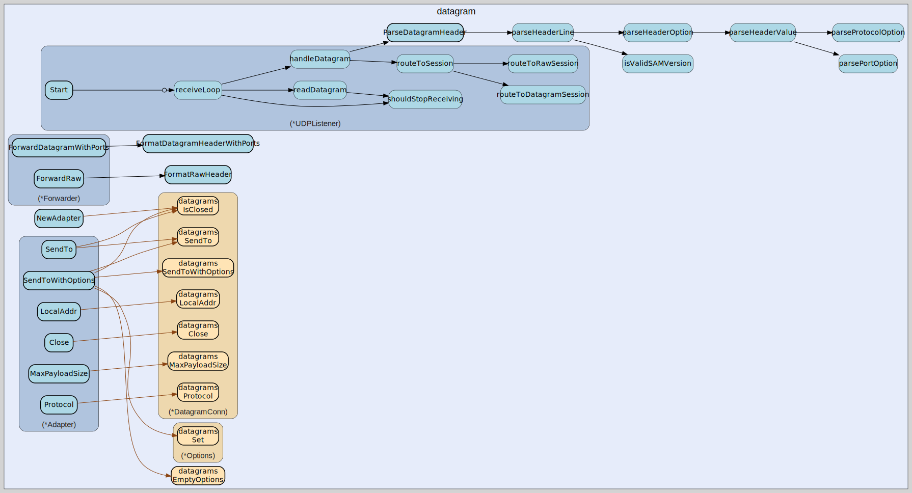

# datagram
--
    import "github.com/go-i2p/go-sam-bridge/lib/datagram"



Package datagram provides adapters between go-datagrams and go-sam-bridge. This
file implements the DatagramConnection interface from lib/datagram/sender.go
using the actual go-datagrams library.

Per SAMv3.md: Datagrams sent through port 7655 are forwarded to I2P after
stripping the header line.

Package datagram implements SAM v3.0-3.3 datagram handling. This file provides
datagram forwarding to client UDP sockets.

Package datagram implements UDP datagram handling for SAM port 7655. This file
provides the UDP listener for receiving datagrams from SAM clients per SAMv3.md
specification.

Per SAM 3.0-3.3 specification, datagrams sent through port 7655 have a first
line containing: version nickname destination [options...] followed by the
payload.

## Usage

```go
const DefaultUDPPort = 7655
```
DefaultUDPPort is the default UDP port for SAM datagrams per specification.

```go
const MaxDatagramSize = 65536
```
MaxDatagramSize is the maximum size of a UDP datagram. I2P datagrams will never
be larger than 65536 per SAMv3.md.

```go
var (
	// ErrForwarderClosed is returned when operations are attempted on a closed forwarder.
	ErrForwarderClosed = fmt.Errorf("forwarder is closed")

	// ErrForwarderNotStarted is returned when forwarding is attempted before Start().
	ErrForwarderNotStarted = fmt.Errorf("forwarder not started")
)
```
Error definitions for forwarder.

```go
var (
	ErrInvalidDatagram  = errors.New("invalid datagram format")
	ErrSessionNotFound  = errors.New("session not found")
	ErrInvalidVersion   = errors.New("invalid SAM version")
	ErrMissingNickname  = errors.New("missing session nickname")
	ErrMissingDest      = errors.New("missing destination")
	ErrDatagramTooSmall = errors.New("datagram too small")
	ErrListenerClosed   = errors.New("listener closed")
	ErrInvalidPort      = errors.New("invalid port value")
	ErrInvalidProtocol  = errors.New("invalid protocol value")
)
```
Common errors for UDP datagram handling

#### func  FormatDatagramHeader

```go
func FormatDatagramHeader(h *DatagramHeader) string
```
FormatDatagramHeader formats a DatagramHeader back to the wire format. This is
useful for testing and debugging.

#### func  FormatDatagramHeaderWithPorts

```go
func FormatDatagramHeaderWithPorts(destination string, fromPort, toPort int) string
```
FormatDatagramHeaderWithPorts formats the header for DATAGRAM forwarding with
ports. Per SAM 3.2: "$destination FROM_PORT=nnn TO_PORT=nnn\n"

#### func  FormatRawHeader

```go
func FormatRawHeader(fromPort, toPort, protocol int) string
```
FormatRawHeader formats the header line for RAW datagram forwarding. Per SAM
3.2: "FROM_PORT=nnn TO_PORT=nnn PROTOCOL=nnn\n"

#### type Adapter

```go
type Adapter struct {
}
```

Adapter wraps go-datagrams' DatagramConn to implement the DatagramConnection
interface. This bridges the gap between the abstract interface used by SAM
handlers and the concrete go-datagrams implementation.

Usage:

    session := i2cpClient.CreateSession(ctx, ...)
    conn, _ := datagrams.NewDatagramConnWithProtocol(session, port, protocol)
    adapter := NewAdapter(conn)
    sender := NewI2CPDatagramSender(adapter)

#### func  NewAdapter

```go
func NewAdapter(conn *datagrams.DatagramConn) (*Adapter, error)
```
NewAdapter creates a new datagram adapter wrapping the given DatagramConn. The
conn must already be initialized and ready for use.

#### func (*Adapter) Close

```go
func (a *Adapter) Close() error
```
Close implements DatagramConnection.Close. Closes the underlying go-datagrams
connection.

#### func (*Adapter) Conn

```go
func (a *Adapter) Conn() *datagrams.DatagramConn
```
Conn returns the underlying go-datagrams DatagramConn. This can be used when
direct access is needed for advanced operations.

#### func (*Adapter) LocalAddr

```go
func (a *Adapter) LocalAddr() string
```
LocalAddr returns the local I2P address for this connection. The address
includes the destination string and port.

#### func (*Adapter) MaxPayloadSize

```go
func (a *Adapter) MaxPayloadSize() int
```
MaxPayloadSize returns the maximum payload size for this adapter's protocol
type. This accounts for protocol-specific overhead in the I2NP message.

#### func (*Adapter) Protocol

```go
func (a *Adapter) Protocol() uint8
```
Protocol implements DatagramConnection.Protocol. Returns the datagram protocol
type (17, 18, 19, or 20).

Protocol types per SAM spec:

    - 17: Datagram1 (authenticated, repliable, legacy)
    - 18: Raw (no authentication, not repliable)
    - 19: Datagram2 (authenticated with replay prevention)
    - 20: Datagram3 (repliable, minimal overhead)

#### func (*Adapter) SendTo

```go
func (a *Adapter) SendTo(payload []byte, destB64 string, port uint16) error
```
SendTo implements DatagramConnection.SendTo. Sends a datagram to the destination
via go-datagrams.

#### func (*Adapter) SendToWithOptions

```go
func (a *Adapter) SendToWithOptions(payload []byte, destB64 string, port uint16, opts *I2PDatagramOptions) error
```
SendToWithOptions implements DatagramConnection.SendToWithOptions. Sends a
datagram with SAM 3.3 options via go-datagrams.

Per SAMv3.md: SAM 3.3 adds SEND_TAGS, TAG_THRESHOLD, EXPIRES, and SEND_LEASESET
options for advanced session tag management.

Note: The go-datagrams Options struct uses an I2P Mapping format for options.
SAM 3.3 options are translated to Mapping key-value pairs.

#### type DatagramConnection

```go
type DatagramConnection interface {
	// SendTo sends a datagram to the destination.
	SendTo(payload []byte, destB64 string, port uint16) error

	// SendToWithOptions sends a datagram with SAM 3.3 options.
	SendToWithOptions(payload []byte, destB64 string, port uint16, opts *I2PDatagramOptions) error

	// Protocol returns the datagram protocol type.
	Protocol() uint8

	// Close closes the connection.
	Close() error
}
```

DatagramConnection is an interface representing go-datagrams DatagramConn. This
abstraction allows for testing without actual I2P router.

#### type DatagramHeader

```go
type DatagramHeader struct {
	// Version is the SAM version (e.g., "3.0", "3.1", "3.2", "3.3").
	// As of SAM 3.2, any "3.x" is allowed.
	Version string

	// Nickname is the session ID that will be used for sending.
	Nickname string

	// Destination is the target I2P destination (Base64, hostname, or b32).
	Destination string

	// FromPort overrides session default source port (SAM 3.2+).
	FromPort int

	// ToPort overrides session default destination port (SAM 3.2+).
	ToPort int

	// Protocol overrides session default protocol for RAW sessions (SAM 3.2+).
	Protocol int

	// SendTags is the number of session tags to send (SAM 3.3+).
	SendTags int

	// TagThreshold is the low session tag threshold (SAM 3.3+).
	TagThreshold int

	// Expires is the expiration in seconds from now (SAM 3.3+).
	Expires int

	// SendLeaseSet controls whether to send our leaseset (SAM 3.3+).
	SendLeaseSet *bool
}
```

DatagramHeader contains parsed header information from incoming datagrams. Per
SAMv3.md, the first line format is: 3.x $nickname $destination [FROM_PORT=nnn]
[TO_PORT=nnn] [PROTOCOL=nnn] [options...]

#### func  ParseDatagramHeader

```go
func ParseDatagramHeader(data []byte) (*DatagramHeader, []byte, error)
```
ParseDatagramHeader parses the header line from a UDP datagram.

Per SAMv3.md, the first line format is:

    3.x $nickname $destination [FROM_PORT=nnn] [TO_PORT=nnn] [PROTOCOL=nnn] \n
    [payload data]

The header line is '\n' terminated. Returns the parsed header and the remaining
payload data.

#### type DatagramSendOptions

```go
type DatagramSendOptions struct {
	// FromPort is the source port (SAM 3.2+).
	FromPort int

	// ToPort is the destination port (SAM 3.2+).
	ToPort int

	// SendTags is the number of session tags to send (SAM 3.3+).
	SendTags int

	// TagThreshold is the low session tag threshold (SAM 3.3+).
	TagThreshold int

	// Expires is the expiration in seconds from now (SAM 3.3+).
	Expires int

	// SendLeaseSet controls whether to send our leaseset (SAM 3.3+).
	SendLeaseSet *bool
}
```

DatagramSendOptions contains options for sending repliable datagrams. These map
to SAM 3.0-3.3 datagram options.

#### type DatagramSender

```go
type DatagramSender interface {
	// SendDatagram sends a repliable datagram (DATAGRAM style).
	// The datagram includes sender destination and signature for reply capability.
	SendDatagram(dest string, payload []byte, opts DatagramSendOptions) error

	// SendRaw sends a raw datagram (RAW style).
	// Raw datagrams have no envelope overhead but cannot be replied to.
	SendRaw(dest string, payload []byte, opts RawSendOptions) error

	// Close releases resources.
	Close() error
}
```

DatagramSender provides the interface for sending datagrams over I2P.
Implementations wrap go-datagrams for actual I2P network communication.

#### type DatagramSenderFactory

```go
type DatagramSenderFactory interface {
	// Create creates a DatagramSender for the given session configuration.
	Create(ctx context.Context, sess session.Session, port int, protocol uint8) (DatagramSender, error)
}
```

DatagramSenderFactory creates DatagramSender instances for sessions.

#### type Forwarder

```go
type Forwarder struct {
}
```

Forwarder handles forwarding of received datagrams to client UDP sockets. Per
SAM specification, when PORT is set in SESSION CREATE, incoming datagrams are
forwarded to the specified host:port instead of being delivered on the control
socket.

Thread-safe for concurrent use.

#### func  NewForwarder

```go
func NewForwarder(config ForwarderConfig) *Forwarder
```
NewForwarder creates a new datagram forwarder with the given configuration. The
forwarder will send datagrams to config.Host:config.Port.

Parameters:

    - config: Forwarding configuration with host, port, and header settings

Returns nil if port is invalid (must be > 0).

#### func (*Forwarder) Addr

```go
func (f *Forwarder) Addr() net.Addr
```
Addr returns the target address for forwarding.

#### func (*Forwarder) Close

```go
func (f *Forwarder) Close() error
```
Close shuts down the forwarder and releases resources. Safe to call multiple
times.

#### func (*Forwarder) ForwardDatagram

```go
func (f *Forwarder) ForwardDatagram(destination string, payload []byte) error
```
ForwardDatagram forwards a repliable datagram to the configured client address.
Prepends the source destination per SAM spec:

    $destination\n
    $payload

Parameters:

    - destination: Base64-encoded source destination
    - payload: Datagram payload bytes

Returns error if forwarder is not started or send fails.

#### func (*Forwarder) ForwardDatagramWithPorts

```go
func (f *Forwarder) ForwardDatagramWithPorts(destination string, fromPort, toPort int, payload []byte) error
```
ForwardDatagramWithPorts forwards a repliable datagram with port information.
Used for SAM 3.2+ with FROM_PORT and TO_PORT.

Format sent:

    $destination FROM_PORT=nnn TO_PORT=nnn\n
    $payload

Parameters:

    - destination: Base64-encoded source destination
    - fromPort: Source I2CP port (0-65535)
    - toPort: Destination I2CP port (0-65535)
    - payload: Datagram payload bytes

#### func (*Forwarder) ForwardRaw

```go
func (f *Forwarder) ForwardRaw(fromPort, toPort, protocol int, payload []byte) error
```
ForwardRaw forwards a raw datagram to the configured client address. If
HeaderEnabled is true, prepends the header line per SAM 3.2 spec:

    FROM_PORT=nnn TO_PORT=nnn PROTOCOL=nnn\n
    $payload

Parameters:

    - fromPort: Source I2CP port (0-65535)
    - toPort: Destination I2CP port (0-65535)
    - protocol: I2CP protocol number (0-255)
    - payload: Datagram payload bytes

Returns error if forwarder is not started or send fails. Per SAM specification,
datagram delivery is best-effort; callers may choose to ignore errors.

#### func (*Forwarder) IsStarted

```go
func (f *Forwarder) IsStarted() bool
```
IsStarted returns true if the forwarder has been started.

#### func (*Forwarder) SetConnection

```go
func (f *Forwarder) SetConnection(conn net.PacketConn, addr net.Addr)
```
SetConnection sets a custom PacketConn for the forwarder. This is useful for
testing or when sharing a connection. Must be called before Start() or will
replace the existing connection.

#### func (*Forwarder) Start

```go
func (f *Forwarder) Start() error
```
Start initializes the forwarder by resolving the target address and creating the
UDP connection for sending.

Returns error if address resolution fails or connection cannot be created.

#### type ForwarderConfig

```go
type ForwarderConfig struct {
	// Host is the target host to forward datagrams to.
	// Default: "127.0.0.1"
	Host string

	// Port is the target port to forward datagrams to.
	// Required: must be > 0
	Port int

	// HeaderEnabled controls whether to prepend header info.
	// When true (SAM 3.2+), forwarded datagrams include:
	// - RAW: "FROM_PORT=nnn TO_PORT=nnn PROTOCOL=nnn\n"
	// - DATAGRAM: "$destination\n" is prepended by the bridge itself
	HeaderEnabled bool
}
```

ForwarderConfig holds configuration for a datagram forwarder.

#### type I2CPDatagramSender

```go
type I2CPDatagramSender struct {
}
```

I2CPDatagramSender implements DatagramSender using go-datagrams. This provides
the bridge between SAM UDP port 7655 and I2P network.

Per SAMv3.md: Datagrams sent through port 7655 are forwarded to I2P after
stripping the header line.

Integration with go-datagrams:

    - Uses datagrams.DatagramConn for connection management
    - Uses SendTo/SendToWithOptions for actual sending
    - Supports all 4 datagram protocols (Raw, Datagram1, Datagram2, Datagram3)

#### func  NewI2CPDatagramSender

```go
func NewI2CPDatagramSender(conn DatagramConnection) *I2CPDatagramSender
```
NewI2CPDatagramSender creates a new I2CPDatagramSender.

#### func (*I2CPDatagramSender) Close

```go
func (s *I2CPDatagramSender) Close() error
```
Close implements DatagramSender.Close.

#### func (*I2CPDatagramSender) SendDatagram

```go
func (s *I2CPDatagramSender) SendDatagram(dest string, payload []byte, opts DatagramSendOptions) error
```
SendDatagram implements DatagramSender.SendDatagram. Sends a repliable datagram
via go-datagrams.

#### func (*I2CPDatagramSender) SendRaw

```go
func (s *I2CPDatagramSender) SendRaw(dest string, payload []byte, opts RawSendOptions) error
```
SendRaw implements DatagramSender.SendRaw. Sends a raw datagram via
go-datagrams.

#### type I2PDatagramOptions

```go
type I2PDatagramOptions struct {
	SendTags     int
	TagThreshold int
	Expires      int
	SendLeaseSet bool
}
```

I2PDatagramOptions represents go-datagrams Options struct. Maps to SAM 3.3
datagram sending options.

#### type RawSendOptions

```go
type RawSendOptions struct {
	// FromPort is the source port (SAM 3.2+).
	FromPort int

	// ToPort is the destination port (SAM 3.2+).
	ToPort int

	// Protocol is the I2CP protocol number (SAM 3.2+).
	// Default is 18 (ProtocolRaw).
	Protocol int

	// SendTags is the number of session tags to send (SAM 3.3+).
	SendTags int

	// TagThreshold is the low session tag threshold (SAM 3.3+).
	TagThreshold int

	// Expires is the expiration in seconds from now (SAM 3.3+).
	Expires int

	// SendLeaseSet controls whether to send our leaseset (SAM 3.3+).
	SendLeaseSet *bool
}
```

RawSendOptions contains options for sending raw datagrams. These map to SAM
3.1-3.3 RAW options.

#### type SessionDatagramManager

```go
type SessionDatagramManager struct {
}
```

SessionDatagramManager manages DatagramSender instances per session. This
enables per-session UDP binding as required by sam.udp.port option.

Per SAMv3.md: The sam.udp.port option allows configuring per-session UDP
datagram binding.

#### func  NewSessionDatagramManager

```go
func NewSessionDatagramManager(factory DatagramSenderFactory) *SessionDatagramManager
```
NewSessionDatagramManager creates a new SessionDatagramManager.

#### func (*SessionDatagramManager) GetSender

```go
func (m *SessionDatagramManager) GetSender(sessionID string) DatagramSender
```
GetSender returns the DatagramSender for a session.

#### func (*SessionDatagramManager) RegisterSession

```go
func (m *SessionDatagramManager) RegisterSession(ctx context.Context, sess session.Session, port int, protocol uint8) error
```
RegisterSession creates and registers a DatagramSender for a session. The port
parameter comes from the sam.udp.port session option.

#### func (*SessionDatagramManager) UnregisterSession

```go
func (m *SessionDatagramManager) UnregisterSession(sessionID string) error
```
UnregisterSession removes and closes the DatagramSender for a session.

#### type UDPListener

```go
type UDPListener struct {
}
```

UDPListener listens for UDP datagrams on port 7655 and routes them to the
appropriate session for sending over I2P.

Per SAMv3.md:

    - Clients send datagrams with header line followed by payload
    - First line is discarded by SAM before sending payload to destination
    - Session must exist and match the nickname in the header

#### func  NewUDPListener

```go
func NewUDPListener(addr string, registry session.Registry) *UDPListener
```
NewUDPListener creates a new UDP listener for SAM datagrams.

Parameters:

    - addr: The address to listen on (e.g., ":7655" or "127.0.0.1:7655")
    - registry: Session registry for looking up sessions by nickname

Per SAMv3.md, the default UDP port is 7655 and default bind is 127.0.0.1.

#### func (*UDPListener) Addr

```go
func (l *UDPListener) Addr() net.Addr
```
Addr returns the local address the listener is bound to. Returns nil if not
started.

#### func (*UDPListener) Close

```go
func (l *UDPListener) Close() error
```
Close stops the UDP listener and releases resources.

#### func (*UDPListener) Start

```go
func (l *UDPListener) Start() error
```
Start begins listening for UDP datagrams. This method is non-blocking and starts
a goroutine to handle incoming datagrams.


datagram 

github.com/go-i2p/go-sam-bridge/lib/datagram

[go-i2p template file](/template.md)
