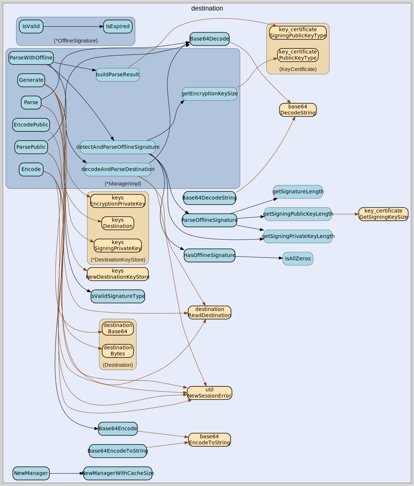

# destination
--
    import "github.com/go-i2p/go-sam-bridge/lib/destination"



Package destination implements I2P destination management including key
generation, Base64 encoding/decoding, and offline signature handling. See
SAMv3.md for destination format details.

Package destination implements I2P destination management.

Package destination implements I2P destination management.

Package destination implements I2P destination management.

## Usage

```go
const (
	SigTypeDSA_SHA1          = signature.SIGNATURE_TYPE_DSA_SHA1
	SigTypeECDSA_SHA256_P256 = signature.SIGNATURE_TYPE_ECDSA_SHA256_P256
	SigTypeECDSA_SHA384_P384 = signature.SIGNATURE_TYPE_ECDSA_SHA384_P384
	SigTypeECDSA_SHA512_P521 = signature.SIGNATURE_TYPE_ECDSA_SHA512_P521
	SigTypeRSA_SHA256_2048   = signature.SIGNATURE_TYPE_RSA_SHA256_2048
	SigTypeRSA_SHA384_3072   = signature.SIGNATURE_TYPE_RSA_SHA384_3072
	SigTypeRSA_SHA512_4096   = signature.SIGNATURE_TYPE_RSA_SHA512_4096
	SigTypeEd25519           = signature.SIGNATURE_TYPE_EDDSA_SHA512_ED25519
	SigTypeEd25519ph         = signature.SIGNATURE_TYPE_EDDSA_SHA512_ED25519PH
)
```
Re-export signature type constants from go-i2p/common for convenience. All
clients should use SigTypeEd25519 (7) for new destinations.

```go
const (
	EncTypeElGamal      = key_certificate.KEYCERT_CRYPTO_ELG
	EncTypeECIES_X25519 = key_certificate.KEYCERT_CRYPTO_X25519
)
```
Re-export encryption type constants from go-i2p/common for convenience.

```go
const DefaultCacheSize = 1000
```
DefaultCacheSize is the default maximum number of destinations to cache. This
prevents unbounded memory growth in long-running servers.

```go
const DefaultSignatureType = SigTypeEd25519
```
DefaultSignatureType is Ed25519 per SAM specification recommendation.

```go
var (
	// ErrUnsupportedSignatureType indicates the signature type is not supported.
	ErrUnsupportedSignatureType = errors.New("unsupported signature type")

	// ErrInvalidDestination indicates the destination data is invalid.
	ErrInvalidDestination = errors.New("invalid destination")

	// ErrInvalidPrivateKey indicates the private key data is invalid.
	ErrInvalidPrivateKey = errors.New("invalid private key")

	// ErrKeyGenerationFailed indicates key generation failed.
	ErrKeyGenerationFailed = errors.New("key generation failed")
)
```
Manager errors.

```go
var (
	// ErrNoOfflineSignature indicates no offline signature is present.
	ErrNoOfflineSignature = errors.New("no offline signature present")

	// ErrInvalidOfflineSignature indicates the offline signature data is malformed.
	ErrInvalidOfflineSignature = errors.New("invalid offline signature format")

	// ErrOfflineSignatureExpired indicates the offline signature has expired.
	ErrOfflineSignatureExpired = errors.New("offline signature expired")

	// ErrUnsupportedTransientType indicates the transient signature type is not supported.
	ErrUnsupportedTransientType = errors.New("unsupported transient signature type")

	// ErrOfflineNotAllowed indicates offline signatures are not allowed for this style.
	ErrOfflineNotAllowed = errors.New("offline signatures only allowed for STREAM and RAW sessions")
)
```
Offline signature parsing errors.

```go
var DefaultEncryptionTypes = []int{EncTypeECIES_X25519, EncTypeElGamal}
```
DefaultEncryptionTypes specifies ECIES-X25519 with ElGamal fallback.

#### func  Base64Decode

```go
func Base64Decode(s string) ([]byte, error)
```
Base64Decode decodes I2P Base64 encoded data. Returns an error if the input
contains invalid characters or has invalid length.

#### func  Base64DecodeString

```go
func Base64DecodeString(s string) ([]byte, error)
```
Base64DecodeString is an alias for Base64Decode for API consistency.

#### func  Base64Encode

```go
func Base64Encode(data []byte) string
```
Base64Encode encodes data to I2P Base64 format. I2P uses a modified alphabet
where + becomes - and / becomes ~.

#### func  Base64EncodeToString

```go
func Base64EncodeToString(data []byte) string
```
Base64EncodeToString is an alias for Base64Encode for API consistency.

#### func  EncryptionTypeName

```go
func EncryptionTypeName(encType int) string
```
EncryptionTypeName returns the human-readable name for an encryption type.

#### func  HasOfflineSignature

```go
func HasOfflineSignature(privateKeyData []byte, signingPrivKeyOffset, signingPrivKeyLen int) bool
```
HasOfflineSignature checks if the signing private key is all zeros, which
indicates an offline signature section follows per SAMv3.md. The
signingPrivKeyLen parameter should match the expected length for the signature
type.

#### func  I2PToStdBase64

```go
func I2PToStdBase64(s string) string
```
I2PToStdBase64 converts I2P Base64 to standard Base64. Replaces - with + and ~
with /.

#### func  IsValidSignatureType

```go
func IsValidSignatureType(sigType int) bool
```
IsValidSignatureType returns true if the signature type is recognized.

#### func  SignatureTypeName

```go
func SignatureTypeName(sigType int) string
```
SignatureTypeName returns the human-readable name for a signature type.

#### func  StdToI2PBase64

```go
func StdToI2PBase64(s string) string
```
StdToI2PBase64 converts standard Base64 to I2P Base64. Replaces + with - and /
with ~.

#### type Manager

```go
type Manager interface {
	// Generate creates a new destination with the specified signature type.
	// Implements SAM DEST GENERATE command.
	// signatureType: 7=Ed25519 (recommended), 0=DSA_SHA1 (deprecated)
	Generate(signatureType int) (*commondest.Destination, []byte, error)

	// Parse decodes a Base64 private key string into destination and private key.
	// Validates format per PrivateKeyFile specification.
	Parse(privkeyBase64 string) (*commondest.Destination, []byte, error)

	// ParseWithOffline decodes a Base64 private key string and also detects/parses
	// offline signatures per SAM 3.3 specification.
	ParseWithOffline(privkeyBase64 string) (*ParseResult, error)

	// ParsePublic decodes a Base64 public destination string.
	ParsePublic(destBase64 string) (*commondest.Destination, error)

	// Encode converts destination and private key to Base64 private key format.
	Encode(dest *commondest.Destination, privateKey []byte) (string, error)

	// EncodePublic converts a Destination to Base64 public format.
	EncodePublic(d *commondest.Destination) (string, error)
}
```

Manager handles I2P destination creation, parsing, and encoding. This is the
main interface for working with I2P destinations in the SAM bridge.

#### type ManagerImpl

```go
type ManagerImpl struct {
}
```

ManagerImpl is the concrete implementation of Manager. It uses go-i2p/keys for
key generation and go-i2p/common for data structures. The destination cache is
bounded using an LRU eviction policy to prevent unbounded memory growth in
long-running servers.

#### func  NewManager

```go
func NewManager() *ManagerImpl
```
NewManager creates a new destination manager with default cache size. Uses
DefaultCacheSize (1000) for the LRU cache.

#### func  NewManagerWithCacheSize

```go
func NewManagerWithCacheSize(cacheSize int) *ManagerImpl
```
NewManagerWithCacheSize creates a new destination manager with a custom cache
size. The cache uses LRU eviction when the size limit is reached. cacheSize must
be > 0; if 0 or negative, DefaultCacheSize is used.

#### func (*ManagerImpl) CacheCapacity

```go
func (m *ManagerImpl) CacheCapacity() int
```
CacheCapacity returns the maximum cache size. This is the limit set at
construction time.

#### func (*ManagerImpl) CacheSize

```go
func (m *ManagerImpl) CacheSize() int
```
CacheSize returns the number of cached destinations.

#### func (*ManagerImpl) ClearCache

```go
func (m *ManagerImpl) ClearCache()
```
ClearCache clears the destination cache. This is useful for testing or when
memory pressure is detected.

#### func (*ManagerImpl) Encode

```go
func (m *ManagerImpl) Encode(dest *commondest.Destination, privateKey []byte) (string, error)
```
Encode converts destination and private key to Base64 private key format.

#### func (*ManagerImpl) EncodePublic

```go
func (m *ManagerImpl) EncodePublic(d *commondest.Destination) (string, error)
```
EncodePublic converts a Destination to Base64 public format.

#### func (*ManagerImpl) Generate

```go
func (m *ManagerImpl) Generate(signatureType int) (*commondest.Destination, []byte, error)
```
Generate creates a new destination with the specified signature type. Uses
go-i2p/keys.DestinationKeyStore for proper Ed25519/X25519 key generation.

Returns the destination and complete private key bytes in SAM PrivateKeyFile
format:

    - Encryption private key (32 bytes for X25519)
    - Signing private key (64 bytes for Ed25519)

Per SAMv3.md DEST GENERATE specification.

#### func (*ManagerImpl) Parse

```go
func (m *ManagerImpl) Parse(privkeyBase64 string) (*commondest.Destination, []byte, error)
```
Parse decodes a Base64 private key string into destination and private key
bytes.

#### func (*ManagerImpl) ParsePublic

```go
func (m *ManagerImpl) ParsePublic(destBase64 string) (*commondest.Destination, error)
```
ParsePublic decodes a Base64 public destination string. Results are cached using
an LRU eviction policy to prevent unbounded growth.

#### func (*ManagerImpl) ParseWithOffline

```go
func (m *ManagerImpl) ParseWithOffline(privkeyBase64 string) (*ParseResult, error)
```
ParseWithOffline decodes a Base64 private key string and also detects/parses
offline signatures per SAM 3.3 specification.

The private key format is:

    - Destination (public key, signing public key, certificate)
    - Private encryption key (256 bytes for ElGamal, 32 for X25519)
    - Signing private key (length per sig type, all zeros if offline)
    - Offline signature section (if signing key is all zeros)

Per SAMv3.md, if the signing private key is all zeros, an offline signature
section follows with: expires (4B) + transient sig type (2B) + transient pub key
+ signature + transient priv key.

#### type OfflineSignature

```go
type OfflineSignature struct {
	// Expires is the time when the offline signature expires.
	Expires time.Time

	// TransientSignatureType is the signature type of the transient key.
	TransientSignatureType int

	// TransientPublicKey is the transient public signing key.
	TransientPublicKey []byte

	// Signature is the signature from the long-term key over the transient data.
	Signature []byte

	// TransientPrivateKey is the transient private signing key (optional, for signing).
	TransientPrivateKey []byte
}
```

OfflineSignature represents offline signing capability per SAM 3.3. This allows
a session to use a transient signing key while keeping the long-term identity
key offline for security.

#### func (*OfflineSignature) Bytes

```go
func (o *OfflineSignature) Bytes() []byte
```
Bytes returns the serialized offline signature for transmission.

#### func (*OfflineSignature) IsExpired

```go
func (o *OfflineSignature) IsExpired() bool
```
IsExpired returns true if the offline signature has expired.

#### func (*OfflineSignature) IsValid

```go
func (o *OfflineSignature) IsValid() bool
```
IsValid performs basic validation of the offline signature structure. Note: This
does NOT verify the cryptographic signature.

#### type ParseResult

```go
type ParseResult struct {
	// Destination is the parsed I2P destination.
	Destination *commondest.Destination
	// PrivateKey contains the private key bytes.
	PrivateKey []byte
	// SignatureType is the destination's signature type.
	SignatureType int
	// OfflineSignature contains the parsed offline signature, if present.
	// Nil if the destination does not use offline signatures.
	OfflineSignature *ParsedOfflineSignature
}
```

ParseResult contains the result of parsing a private key, including offline
signature data if present.

#### type ParsedOfflineSignature

```go
type ParsedOfflineSignature struct {
	// Expires is when the offline signature expires.
	Expires time.Time

	// TransientSigType is the signature type of the transient key.
	TransientSigType int

	// TransientPublicKey is the transient signing public key.
	TransientPublicKey []byte

	// Signature is the signature from the long-term (offline) key.
	Signature []byte

	// TransientPrivateKey is the transient signing private key.
	TransientPrivateKey []byte
}
```

ParsedOfflineSignature contains the parsed offline signature data. This struct
is used during parsing before creating the session config OfflineSignature.

#### func  ParseOfflineSignature

```go
func ParseOfflineSignature(offlineData []byte, destSigType int) (*ParsedOfflineSignature, error)
```
ParseOfflineSignature parses the offline signature section from private key
data.

Per SAMv3.md, the offline signature format is: - Expires timestamp (4 bytes, big
endian, seconds since epoch) - Sig type of transient Signing Public Key (2
bytes, big endian) - Transient Signing Public key (length per transient sig
type) - Signature of above three fields by offline key (length per destination
sig type) - Transient Signing Private key (length per transient sig type)

Parameters:

    - offlineData: the data after the all-zeros signing private key
    - destSigType: the signature type of the destination (for offline signature length)

Returns the parsed offline signature or an error.

#### func (*ParsedOfflineSignature) Bytes

```go
func (p *ParsedOfflineSignature) Bytes() []byte
```
Bytes serializes the offline signature back to binary format for transmission.
This is used when echoing back the offline signature in SESSION STATUS response.

#### func (*ParsedOfflineSignature) IsExpired

```go
func (p *ParsedOfflineSignature) IsExpired() bool
```
IsExpired returns true if the offline signature has expired.


destination 

github.com/go-i2p/go-sam-bridge/lib/destination

[go-i2p template file](/template.md)
