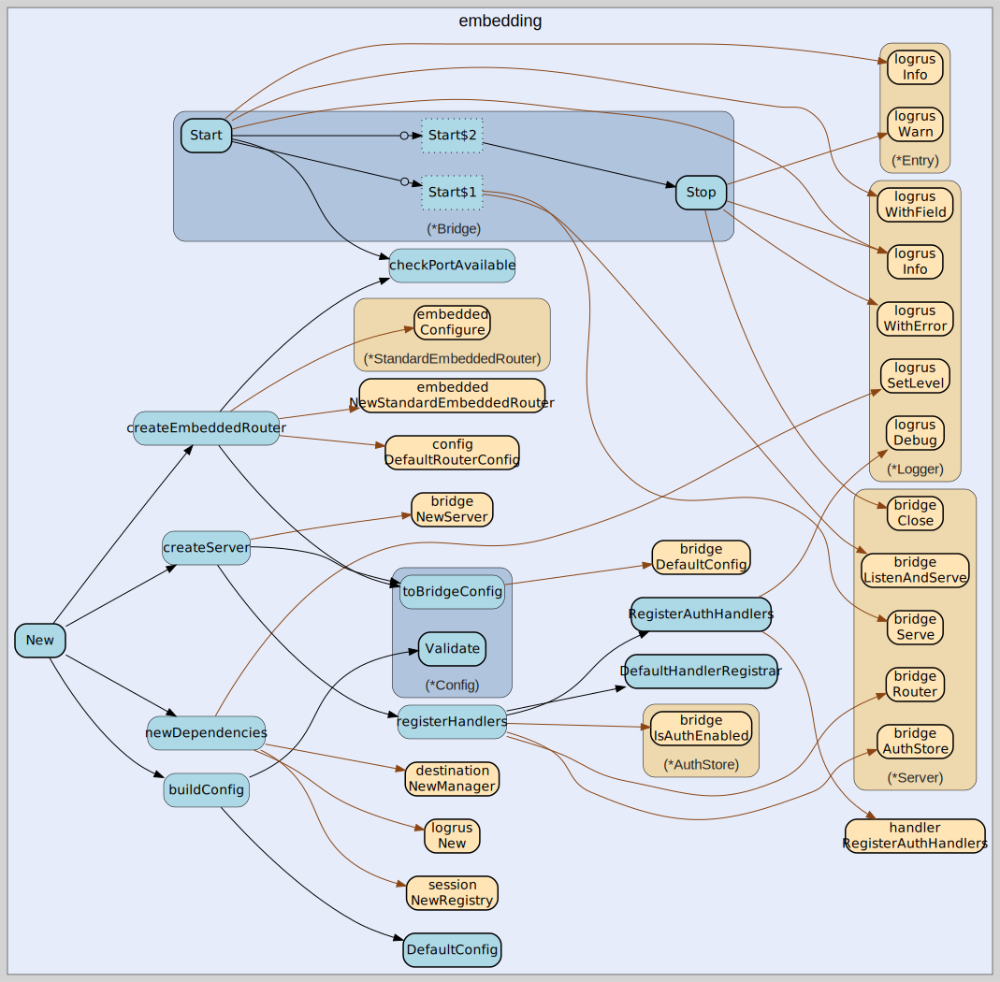

# embedding
--
    import "github.com/go-i2p/go-sam-bridge/lib/embedding"



Package embedding provides an embeddable API for third-party Go applications to
initialize and run a SAM bridge server with minimal setup code.

Package embedding provides an embeddable API for initializing and running a SAM
(Simple Anonymous Messaging) bridge server in third-party Go applications.

The embedding package enables applications to integrate SAM bridge functionality
with minimal setup code, using functional options for configuration and
context-aware lifecycle management.

# Basic Usage

Create and start a bridge with default settings:

    bridge, err := embedding.New()
    if err != nil {
        log.Fatal(err)
    }

    ctx, cancel := context.WithCancel(context.Background())
    defer cancel()

    if err := bridge.Start(ctx); err != nil {
        log.Fatal(err)
    }

    // Wait for interrupt
    sig := make(chan os.Signal, 1)
    signal.Notify(sig, syscall.SIGINT, syscall.SIGTERM)
    <-sig

    bridge.Stop(context.Background())

# Configuration with Options

Use functional options to customize the bridge:

    bridge, err := embedding.New(
        embedding.WithListenAddr(":7656"),
        embedding.WithI2CPAddr("127.0.0.1:7654"),
        embedding.WithLogger(myLogger),
        embedding.WithDebug(true),
    )

# Available Options

    - WithListenAddr: Set SAM TCP listen address (default ":7656")
    - WithI2CPAddr: Set I2CP router address (default "127.0.0.1:7654")
    - WithDatagramPort: Set UDP datagram port (default 7655)
    - WithListener: Provide custom net.Listener
    - WithRegistry: Provide custom session.Registry
    - WithI2CPProvider: Provide custom I2CP session provider
    - WithLogger: Provide custom logrus.Logger
    - WithTLS: Enable TLS with custom config
    - WithAuth: Set SAM authentication users
    - WithI2CPCredentials: Set I2CP authentication
    - WithHandlerRegistrar: Custom handler registration
    - WithDebug: Enable debug logging

# Custom Handlers

Register custom handlers alongside or instead of default handlers:

    customRegistrar := func(router *handler.Router, deps *embedding.Dependencies) {
        // Register default handlers first
        embedding.DefaultHandlerRegistrar()(router, deps)

        // Add custom handler
        router.Register("CUSTOM COMMAND", myHandler)
    }

    bridge, err := embedding.New(
        embedding.WithHandlerRegistrar(customRegistrar),
    )

# Lifecycle Management

The Bridge implements the Lifecycle interface:

    - Start(ctx): Begin serving (non-blocking)
    - Stop(ctx): Graceful shutdown
    - Wait(): Block until stopped
    - Running(): Check if bridge is active

Context cancellation in Start() triggers automatic shutdown.

# Thread Safety

Bridge methods are safe for concurrent use. The bridge uses atomic operations
and mutexes to protect shared state during lifecycle transitions.

# SAM Protocol Version

This implementation supports SAM protocol versions 3.0 through 3.3. See SAMv3.md
in the project root for the complete protocol specification.

## Usage

```go
const (
	// DefaultListenAddr is the standard SAM port per SAMv3.md.
	DefaultListenAddr = ":7656"

	// DefaultI2CPAddr is the standard I2CP port per I2CP spec.
	DefaultI2CPAddr = "127.0.0.1:7654"

	// DefaultDatagramPort is the standard SAM UDP port per SAMv3.md.
	DefaultDatagramPort = 7655
)
```
Default configuration values.

```go
var (
	// ErrMissingListenAddr is returned when no listen address or listener is provided.
	ErrMissingListenAddr = errors.New("embedding: listen address or listener required")

	// ErrMissingI2CPAddr is returned when no I2CP address or provider is provided.
	ErrMissingI2CPAddr = errors.New("embedding: I2CP address or provider required")

	// ErrBridgeAlreadyRunning is returned when Start is called on a running bridge.
	ErrBridgeAlreadyRunning = errors.New("embedding: bridge is already running")

	// ErrBridgeNotRunning is returned when Stop is called on a stopped bridge.
	ErrBridgeNotRunning = errors.New("embedding: bridge is not running")

	// ErrI2CPConnectFailed is returned when connection to I2P router fails.
	ErrI2CPConnectFailed = errors.New("embedding: failed to connect to I2P router")
)
```
Errors returned by the embedding package.

#### func  RegisterAuthHandlers

```go
func RegisterAuthHandlers(router *handler.Router, authStore *bridge.AuthStore, deps *Dependencies)
```
RegisterAuthHandlers adds authentication handlers to a router. Call this
separately when authentication is enabled.

#### type Bridge

```go
type Bridge struct {
}
```

Bridge is an embeddable SAM bridge server. It implements the Lifecycle interface
for easy integration.

#### func  New

```go
func New(opts ...Option) (*Bridge, error)
```
New creates a new Bridge with the given options. Options are applied to a
default configuration. Returns an error if configuration is invalid.

#### func (*Bridge) Config

```go
func (b *Bridge) Config() *Config
```
Config returns the bridge's configuration. This is a read-only view; modifying
the returned config has no effect.

#### func (*Bridge) Dependencies

```go
func (b *Bridge) Dependencies() *Dependencies
```
Dependencies returns the bridge's dependencies. This allows access to the
registry, logger, etc.

#### func (*Bridge) Running

```go
func (b *Bridge) Running() bool
```
Running returns true if the bridge is actively serving.

#### func (*Bridge) Server

```go
func (b *Bridge) Server() *bridge.Server
```
Server returns the underlying bridge.Server. This allows advanced access to the
server's Router and other internals.

#### func (*Bridge) Start

```go
func (b *Bridge) Start(ctx context.Context) error
```
Start begins serving SAM connections. The context is used for cancellation -
when cancelled, the bridge stops. This method is non-blocking and returns
immediately after starting.

#### func (*Bridge) Stop

```go
func (b *Bridge) Stop(ctx context.Context) error
```
Stop gracefully shuts down the bridge. The context can be used to set a timeout
for shutdown operations.

#### func (*Bridge) Wait

```go
func (b *Bridge) Wait() error
```
Wait blocks until the bridge has stopped. Returns any error that caused the
shutdown.

#### type Config

```go
type Config struct {
	// ListenAddr is the SAM TCP listen address (default ":7656").
	ListenAddr string

	// I2CPAddr is the I2CP router address (default "127.0.0.1:7654").
	I2CPAddr string

	// DatagramPort is the UDP port for datagram forwarding (default 7655).
	DatagramPort int

	// I2CPUsername for I2CP authentication (optional).
	I2CPUsername string

	// I2CPPassword for I2CP authentication (optional).
	I2CPPassword string

	// TLSConfig enables TLS on the control socket if non-nil.
	TLSConfig *tls.Config

	// AuthUsers maps usernames to passwords for SAM authentication.
	// Empty map disables authentication.
	AuthUsers map[string]string

	// Listener is a custom net.Listener for the SAM server.
	// If nil, the bridge creates its own listener on ListenAddr.
	Listener net.Listener

	// Registry is a custom session registry.
	// If nil, a default registry is created.
	Registry session.Registry

	// I2CPProvider is a custom I2CP session provider.
	// If nil, the bridge creates one using I2CPAddr.
	I2CPProvider session.I2CPSessionProvider

	// Logger is a custom logger instance.
	// If nil, a default logger is created.
	Logger *logrus.Logger

	// HandlerRegistrar is a custom function to register handlers.
	// If nil, DefaultHandlerRegistrar is used.
	HandlerRegistrar HandlerRegistrarFunc

	// Debug enables debug logging.
	Debug bool
}
```

Config holds the complete configuration for an embedded SAM bridge. It extends
bridge.Config with I2CP and embedding-specific settings.

#### func  DefaultConfig

```go
func DefaultConfig() *Config
```
DefaultConfig returns a Config with sensible defaults. All fields can be
overridden via functional options.

#### func (*Config) Validate

```go
func (c *Config) Validate() error
```
Validate checks that the configuration is valid. Returns an error if any
required fields are missing or invalid.

#### type Dependencies

```go
type Dependencies struct {
	// Registry manages all active sessions.
	Registry session.Registry

	// I2CPProvider creates I2CP sessions for SAM sessions.
	I2CPProvider session.I2CPSessionProvider

	// DestManager handles I2P destination creation and management.
	DestManager destination.Manager

	// Logger is the structured logger for all components.
	Logger *logrus.Logger
}
```

Dependencies bundles shared resources used by handlers. This struct is passed to
handler registrar functions to allow access to common dependencies without tight
coupling.

#### type HandlerRegistrarFunc

```go
type HandlerRegistrarFunc func(router *handler.Router, deps *Dependencies)
```

HandlerRegistrarFunc is a function that registers handlers with a router. It
receives the router and dependencies for custom handler setup.

#### func  DefaultHandlerRegistrar

```go
func DefaultHandlerRegistrar() HandlerRegistrarFunc
```
DefaultHandlerRegistrar returns a HandlerRegistrarFunc that registers all
standard SAM command handlers. This is the default handler setup used when no
custom HandlerRegistrar is provided.

This registers handlers for:

    - HELLO VERSION (handshake)
    - SESSION CREATE/ADD/REMOVE
    - STREAM CONNECT/ACCEPT/FORWARD
    - DATAGRAM SEND
    - RAW SEND
    - NAMING LOOKUP
    - DEST GENERATE
    - PING
    - QUIT/STOP/EXIT
    - HELP
    - AUTH ENABLE/DISABLE/ADD/REMOVE (if authentication enabled)

#### type Lifecycle

```go
type Lifecycle interface {
	// Start begins serving SAM connections. Non-blocking.
	// Returns an error if the bridge cannot start.
	Start(ctx context.Context) error

	// Stop gracefully shuts down the bridge.
	// The context can be used to set a timeout for shutdown.
	Stop(ctx context.Context) error

	// Wait blocks until the bridge has stopped.
	// Returns any error that caused the shutdown.
	Wait() error

	// Running returns true if the bridge is actively serving.
	Running() bool
}
```

Lifecycle defines the interface for controlling a Bridge.

#### type Option

```go
type Option func(*Config)
```

Option is a functional option for configuring the Bridge.

#### func  WithAuth

```go
func WithAuth(users map[string]string) Option
```
WithAuth sets the SAM authentication users. Per SAM 3.2, optional authorization
with USER/PASSWORD is supported.

#### func  WithDatagramPort

```go
func WithDatagramPort(port int) Option
```
WithDatagramPort sets the UDP port for datagram forwarding. Default is 7655 per
SAMv3.md.

#### func  WithDebug

```go
func WithDebug(enabled bool) Option
```
WithDebug enables debug logging.

#### func  WithHandlerRegistrar

```go
func WithHandlerRegistrar(fn HandlerRegistrarFunc) Option
```
WithHandlerRegistrar sets a custom handler registration function. This allows
embedders to customize which handlers are registered or add custom handlers to
the router.

#### func  WithI2CPAddr

```go
func WithI2CPAddr(addr string) Option
```
WithI2CPAddr sets the I2CP router address. Default is "127.0.0.1:7654" per I2CP
spec.

#### func  WithI2CPCredentials

```go
func WithI2CPCredentials(username, password string) Option
```
WithI2CPCredentials sets I2CP authentication credentials.

#### func  WithI2CPProvider

```go
func WithI2CPProvider(p session.I2CPSessionProvider) Option
```
WithI2CPProvider sets a custom I2CP session provider. When provided, the bridge
uses this provider instead of creating its own.

#### func  WithListenAddr

```go
func WithListenAddr(addr string) Option
```
WithListenAddr sets the SAM TCP listen address. Default is ":7656" per SAMv3.md.

#### func  WithListener

```go
func WithListener(l net.Listener) Option
```
WithListener sets a custom net.Listener for the SAM server. When provided,
ListenAddr is ignored and the bridge uses this listener.

#### func  WithLogger

```go
func WithLogger(l *logrus.Logger) Option
```
WithLogger sets a custom logger instance. When provided, the bridge uses this
logger instead of creating its own.

#### func  WithRegistry

```go
func WithRegistry(r session.Registry) Option
```
WithRegistry sets a custom session registry. When provided, the bridge uses this
registry instead of creating its own.

#### func  WithTLS

```go
func WithTLS(cfg *tls.Config) Option
```
WithTLS enables TLS on the SAM control socket. Per SAM 3.2, optional SSL/TLS
support may be offered.


embedding 

github.com/go-i2p/go-sam-bridge/lib/embedding

[go-i2p template file](/template.md)
