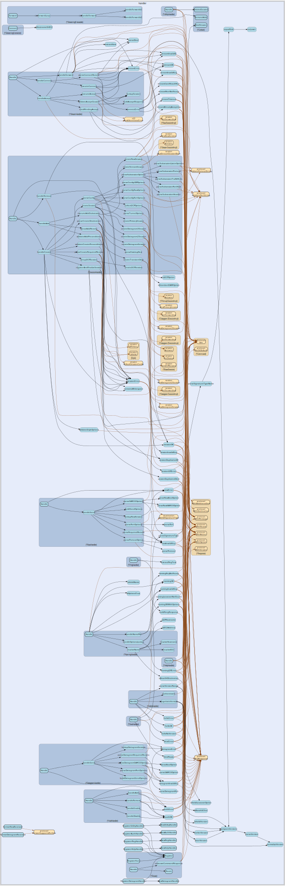

# handler
--
    import "github.com/go-i2p/go-sam-bridge/lib/handler"



Package handler implements SAM command handlers per SAMv3.md specification.

Package handler implements SAM command handlers per SAMv3.md specification. This
file implements DATAGRAM SEND and DATAGRAM RECEIVED handling per SAM 3.0-3.3.

Package handler implements SAM command handlers per SAMv3.md specification.

Package handler implements SAM command handlers per SAMv3.md specification. Each
handler processes a specific SAM command (HELLO, SESSION, STREAM, etc.) and
returns an appropriate response.

Package handler implements SAM command handlers per SAMv3.md specification.

Package handler implements SAM command handlers per SAMv3.md specification.

Package handler implements SAM command handlers per SAMv3.md specification.

Package handler implements SAM command handlers per SAMv3.md specification. This
file implements RAW SEND and RAW RECEIVED handling per SAM 3.1-3.3.

Package handler implements SAM command handlers per SAMv3.md specification.

Package handler implements SAM command handlers per SAMv3.md specification.

Package handler implements SAM command handlers per SAMv3.md specification.

## Usage

```go
const DefaultResolveTimeout = 30 * time.Second
```
DefaultResolveTimeout is the default timeout for destination resolution.

```go
const DefaultTunnelBuildTimeout = 60 * time.Second
```
DefaultTunnelBuildTimeout is the default timeout for tunnel building. Per
SAMv3.md: "the router builds tunnels before responding with SESSION STATUS. This
could take several seconds."

#### func  FormatDatagramForward

```go
func FormatDatagramForward(dg session.ReceivedDatagram) string
```
FormatDatagramForward creates the header line for forwarded DATAGRAM datagrams.

Per SAMv3.md, forwarded repliable datagrams are prepended with:

    $destination\n
    <datagram_payload>

Parameters:

    - dg: The received datagram containing source destination

Returns the header line (just the destination, without trailing newline).

#### func  FormatDatagramReceived

```go
func FormatDatagramReceived(dg session.ReceivedDatagram, version string) string
```
FormatDatagramReceived creates a DATAGRAM RECEIVED response for incoming
datagrams.

Per SAMv3.md, the format is:

    DATAGRAM RECEIVED DESTINATION=$dest SIZE=$numBytes [FROM_PORT=nnn] [TO_PORT=nnn] \n
    <$numBytes of data>

Note: FROM_PORT and TO_PORT are only included for SAM 3.2 or higher.

Parameters:

    - dg: The received datagram containing source, ports, and data
    - version: The negotiated SAM version (e.g., "3.2", "3.3")

Returns the formatted response line (without the data payload).

#### func  FormatRawHeader

```go
func FormatRawHeader(dg session.ReceivedRawDatagram) string
```
FormatRawHeader creates the header line for forwarded RAW datagrams.

Per SAMv3.md, when HEADER=true is specified in SESSION CREATE, the forwarded raw
datagram is prepended with:

    FROM_PORT=nnn TO_PORT=nnn PROTOCOL=nnn\n
    <datagram_payload>

Parameters:

    - dg: The received raw datagram containing port and protocol info

Returns the header line (without trailing newline).

#### func  FormatRawReceived

```go
func FormatRawReceived(dg session.ReceivedRawDatagram, version string) string
```
FormatRawReceived creates a RAW RECEIVED response for incoming datagrams.

Per SAMv3.md, the format is:

    RAW RECEIVED SIZE=$numBytes [FROM_PORT=nnn] [TO_PORT=nnn] [PROTOCOL=nnn] \n
    <$numBytes of data>

Note: FROM_PORT, TO_PORT, and PROTOCOL are only included for SAM 3.2 or higher.

Parameters:

    - dg: The received raw datagram containing port, protocol, and data
    - version: The negotiated SAM version (e.g., "3.2", "3.3")

Returns the formatted response line (without the data payload).

#### func  RegisterAuthHandlers

```go
func RegisterAuthHandlers(router *Router, manager AuthManager)
```
RegisterAuthHandlers registers the AUTH handler with a router. All AUTH actions
(ENABLE, DISABLE, ADD, REMOVE) use the same handler.

#### func  RegisterDatagramHandler

```go
func RegisterDatagramHandler(router *Router)
```
RegisterDatagramHandler registers the DATAGRAM handler with the router. This
should be called during server initialization to enable DATAGRAM commands.

#### func  RegisterHelpHandler

```go
func RegisterHelpHandler(router *Router)
```
RegisterHelpHandler registers the HELP handler with a router.

#### func  RegisterPingHandler

```go
func RegisterPingHandler(router *Router)
```
RegisterPingHandler registers the PING handler with a router. PING is a
standalone command with no action.

#### func  RegisterUtilityHandlers

```go
func RegisterUtilityHandlers(router *Router)
```
RegisterUtilityHandlers registers QUIT, STOP, and EXIT handlers with a router.
All three commands use the same handler logic.

#### type AcceptInfo

```go
type AcceptInfo struct {
	// Destination is the Base64-encoded destination of the connecting peer.
	Destination string
	// FromPort is the source port (SAM 3.2+).
	FromPort int
	// ToPort is the destination port (SAM 3.2+).
	ToPort int
}
```

AcceptInfo contains information about an accepted connection.

#### type AuthHandler

```go
type AuthHandler struct {
}
```

AuthHandler handles AUTH commands per SAM 3.2. These commands configure
authentication without requiring a session.

Supported commands:

    - AUTH ENABLE — Enable authentication on subsequent connections
    - AUTH DISABLE — Disable authentication on subsequent connections
    - AUTH ADD USER="xxx" PASSWORD="yyy" — Add or update a user
    - AUTH REMOVE USER="xxx" — Remove a user

Per SAMv3.md: "AUTH does not require that a session has been created first."

#### func  NewAuthHandler

```go
func NewAuthHandler(manager AuthManager) *AuthHandler
```
NewAuthHandler creates a new AUTH handler with the given auth manager.

#### func (*AuthHandler) Handle

```go
func (h *AuthHandler) Handle(ctx *Context, cmd *protocol.Command) (*protocol.Response, error)
```
Handle processes an AUTH command. Routes to the appropriate handler based on the
action.

#### type AuthManager

```go
type AuthManager interface {
	// IsAuthEnabled returns true if authentication is currently required.
	IsAuthEnabled() bool

	// SetAuthEnabled enables or disables authentication requirement.
	// When enabled, subsequent connections must provide USER/PASSWORD in HELLO.
	SetAuthEnabled(enabled bool)

	// AddUser adds or updates a user with the given password.
	// Returns an error if the username is empty or invalid.
	AddUser(username, password string) error

	// RemoveUser removes a user from the authentication store.
	// Returns an error if the user does not exist.
	RemoveUser(username string) error

	// HasUser returns true if the username exists.
	HasUser(username string) bool
}
```

AuthManager provides an interface for managing authentication configuration.
This abstraction allows the AUTH handler to modify server auth settings without
depending on the concrete bridge.Config type.

Per SAM 3.2, AUTH commands allow runtime configuration of authentication.

#### type Context

```go
type Context struct {
	// Conn is the client connection.
	Conn net.Conn

	// Session is the bound session, if any.
	// Nil until SESSION CREATE succeeds on this connection.
	Session session.Session

	// Registry provides access to the global session registry.
	Registry session.Registry

	// Version is the negotiated SAM version after HELLO.
	// Empty string before handshake completes.
	Version string

	// Authenticated indicates if the client has authenticated.
	// Always true if authentication is disabled on the bridge.
	Authenticated bool

	// HandshakeComplete indicates if HELLO has been received.
	HandshakeComplete bool

	// Ctx is the request context for cancellation and timeouts.
	Ctx context.Context
}
```

Context holds state for command execution. Created per-command and contains
connection-specific information.

#### func  NewContext

```go
func NewContext(conn net.Conn, registry session.Registry) *Context
```
NewContext creates a new handler context with the given connection.

#### func (*Context) BindSession

```go
func (c *Context) BindSession(s session.Session)
```
BindSession binds a session to this connection context.

#### func (*Context) RemoteAddr

```go
func (c *Context) RemoteAddr() string
```
RemoteAddr returns the remote address of the client connection. Returns empty
string if connection is nil.

#### func (*Context) UnbindSession

```go
func (c *Context) UnbindSession()
```
UnbindSession removes the session binding from this context.

#### func (*Context) WithContext

```go
func (c *Context) WithContext(ctx context.Context) *Context
```
WithContext returns a copy of the Context with the given context.Context.

#### type DatagramHandler

```go
type DatagramHandler struct{}
```

DatagramHandler handles DATAGRAM SEND commands per SAM 3.0-3.3 specification.

DATAGRAM SEND is used to send repliable/authenticated datagrams directly via the
SAM bridge socket. Unlike RAW datagrams, DATAGRAM includes sender destination
and signature, enabling replies.

Per SAMv3.md:

    - DATAGRAM SEND supported on bridge socket for STYLE=DATAGRAM sessions
    - FROM_PORT, TO_PORT options added in SAM 3.2
    - SAM 3.3 adds SEND_TAGS, TAG_THRESHOLD, EXPIRES, SEND_LEASESET options
    - Does not support ID parameter (sends to most recently created DATAGRAM session)

#### func  NewDatagramHandler

```go
func NewDatagramHandler() *DatagramHandler
```
NewDatagramHandler creates a new DATAGRAM command handler.

#### func (*DatagramHandler) Handle

```go
func (h *DatagramHandler) Handle(ctx *Context, cmd *protocol.Command) (*protocol.Response, error)
```
Handle processes DATAGRAM commands (SEND).

Per SAMv3.md, DATAGRAM commands operate on the most recently created DATAGRAM
session for this connection (the ID parameter is not supported).

Commands:

    - DATAGRAM SEND DESTINATION=$dest SIZE=$size [FROM_PORT=nnn] [TO_PORT=nnn]
      [SEND_TAGS=n] [TAG_THRESHOLD=n] [EXPIRES=n] [SEND_LEASESET=true|false] \n <data>

Response on failure:

    - DATAGRAM STATUS RESULT=I2P_ERROR MESSAGE="..."

#### type DestHandler

```go
type DestHandler struct {
}
```

DestHandler handles DEST GENERATE commands per SAM 3.0-3.3. Generates new I2P
destinations with configurable signature types.

#### func  NewDestHandler

```go
func NewDestHandler(manager destination.Manager) *DestHandler
```
NewDestHandler creates a new DEST handler with the given destination manager.

#### func (*DestHandler) Handle

```go
func (h *DestHandler) Handle(ctx *Context, cmd *protocol.Command) (*protocol.Response, error)
```
Handle processes a DEST GENERATE command. Per SAMv3.md, DEST GENERATE creates a
new destination keypair. DEST GENERATE cannot be used to create a destination
with offline signatures.

Request: DEST GENERATE [SIGNATURE_TYPE=value] Response: DEST REPLY
PUB=$destination PRIV=$privkey

    DEST REPLY RESULT=I2P_ERROR MESSAGE="..."

#### type DestinationResolver

```go
type DestinationResolver interface {
	// Resolve looks up an I2P destination by name.
	// Returns the full Base64-encoded destination on success.
	// Returns empty string and error if the destination cannot be found.
	// The name can be a .b32.i2p address or a .i2p hostname.
	Resolve(ctx context.Context, name string) (string, error)
}
```

DestinationResolver resolves I2P destination names to full destinations. This
interface abstracts the go-i2cp DestinationLookup functionality for NAMING
LOOKUP commands per SAM 3.0-3.3 specification.

Implementations should support:

    - .b32.i2p addresses (decoded to hash, looked up via I2CP HostLookupMessage type 0)
    - .i2p hostnames (looked up via I2CP HostLookupMessage type 1)

The resolver is called with a context that may have a deadline for timeout
control.

#### type Handler

```go
type Handler interface {
	// Handle processes the command and returns a response.
	// Returns nil response if no response should be sent (e.g., after QUIT).
	// Returns error for internal errors (connection issues, not protocol errors).
	Handle(ctx *Context, cmd *protocol.Command) (*protocol.Response, error)
}
```

Handler processes a SAM command and returns a response. Implementations must be
safe for concurrent use.

#### type HandlerFunc

```go
type HandlerFunc func(ctx *Context, cmd *protocol.Command) (*protocol.Response, error)
```

HandlerFunc is a function adapter for Handler interface. Allows using functions
as handlers without creating a struct.

#### func (HandlerFunc) Handle

```go
func (f HandlerFunc) Handle(ctx *Context, cmd *protocol.Command) (*protocol.Response, error)
```
Handle implements Handler by calling the function.

#### type HelloConfig

```go
type HelloConfig struct {
	// MinVersion is the minimum SAM version this bridge supports.
	// Default: "3.0"
	MinVersion string

	// MaxVersion is the maximum SAM version this bridge supports.
	// Default: "3.3"
	MaxVersion string

	// RequireAuth indicates if authentication is required.
	// If true, USER and PASSWORD must be provided in HELLO.
	RequireAuth bool

	// AuthFunc validates user/password credentials.
	// Only called if RequireAuth is true.
	// Returns true if credentials are valid.
	AuthFunc func(user, password string) bool
}
```

HelloConfig holds configuration for the HELLO handler.

#### func  DefaultHelloConfig

```go
func DefaultHelloConfig() HelloConfig
```
DefaultHelloConfig returns the default HELLO configuration.

#### type HelloHandler

```go
type HelloHandler struct {
}
```

HelloHandler handles HELLO VERSION commands per SAM 3.0-3.3. Performs version
negotiation and optional authentication.

#### func  NewHelloHandler

```go
func NewHelloHandler(config HelloConfig) *HelloHandler
```
NewHelloHandler creates a new HELLO handler with the given configuration.

#### func (*HelloHandler) Handle

```go
func (h *HelloHandler) Handle(ctx *Context, cmd *protocol.Command) (*protocol.Response, error)
```
Handle processes a HELLO VERSION command. Per SAMv3.md, HELLO must be the first
command on a connection.

Request: HELLO VERSION [MIN=$min] [MAX=$max] [USER="xxx"] [PASSWORD="yyy"]
Response: HELLO REPLY RESULT=OK VERSION=3.3

    HELLO REPLY RESULT=NOVERSION
    HELLO REPLY RESULT=I2P_ERROR MESSAGE="..."

#### type HelpHandler

```go
type HelpHandler struct{}
```

HelpHandler handles the HELP command per SAM 3.2. Provides basic usage
information to clients.

#### func  NewHelpHandler

```go
func NewHelpHandler() *HelpHandler
```
NewHelpHandler creates a new HELP handler.

#### func (*HelpHandler) Handle

```go
func (h *HelpHandler) Handle(ctx *Context, cmd *protocol.Command) (*protocol.Response, error)
```
Handle processes a HELP command and returns usage information. Per SAM 3.2,
returns a list of all implemented SAM commands.

#### type LeasesetLookupProvider

```go
type LeasesetLookupProvider interface {
	// LookupWithOptions performs a leaseset lookup and returns options if requested.
	// Returns the destination and any leaseset options.
	LookupWithOptions(name string) (*LeasesetLookupResult, error)
}
```

LeasesetLookupProvider is the interface for querying leasesets with options.
This abstracts the I2CP integration for testing purposes.

#### type LeasesetLookupResult

```go
type LeasesetLookupResult struct {
	// Destination is the resolved destination as Base64.
	Destination string
	// Options contains the leaseset options (service records, etc.).
	Options []LeasesetOption
	// Found indicates whether the leaseset was found.
	Found bool
}
```

LeasesetLookupResult contains the result of a leaseset lookup with options.

#### type LeasesetOption

```go
type LeasesetOption struct {
	Key   string
	Value string
}
```

LeasesetOption represents a single key-value option from a leaseset. Per SAM API
0.9.66, options are returned with OPTION: prefix.

#### type NamingHandler

```go
type NamingHandler struct {
}
```

NamingHandler handles NAMING LOOKUP commands per SAM 3.0-3.3. Resolves I2P
hostnames, .b32.i2p addresses, and special names like ME. As of API 0.9.66,
supports OPTIONS=true for leaseset option queries.

#### func  NewNamingHandler

```go
func NewNamingHandler(destManager destination.Manager) *NamingHandler
```
NewNamingHandler creates a new NAMING handler with the given destination
manager.

#### func (*NamingHandler) Handle

```go
func (h *NamingHandler) Handle(ctx *Context, cmd *protocol.Command) (*protocol.Response, error)
```
Handle processes a NAMING LOOKUP command. Per SAMv3.md, NAMING LOOKUP resolves
names to destinations.

Request: NAMING LOOKUP NAME=$name [OPTIONS=true] Response: NAMING REPLY
RESULT=OK NAME=$name VALUE=$destination [OPTION:key=value...]

    NAMING REPLY RESULT=KEY_NOT_FOUND NAME=$name
    NAMING REPLY RESULT=INVALID_KEY NAME=$name MESSAGE="..."
    NAMING REPLY RESULT=LEASESET_NOT_FOUND NAME=$name (when OPTIONS=true)

#### func (*NamingHandler) SetDestinationResolver

```go
func (h *NamingHandler) SetDestinationResolver(resolver DestinationResolver)
```
SetDestinationResolver sets the resolver for B32 and hostname lookups. This
enables NAMING LOOKUP to resolve .b32.i2p addresses and .i2p hostnames via the
I2P router's network database. If not set, these lookups return KEY_NOT_FOUND.

The resolver is typically backed by go-i2cp's DestinationLookup function:

    client.DestinationLookup(ctx, session, "example.i2p")
    client.DestinationLookup(ctx, session, "xxx.b32.i2p")

#### func (*NamingHandler) SetLeasesetProvider

```go
func (h *NamingHandler) SetLeasesetProvider(provider LeasesetLookupProvider)
```
SetLeasesetProvider sets the leaseset lookup provider for OPTIONS=true support.
If not set, OPTIONS=true lookups will fail with I2P_ERROR.

#### func (*NamingHandler) SetResolveTimeout

```go
func (h *NamingHandler) SetResolveTimeout(timeout time.Duration)
```
SetResolveTimeout sets the timeout for destination resolution. Default is 30
seconds per I2CP HostLookupMessage recommendations.

#### type PingHandler

```go
type PingHandler struct{}
```

PingHandler handles PING/PONG commands per SAM 3.2. PING echoes arbitrary text
back as PONG with the same text. No session is required for PING/PONG.

Per SAMv3.md:

    -> PING[ arbitrary text]
    <- PONG[ arbitrary text]

#### func  NewPingHandler

```go
func NewPingHandler() *PingHandler
```
NewPingHandler creates a new PING handler.

#### func (*PingHandler) Handle

```go
func (h *PingHandler) Handle(ctx *Context, cmd *protocol.Command) (*protocol.Response, error)
```
Handle processes a PING command and returns a PONG response. Per SAM 3.2,
PING/PONG is used for keepalive and echoes any text.

#### type RawHandler

```go
type RawHandler struct{}
```

RawHandler handles RAW SEND commands per SAM 3.1-3.3 specification.

RAW SEND is used to send anonymous datagrams directly via the SAM bridge socket.
Unlike DATAGRAM SEND, RAW datagrams do not include sender destination or
signature, providing anonymity at the cost of non-repliability.

Per SAMv3.md:

    - RAW SEND supported on bridge socket as of SAM 3.1
    - FROM_PORT, TO_PORT options added in SAM 3.2
    - PROTOCOL option added in SAM 3.2
    - Does not support ID parameter (sends to most recently created RAW session)

#### func  NewRawHandler

```go
func NewRawHandler() *RawHandler
```
NewRawHandler creates a new RAW command handler.

#### func (*RawHandler) Handle

```go
func (h *RawHandler) Handle(ctx *Context, cmd *protocol.Command) (*protocol.Response, error)
```
Handle processes RAW commands (SEND).

Per SAMv3.md, RAW commands operate on the most recently created RAW session for
this connection (the ID parameter is not supported).

Commands:

    - RAW SEND DESTINATION=$dest SIZE=$size [FROM_PORT=nnn] [TO_PORT=nnn] [PROTOCOL=nnn] \n <data>

Response on failure:

    - RAW STATUS RESULT=I2P_ERROR MESSAGE="..."

#### type Router

```go
type Router struct {

	// CaseInsensitive enables case-insensitive verb/action matching.
	// Recommended per SAM 3.2 specification.
	CaseInsensitive bool

	// UnknownHandler is called when no handler matches the command.
	// If nil, returns I2P_ERROR with "unknown command" message.
	UnknownHandler Handler
}
```

Router dispatches SAM commands to appropriate handlers. Per SAMv3.md, it is
recommended that servers map commands to upper case for ease in testing via
telnet.

#### func  NewRouter

```go
func NewRouter() *Router
```
NewRouter creates a new command router with case-insensitive matching enabled.

#### func (*Router) Count

```go
func (r *Router) Count() int
```
Count returns the number of registered handlers.

#### func (*Router) Handle

```go
func (r *Router) Handle(ctx *Context, cmd *protocol.Command) (*protocol.Response, error)
```
Handle dispatches the command to the appropriate handler. If no handler is found
and UnknownHandler is nil, returns an I2P_ERROR response.

#### func (*Router) HasHandler

```go
func (r *Router) HasHandler(key string) bool
```
HasHandler returns true if a handler is registered for the given key.

#### func (*Router) Keys

```go
func (r *Router) Keys() []string
```
Keys returns all registered handler keys.

#### func (*Router) Register

```go
func (r *Router) Register(key string, handler Handler)
```
Register adds a handler for a command key. The key format is "VERB" or "VERB
ACTION" (e.g., "HELLO VERSION"). If CaseInsensitive is true, the key is
normalized to upper case.

#### func (*Router) RegisterFunc

```go
func (r *Router) RegisterFunc(key string, fn HandlerFunc)
```
RegisterFunc is a convenience method to register a HandlerFunc.

#### func (*Router) Route

```go
func (r *Router) Route(cmd *protocol.Command) Handler
```
Route returns the handler for the given command. Matching order: 1. "VERB
ACTION" (exact match) 2. "VERB" (verb-only match for commands like PING, QUIT)
3. UnknownHandler (if set) 4. nil (no handler found)

#### type SessionCreatedCallback

```go
type SessionCreatedCallback func(sess session.Session, i2cpHandle session.I2CPSessionHandle)
```

SessionCreatedCallback is called after a session is successfully created. This
can be used to wire additional components like StreamManager. The callback
receives the session and the I2CP handle (may be nil if no I2CP provider).

#### type SessionHandler

```go
type SessionHandler struct {
}
```

SessionHandler handles SESSION CREATE commands per SAM 3.0-3.3. Creates new SAM
sessions with I2P destinations.

#### func  NewSessionHandler

```go
func NewSessionHandler(destManager destination.Manager) *SessionHandler
```
NewSessionHandler creates a new SESSION handler with the given destination
manager.

#### func (*SessionHandler) Handle

```go
func (h *SessionHandler) Handle(ctx *Context, cmd *protocol.Command) (*protocol.Response, error)
```
Handle processes a SESSION command. Per SAMv3.md, SESSION commands manage SAM
sessions. Dispatches to handleCreate, handleAdd, or handleRemove based on
action.

#### func (*SessionHandler) SetI2CPProvider

```go
func (h *SessionHandler) SetI2CPProvider(provider session.I2CPSessionProvider)
```
SetI2CPProvider sets the I2CP session provider for creating I2CP sessions.
ISSUE-003: When set, SESSION CREATE will wait for tunnels before responding.

#### func (*SessionHandler) SetSessionCreatedCallback

```go
func (h *SessionHandler) SetSessionCreatedCallback(cb SessionCreatedCallback)
```
SetSessionCreatedCallback sets the callback called after a session is
successfully created. This enables wiring additional components like
StreamManager per session.

#### func (*SessionHandler) SetTunnelBuildTimeout

```go
func (h *SessionHandler) SetTunnelBuildTimeout(timeout time.Duration)
```
SetTunnelBuildTimeout sets the timeout for waiting for tunnels to build. Default
is 60 seconds per SAM specification guidance.

#### type StreamAcceptor

```go
type StreamAcceptor interface {
	// Accept waits for and accepts an incoming stream connection.
	// Returns the connection and the remote destination info.
	Accept(sess session.Session) (net.Conn, *AcceptInfo, error)
}
```

StreamAcceptor accepts inbound I2P stream connections. Implementations wrap
go-streaming or similar I2P streaming libraries.

#### type StreamConnector

```go
type StreamConnector interface {
	// Connect establishes a stream connection to the destination.
	// Returns a net.Conn representing the bidirectional stream.
	Connect(sess session.Session, dest string, fromPort, toPort int) (net.Conn, error)
}
```

StreamConnector establishes outbound I2P stream connections. Implementations
wrap go-streaming or similar I2P streaming libraries.

#### type StreamForwarder

```go
type StreamForwarder interface {
	// Forward sets up forwarding to the specified host:port.
	// Returns a Listener that can be closed to stop forwarding.
	Forward(sess session.Session, host string, port int, ssl bool) (net.Listener, error)
}
```

StreamForwarder sets up forwarding for incoming connections. Implementations
handle the forwarding lifecycle.

#### type StreamHandler

```go
type StreamHandler struct {
	// Connector establishes outbound stream connections.
	Connector StreamConnector

	// Acceptor accepts inbound stream connections.
	Acceptor StreamAcceptor

	// Forwarder sets up connection forwarding.
	Forwarder StreamForwarder
}
```

StreamHandler handles STREAM CONNECT, ACCEPT, and FORWARD commands per SAM
3.0-3.3. These commands operate on existing STREAM sessions to establish virtual
connections.

#### func  NewStreamHandler

```go
func NewStreamHandler(connector StreamConnector, acceptor StreamAcceptor, forwarder StreamForwarder) *StreamHandler
```
NewStreamHandler creates a new STREAM command handler.

#### func (*StreamHandler) Handle

```go
func (h *StreamHandler) Handle(ctx *Context, cmd *protocol.Command) (*protocol.Response, error)
```
Handle processes STREAM commands (CONNECT, ACCEPT, FORWARD). Per SAMv3.md,
STREAM commands operate on existing STREAM sessions.

#### type StreamManager

```go
type StreamManager interface {
	// LookupDestination resolves a hostname or B32 to a destination.
	LookupDestination(ctx context.Context, hostname string) (interface{}, error)

	// Dial establishes an outbound stream connection.
	Dial(dest interface{}, port uint16, mtu int) (net.Conn, error)

	// Listen creates a StreamListener on the specified port.
	Listen(port uint16, mtu int) (net.Listener, error)

	// Destination returns the local I2P destination.
	Destination() interface{}

	// Close closes the stream manager.
	Close() error
}
```

StreamManager is an interface representing go-streaming's StreamManager. This
abstraction allows for testing without actual I2P router.

#### type StreamingAcceptor

```go
type StreamingAcceptor struct {
}
```

StreamingAcceptor implements StreamAcceptor using go-streaming. It accepts
inbound I2P stream connections.

Per SAMv3.md: STREAM ACCEPT waits for and accepts incoming connections.

#### func  NewStreamingAcceptor

```go
func NewStreamingAcceptor() *StreamingAcceptor
```
NewStreamingAcceptor creates a new StreamingAcceptor.

#### func (*StreamingAcceptor) Accept

```go
func (a *StreamingAcceptor) Accept(sess session.Session) (net.Conn, *AcceptInfo, error)
```
Accept implements StreamAcceptor.Accept. Waits for and accepts an incoming
stream connection.

Per SAMv3.md: Returns the connection and remote destination info.

#### func (*StreamingAcceptor) RegisterManager

```go
func (a *StreamingAcceptor) RegisterManager(sessionID string, manager StreamManager) error
```
RegisterManager registers a StreamManager for a session.

#### func (*StreamingAcceptor) UnregisterManager

```go
func (a *StreamingAcceptor) UnregisterManager(sessionID string)
```
UnregisterManager removes a StreamManager for a session.

#### type StreamingConnector

```go
type StreamingConnector struct {
}
```

StreamingConnector implements StreamConnector using go-streaming. It establishes
outbound I2P stream connections.

Per SAMv3.md: STREAM CONNECT establishes a virtual streaming connection to the
specified I2P destination.

Integration with go-streaming:

    - Uses streaming.StreamManager for I2CP session bridging
    - Uses streaming.Dial() for connection establishment
    - Returns net.Conn representing bidirectional stream

#### func  NewStreamingConnector

```go
func NewStreamingConnector() *StreamingConnector
```
NewStreamingConnector creates a new StreamingConnector.

#### func (*StreamingConnector) Connect

```go
func (c *StreamingConnector) Connect(sess session.Session, dest string, fromPort, toPort int) (net.Conn, error)
```
Connect implements StreamConnector.Connect. Establishes a stream connection to
the destination.

Per SAMv3.md: The destination can be:

    - Base64-encoded full destination
    - Base32 address (xxx.b32.i2p)
    - Hostname (example.i2p)

#### func (*StreamingConnector) RegisterManager

```go
func (c *StreamingConnector) RegisterManager(sessionID string, manager StreamManager)
```
RegisterManager registers a StreamManager for a session.

#### func (*StreamingConnector) UnregisterManager

```go
func (c *StreamingConnector) UnregisterManager(sessionID string)
```
UnregisterManager removes a StreamManager for a session.

#### type StreamingForwarder

```go
type StreamingForwarder struct {
}
```

StreamingForwarder implements StreamForwarder for STREAM FORWARD. It sets up
connection forwarding to a local host:port.

Per SAMv3.md: STREAM FORWARD listens for incoming I2P connections and forwards
them to a local address.

#### func  NewStreamingForwarder

```go
func NewStreamingForwarder() *StreamingForwarder
```
NewStreamingForwarder creates a new StreamingForwarder.

#### func (*StreamingForwarder) Forward

```go
func (f *StreamingForwarder) Forward(sess session.Session, host string, port int, ssl bool) (net.Listener, error)
```
Forward implements StreamForwarder.Forward. Sets up forwarding from I2P to a
local host:port.

Per SAMv3.md: When SSL=true, the connection to the local host uses TLS.

#### func (*StreamingForwarder) RegisterManager

```go
func (f *StreamingForwarder) RegisterManager(sessionID string, manager StreamManager)
```
RegisterManager registers a StreamManager for a session.

#### func (*StreamingForwarder) UnregisterManager

```go
func (f *StreamingForwarder) UnregisterManager(sessionID string)
```
UnregisterManager removes a StreamManager for a session.

#### type UtilityHandler

```go
type UtilityHandler struct {
	// SendResponse controls whether to send a response before closing.
	// Per SAM spec, response is optional.
	SendResponse bool
}
```

UtilityHandler handles QUIT, STOP, and EXIT commands per SAM 3.2. These commands
close the session and socket.

Per SAMv3.md:

    -> QUIT
    -> STOP
    -> EXIT

No response is required, but an optional SESSION STATUS may be sent.

#### func  NewUtilityHandler

```go
func NewUtilityHandler() *UtilityHandler
```
NewUtilityHandler creates a new utility command handler. By default, sends a
response before closing.

#### func (*UtilityHandler) Handle

```go
func (h *UtilityHandler) Handle(ctx *Context, cmd *protocol.Command) (*protocol.Response, error)
```
Handle processes QUIT, STOP, or EXIT command. Returns a SESSION STATUS response
if SendResponse is true, then signals close. The caller should close the
connection after sending the response.


handler 

github.com/go-i2p/go-sam-bridge/lib/handler

[go-i2p template file](/template.md)
