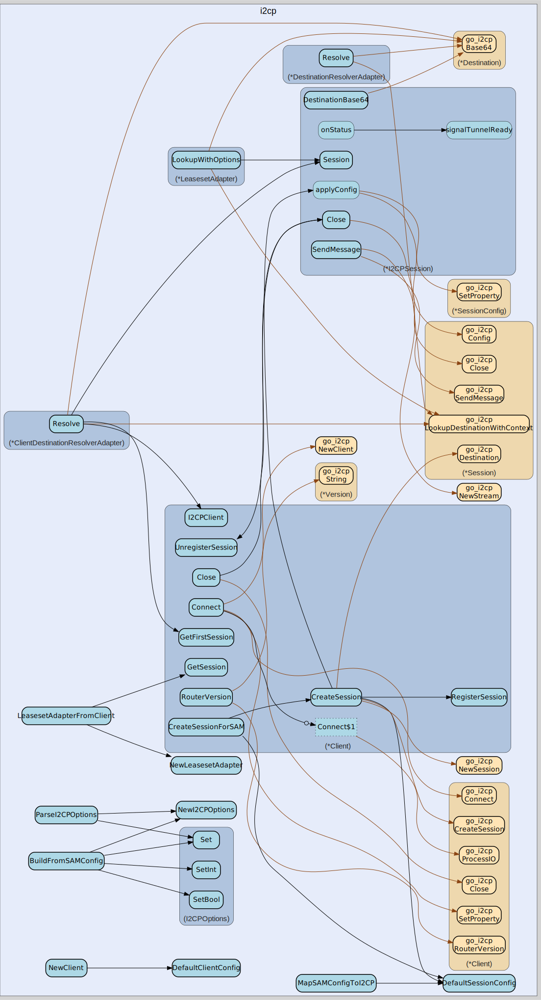

# i2cp
--
    import "github.com/go-i2p/go-sam-bridge/lib/i2cp"



Package i2cp provides I2CP client integration for the SAM bridge. This package
wraps the go-i2cp library to provide session management and tunnel operations
required by the SAM protocol.

The I2CP (I2P Control Protocol) is the low-level protocol used to communicate
with the I2P router for creating sessions, sending messages, and managing tunnel
lifecycles.

See PLAN.md section 1.7 for integration requirements. See SAMv3.md for how SAM
sessions map to I2CP sessions.

Package i2cp provides I2CP integration for the SAM bridge. This file implements
the leaseset lookup provider for NAMING LOOKUP OPTIONS=true support. ISSUE-011:
Implements LeasesetLookupProvider interface.

Package i2cp provides I2CP option mapping for the SAM bridge.

Package i2cp provides I2CP session management for the SAM bridge.

## Usage

```go
const DefaultLeasesetLookupTimeout = 30 * time.Second
```
DefaultLeasesetLookupTimeout is the default timeout for leaseset lookups.

#### func  EncryptionTypeName

```go
func EncryptionTypeName(encType int) string
```
EncryptionTypeName returns the human-readable name for an encryption type.

#### func  SignatureTypeName

```go
func SignatureTypeName(sigType int) string
```
SignatureTypeName returns the human-readable name for a signature type.

#### func  ValidateEncryptionType

```go
func ValidateEncryptionType(encType int) bool
```
ValidateEncryptionType returns true if the encryption type is valid.

#### func  ValidateSignatureType

```go
func ValidateSignatureType(sigType int) bool
```
ValidateSignatureType returns true if the signature type is valid.

#### type Client

```go
type Client struct {
}
```

Client wraps the go-i2cp client to provide a SAM-friendly interface. It manages
the connection to the I2P router and session lifecycle.

Thread-safety: All methods are safe for concurrent use. The Client maintains a
single connection to the I2P router and multiplexes all SAM sessions over it.

#### func  NewClient

```go
func NewClient(config *ClientConfig) *Client
```
NewClient creates a new I2CP client with the given configuration. The client is
not connected until Connect() is called.

Per PLAN.md section 1.7: The client wrapper provides connection to the I2P
router and session creation capabilities.

#### func (*Client) Close

```go
func (c *Client) Close() error
```
Close closes the connection to the I2P router and all sessions. Safe to call
multiple times.

#### func (*Client) Connect

```go
func (c *Client) Connect(ctx context.Context) error
```
Connect establishes a connection to the I2P router. This must be called before
creating any sessions.

The connection process:

    1. Parse router address and configure go-i2cp properties
    2. Create go-i2cp client with callbacks
    3. Establish TCP/TLS connection to router
    4. Start I2CP message processing

Returns an error if the connection fails or times out.

#### func (*Client) CreateSession

```go
func (c *Client) CreateSession(ctx context.Context, samSessionID string, config *SessionConfig) (*I2CPSession, error)
```
CreateSession creates a new I2CP session with the given configuration. This
allocates I2P tunnels and establishes the session with the router.

The creation process:

    1. Create go-i2cp Session with callbacks
    2. Apply configuration options (tunnels, crypto)
    3. Send CreateSession to router
    4. Wait for session confirmation

Returns the session or an error if creation fails.

#### func (*Client) CreateSessionForSAM

```go
func (c *Client) CreateSessionForSAM(ctx context.Context, samSessionID string, config *SessionConfigFromSession) (I2CPSessionHandleFromSession, error)
```
CreateSessionForSAM creates an I2CP session for a SAM session and returns a
handle implementing session.I2CPSessionHandle. This method satisfies the
session.I2CPSessionProvider interface.

ISSUE-003: Enables session handler to create I2CP sessions and wait for tunnels.

Per SAMv3.md: "the router builds tunnels before responding with SESSION STATUS.
This could take several seconds." Use the returned handle's WaitForTunnels() to
block until ready.

#### func (*Client) GetFirstSession

```go
func (c *Client) GetFirstSession() *I2CPSession
```
GetFirstSession returns any available I2CP session. This is useful for
operations like NAMING LOOKUP that need a session for I2CP queries but don't
require a specific session. Returns nil if no sessions are registered.

#### func (*Client) GetSession

```go
func (c *Client) GetSession(samSessionID string) *I2CPSession
```
GetSession returns the I2CP session for the given SAM session ID. Returns nil if
no session exists with that ID.

#### func (*Client) I2CPClient

```go
func (c *Client) I2CPClient() *go_i2cp.Client
```
I2CPClient returns the underlying go-i2cp client. This allows direct access for
advanced operations. Returns nil if not connected.

#### func (*Client) IsConnected

```go
func (c *Client) IsConnected() bool
```
IsConnected returns true if connected to the I2P router.

#### func (*Client) RegisterSession

```go
func (c *Client) RegisterSession(samSessionID string, sess *I2CPSession)
```
RegisterSession registers an I2CP session with a SAM session ID. This allows
looking up sessions by their SAM identifier.

#### func (*Client) RouterVersion

```go
func (c *Client) RouterVersion() string
```
RouterVersion returns the connected router's version string. Returns empty
string if not connected or version unknown.

#### func (*Client) SetCallbacks

```go
func (c *Client) SetCallbacks(callbacks *ClientCallbacks)
```
SetCallbacks sets the client callbacks. Should be called before Connect().

#### func (*Client) UnregisterSession

```go
func (c *Client) UnregisterSession(samSessionID string)
```
UnregisterSession removes an I2CP session registration.

#### type ClientCallbacks

```go
type ClientCallbacks struct {
	// OnConnected is called when the router connection is established.
	OnConnected func()

	// OnDisconnected is called when the router connection is lost.
	OnDisconnected func(err error)

	// OnRouterInfo is called when router info is received.
	OnRouterInfo func(version string)
}
```

ClientCallbacks holds callbacks for client-level events.

#### type ClientConfig

```go
type ClientConfig struct {
	// RouterAddr is the I2CP router address (default: 127.0.0.1:7654).
	RouterAddr string

	// Username is the optional I2CP username for authentication.
	Username string

	// Password is the optional I2CP password for authentication.
	Password string

	// TLSEnabled enables TLS for the I2CP connection.
	TLSEnabled bool

	// TLSInsecure allows insecure TLS connections (for testing).
	TLSInsecure bool

	// ConnectTimeout is the timeout for connecting to the router.
	ConnectTimeout time.Duration

	// SessionTimeout is the timeout for session creation.
	SessionTimeout time.Duration
}
```

ClientConfig holds configuration for connecting to the I2P router.

#### func  DefaultClientConfig

```go
func DefaultClientConfig() *ClientConfig
```
DefaultClientConfig returns a ClientConfig with sensible defaults. Uses standard
I2CP port 7654 on localhost.

#### type ClientDestinationResolverAdapter

```go
type ClientDestinationResolverAdapter struct {
}
```

ClientDestinationResolverAdapter implements handler.DestinationResolver using
the I2CP client. It uses the first available I2CP session for lookups, making it
suitable for global resolver use.

This adapter is useful for NAMING LOOKUP commands that may occur before or after
specific session creation.

#### func  NewClientDestinationResolverAdapter

```go
func NewClientDestinationResolverAdapter(client *Client, timeout time.Duration) (*ClientDestinationResolverAdapter, error)
```
NewClientDestinationResolverAdapter creates a DestinationResolver adapter using
the I2CP client.

#### func (*ClientDestinationResolverAdapter) Resolve

```go
func (a *ClientDestinationResolverAdapter) Resolve(ctx context.Context, name string) (string, error)
```
Resolve looks up an I2P destination by name using any available session.
Implements handler.DestinationResolver interface.

#### type DestinationResolverAdapter

```go
type DestinationResolverAdapter struct {
}
```

DestinationResolverAdapter implements handler.DestinationResolver using go-i2cp.
This adapter wraps go-i2cp's LookupDestination functionality for NAMING LOOKUP
commands.

Per SAMv3.md, NAMING LOOKUP should resolve:

    - .b32.i2p addresses (base32-encoded destination hashes)
    - .i2p hostnames (resolved via the I2P router's address book / network database)

#### func  NewDestinationResolverAdapter

```go
func NewDestinationResolverAdapter(session *go_i2cp.Session, timeout time.Duration) (*DestinationResolverAdapter, error)
```
NewDestinationResolverAdapter creates a DestinationResolver adapter for the
given session.

#### func (*DestinationResolverAdapter) Resolve

```go
func (a *DestinationResolverAdapter) Resolve(ctx context.Context, name string) (string, error)
```
Resolve looks up an I2P destination by name. Implements
handler.DestinationResolver interface.

The name can be:

    - A .b32.i2p address (e.g., "abcd...wxyz.b32.i2p")
    - A .i2p hostname (e.g., "example.i2p")

Returns the full Base64-encoded destination on success.

#### type I2CPOptions

```go
type I2CPOptions map[string]string
```

I2CPOptions represents a set of I2CP key-value options. These are sent to the
I2P router during session creation.

#### func  BuildFromSAMConfig

```go
func BuildFromSAMConfig(samConfig *session.SessionConfig) I2CPOptions
```
BuildFromSAMConfig builds I2CP options from a SAM session configuration. This is
used when creating I2CP sessions from SAM SESSION CREATE commands.

#### func  NewI2CPOptions

```go
func NewI2CPOptions() I2CPOptions
```
NewI2CPOptions creates an empty options map.

#### func  ParseI2CPOptions

```go
func ParseI2CPOptions(cmdOptions map[string]string) I2CPOptions
```
ParseI2CPOptions parses I2CP options from a SAM command's key-value pairs. This
extracts options that start with "i2cp." or are known tunnel options.

#### func (I2CPOptions) Get

```go
func (o I2CPOptions) Get(key string) string
```
Get returns an option value, or empty string if not set.

#### func (I2CPOptions) GetBool

```go
func (o I2CPOptions) GetBool(key string) bool
```
GetBool returns a boolean option value, or false if not set or invalid.

#### func (I2CPOptions) GetInt

```go
func (o I2CPOptions) GetInt(key string) int
```
GetInt returns an integer option value, or 0 if not set or invalid.

#### func (I2CPOptions) Set

```go
func (o I2CPOptions) Set(key, value string)
```
Set sets an option value.

#### func (I2CPOptions) SetBool

```go
func (o I2CPOptions) SetBool(key string, value bool)
```
SetBool sets a boolean option value.

#### func (I2CPOptions) SetInt

```go
func (o I2CPOptions) SetInt(key string, value int)
```
SetInt sets an integer option value.

#### type I2CPSession

```go
type I2CPSession struct {
}
```

I2CPSession wraps a go-i2cp Session to provide SAM-specific functionality. Each
SAM session maps to one I2CPSession which manages the underlying I2P tunnels and
destination.

Thread-safety: All methods are safe for concurrent use.

#### func (*I2CPSession) Close

```go
func (sess *I2CPSession) Close() error
```
Close closes the I2CP session and releases resources. Safe to call multiple
times.

#### func (*I2CPSession) Config

```go
func (sess *I2CPSession) Config() *SessionConfig
```
Config returns the session configuration.

#### func (*I2CPSession) Destination

```go
func (sess *I2CPSession) Destination() *go_i2cp.Destination
```
Destination returns the I2P destination for this session.

#### func (*I2CPSession) DestinationBase64

```go
func (sess *I2CPSession) DestinationBase64() string
```
DestinationBase64 returns the base64-encoded destination. Implements
session.I2CPSessionHandle interface.

#### func (*I2CPSession) IsActive

```go
func (sess *I2CPSession) IsActive() bool
```
IsActive returns true if the session is active.

#### func (*I2CPSession) IsTunnelReady

```go
func (sess *I2CPSession) IsTunnelReady() bool
```
IsTunnelReady returns true if tunnels are built and ready.

#### func (*I2CPSession) SAMSessionID

```go
func (sess *I2CPSession) SAMSessionID() string
```
SAMSessionID returns the SAM session identifier.

#### func (*I2CPSession) SendMessage

```go
func (sess *I2CPSession) SendMessage(dest *go_i2cp.Destination, protocol uint8, srcPort, destPort uint16, payload []byte, nonce uint32) error
```
SendMessage sends a message to a destination.

#### func (*I2CPSession) Session

```go
func (sess *I2CPSession) Session() *go_i2cp.Session
```
Session returns the underlying go-i2cp session. This allows direct access for
advanced operations.

#### func (*I2CPSession) SetCallbacks

```go
func (sess *I2CPSession) SetCallbacks(callbacks *SessionCallbacks)
```
SetCallbacks sets the session callbacks.

#### func (*I2CPSession) WaitForTunnels

```go
func (sess *I2CPSession) WaitForTunnels(ctx context.Context) error
```
WaitForTunnels blocks until tunnels are built or context is cancelled. Returns
nil when tunnels are ready, or context error on timeout/cancellation.

Per SAMv3.md: "the router builds tunnels before responding with SESSION STATUS.
This could take several seconds." ISSUE-003: Use this to block SESSION STATUS
response until tunnels are ready.

#### type I2CPSessionHandleFromSession

```go
type I2CPSessionHandleFromSession interface {
	WaitForTunnels(ctx context.Context) error
	IsTunnelReady() bool
	Close() error
	DestinationBase64() string
}
```

I2CPSessionHandleFromSession is an alias for the session.I2CPSessionHandle
interface. We define it here to avoid importing session package.

#### type LeasesetAdapter

```go
type LeasesetAdapter struct {
}
```

LeasesetAdapter implements handler.LeasesetLookupProvider using go-i2cp. This
adapter wraps go-i2cp destination lookup functionality and provides leaseset
options querying as specified in SAM API 0.9.66.

Note: Full leaseset options support requires go-i2cp to be extended with
leaseset query message support. Currently, only destination lookup is fully
implemented; leaseset options return an empty list.

ISSUE-011: Resolves NAMING LOOKUP OPTIONS=true integration.

#### func  LeasesetAdapterFromClient

```go
func LeasesetAdapterFromClient(client *Client, sessionID string) (*LeasesetAdapter, error)
```
LeasesetAdapterFromClient creates a LeasesetAdapter using the first available
session from the I2CP client. This is useful when you need leaseset lookups
without a specific session context.

#### func  NewLeasesetAdapter

```go
func NewLeasesetAdapter(session *I2CPSession) (*LeasesetAdapter, error)
```
NewLeasesetAdapter creates a new LeasesetAdapter for the given I2CP session. The
adapter uses the session's underlying go-i2cp session for destination lookups.

#### func (*LeasesetAdapter) LookupWithOptions

```go
func (a *LeasesetAdapter) LookupWithOptions(name string) (*handler.LeasesetLookupResult, error)
```
LookupWithOptions performs a leaseset lookup and returns options if available.
Implements handler.LeasesetLookupProvider interface.

Per SAM API 0.9.66, OPTIONS=true in NAMING LOOKUP should return leaseset options
with OPTION: prefix. The options include service records and other leaseset
metadata.

Current implementation:

    - Resolves the destination using go-i2cp's LookupDestination
    - Returns an empty options list (leaseset options querying not yet implemented in go-i2cp)

Future implementation (when go-i2cp supports leaseset queries):

    - Query the router for the destination's leaseset
    - Parse leaseset options/service records
    - Return options with their key-value pairs

#### func (*LeasesetAdapter) SetTimeout

```go
func (a *LeasesetAdapter) SetTimeout(timeout time.Duration)
```
SetTimeout sets the timeout for leaseset lookups.

#### type SessionCallbacks

```go
type SessionCallbacks struct {
	// OnCreated is called when the session is created and ready.
	OnCreated func(dest *go_i2cp.Destination)

	// OnDestroyed is called when the session is destroyed.
	OnDestroyed func()

	// OnMessage is called when a message is received.
	OnMessage func(srcDest *go_i2cp.Destination, protocol uint8, srcPort, destPort uint16, payload []byte)

	// OnMessageStatus is called with message delivery status.
	OnMessageStatus func(nonce uint32, status int)
}
```

SessionCallbacks holds callbacks for session-level events.

#### type SessionConfig

```go
type SessionConfig struct {
	// SignatureType is the signature algorithm (default: 7 = Ed25519).
	SignatureType int

	// EncryptionTypes specifies encryption algorithms (default: [4, 0]).
	EncryptionTypes []int

	// InboundQuantity is the number of inbound tunnels (default: 3).
	InboundQuantity int

	// OutboundQuantity is the number of outbound tunnels (default: 3).
	OutboundQuantity int

	// InboundLength is the number of hops for inbound tunnels (default: 3).
	InboundLength int

	// OutboundLength is the number of hops for outbound tunnels (default: 3).
	OutboundLength int

	// InboundBackupQuantity is the number of backup inbound tunnels.
	InboundBackupQuantity int

	// OutboundBackupQuantity is the number of backup outbound tunnels.
	OutboundBackupQuantity int

	// FastReceive enables fast receive mode.
	FastReceive bool

	// ReduceIdleTime enables tunnel reduction when idle (seconds, 0 = disabled).
	ReduceIdleTime int

	// CloseIdleTime closes session after idle (seconds, 0 = disabled).
	CloseIdleTime int

	// ExistingDestination is an existing private key to use.
	// If nil, a new transient destination is generated.
	ExistingDestination []byte
}
```

SessionConfig holds configuration for an I2CP session. These options map to SAM
SESSION CREATE options.

#### func  DefaultSessionConfig

```go
func DefaultSessionConfig() *SessionConfig
```
DefaultSessionConfig returns a SessionConfig with recommended defaults. Uses
Ed25519 signatures and ECIES-X25519 encryption per SAM best practices.

#### func  MapSAMConfigToI2CP

```go
func MapSAMConfigToI2CP(samConfig *session.SessionConfig) *SessionConfig
```
MapSAMConfigToI2CP converts a SAM SessionConfig to an I2CP SessionConfig. This
translates SAM protocol options to their I2CP equivalents.

Per PLAN.md section 1.7: Maps SAM session configuration to I2CP options format.

#### type SessionConfigFromSession

```go
type SessionConfigFromSession = struct {
	SignatureType          int
	EncryptionTypes        []int
	InboundQuantity        int
	OutboundQuantity       int
	InboundLength          int
	OutboundLength         int
	InboundBackupQuantity  int
	OutboundBackupQuantity int
	FastReceive            bool
	ReduceIdleTime         int
	CloseIdleTime          int
}
```

SessionConfigFromSession is an alias type for session package configs. We use
this to avoid importing session package and creating circular deps. The actual
conversion happens at the call site.


i2cp 

github.com/go-i2p/go-sam-bridge/lib/i2cp

[go-i2p template file](/template.md)
