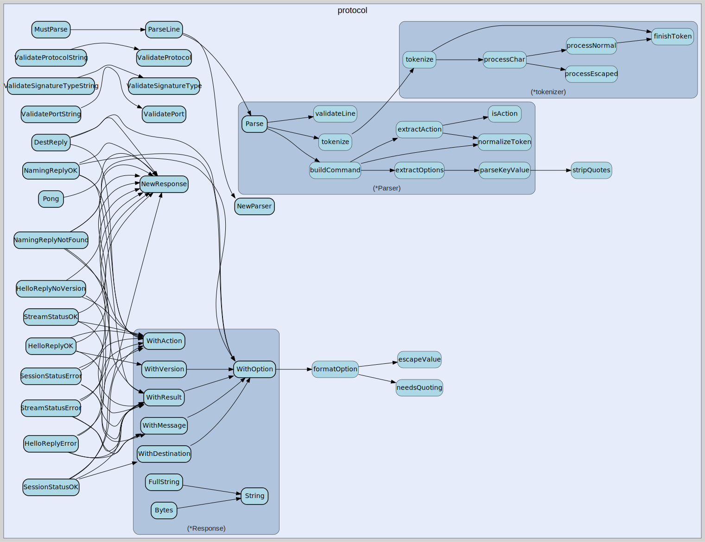

# protocol
--
    import "github.com/go-i2p/go-sam-bridge/lib/protocol"



Package protocol implements SAM v3.0-3.3 command parsing and response building.
See SAMv3.md for the complete protocol specification.

## Usage

```go
const (
	VerbHello    = "HELLO"
	VerbSession  = "SESSION"
	VerbStream   = "STREAM"
	VerbDatagram = "DATAGRAM"
	VerbRaw      = "RAW"
	VerbDest     = "DEST"
	VerbNaming   = "NAMING"
	VerbPing     = "PING"
	VerbPong     = "PONG"
	VerbAuth     = "AUTH"
	VerbQuit     = "QUIT"
	VerbStop     = "STOP"
	VerbExit     = "EXIT"
	VerbHelp     = "HELP"
)
```
SAM Protocol Verbs per SAM 3.0-3.3 specification.

```go
const (
	ActionVersion  = "VERSION"
	ActionReply    = "REPLY"
	ActionStatus   = "STATUS"
	ActionCreate   = "CREATE"
	ActionAdd      = "ADD"
	ActionRemove   = "REMOVE"
	ActionConnect  = "CONNECT"
	ActionAccept   = "ACCEPT"
	ActionForward  = "FORWARD"
	ActionSend     = "SEND"
	ActionReceived = "RECEIVED"
	ActionGenerate = "GENERATE"
	ActionLookup   = "LOOKUP"
	ActionEnable   = "ENABLE"
	ActionDisable  = "DISABLE"
)
```
SAM Protocol Actions per SAM 3.0-3.3 specification.

```go
const (
	ResultOK               = "OK"
	ResultAlreadyAccepting = "ALREADY_ACCEPTING"
	ResultCantReachPeer    = "CANT_REACH_PEER"
	ResultDuplicatedDest   = "DUPLICATED_DEST"
	ResultDuplicatedID     = "DUPLICATED_ID"
	ResultI2PError         = "I2P_ERROR"
	ResultInvalidKey       = "INVALID_KEY"
	ResultInvalidID        = "INVALID_ID"
	ResultKeyNotFound      = "KEY_NOT_FOUND"
	ResultPeerNotFound     = "PEER_NOT_FOUND"
	ResultTimeout          = "TIMEOUT"
	ResultNoVersion        = "NOVERSION"
	ResultLeasesetNotFound = "LEASESET_NOT_FOUND"
)
```
SAM Result Codes per SAM 3.0-3.3 specification. These are returned in the
RESULT= field of responses.

```go
const (
	StyleStream    = "STREAM"
	StyleDatagram  = "DATAGRAM"
	StyleRaw       = "RAW"
	StyleDatagram2 = "DATAGRAM2"
	StyleDatagram3 = "DATAGRAM3"
	StylePrimary   = "PRIMARY"
	StyleMaster    = "MASTER" // Deprecated, alias for PRIMARY (pre-0.9.47)
)
```
SAM Session Styles per SAM 3.0-3.3 specification.

```go
const (
	DefaultSAMPort      = 7656
	DefaultDatagramPort = 7655
	DefaultI2CPPort     = 7654
)
```
SAM Default Ports per SAM specification.

```go
const (
	MinPort = 0
	MaxPort = 65535
)
```
Port validation constants.

```go
const (
	MinProtocol        = 0
	MaxProtocol        = 255
	DefaultRawProtocol = 18
)
```
Protocol validation constants for RAW sessions.

```go
const (
	SigTypeDSA_SHA1          = 0 // Default (deprecated, do not use)
	SigTypeECDSA_SHA256_P256 = 1
	SigTypeECDSA_SHA384_P384 = 2
	SigTypeECDSA_SHA512_P521 = 3
	SigTypeRSA_SHA256_2048   = 4
	SigTypeRSA_SHA384_3072   = 5
	SigTypeRSA_SHA512_4096   = 6
	SigTypeEd25519           = 7 // Recommended
	SigTypeEd25519ph         = 8
)
```
Signature Types per I2P specification. All clients should use SigTypeEd25519 (7)
for new destinations.

```go
const (
	SAMVersionMin = "3.0"
	SAMVersionMax = "3.3"
)
```
SAM Version constants.

```go
const DefaultSignatureType = SigTypeEd25519
```
DefaultSignatureType is Ed25519 per SAM specification recommendation.

```go
const DefaultTunnelQuantity = 3
```
DefaultTunnelQuantity is the recommended tunnel count for balanced performance
between Java I2P (default 2) and i2pd (default 5).

```go
var (
	ErrEmptyCommand      = errors.New("empty command")
	ErrInvalidUTF8       = errors.New("command contains invalid UTF-8")
	ErrUnterminatedQuote = errors.New("unterminated quoted value")
	ErrInvalidEscape     = errors.New("invalid escape sequence")
)
```
Parser errors

```go
var (
	ErrPortOutOfRange       = errors.New("port out of range (0-65535)")
	ErrProtocolOutOfRange   = errors.New("protocol out of range (0-255)")
	ErrProtocolDisallowed   = errors.New("protocol is disallowed for RAW sessions")
	ErrInvalidSessionID     = errors.New("session ID contains invalid characters")
	ErrEmptySessionID       = errors.New("session ID cannot be empty")
	ErrInvalidSignatureType = errors.New("invalid signature type")
)
```
Validation errors

```go
var DefaultEncryptionTypes = []int{4, 0}
```
DefaultEncryptionTypes specifies ECIES-X25519 with ElGamal fallback. This
ensures compatibility with older routers while preferring modern crypto.

```go
var DisallowedRawProtocols = []int{6, 17, 19, 20}
```
DisallowedRawProtocols are I2CP protocols that cannot be used with RAW sessions
per SAMv3.md specification. These are reserved for TCP(6), UDP(17), and internal
I2P protocols (19, 20).

#### func  NormalizeStyle

```go
func NormalizeStyle(style string) string
```
NormalizeStyle normalizes a session style to uppercase and converts deprecated
MASTER to PRIMARY per SAM 3.3.

#### func  ParseBool

```go
func ParseBool(s string, defaultVal bool) (bool, error)
```
ParseBool parses a boolean option value. Accepts "true", "false", "1", "0"
(case-insensitive).

#### func  ParseEncryptionTypes

```go
func ParseEncryptionTypes(s string) ([]int, error)
```
ParseEncryptionTypes parses the i2cp.leaseSetEncType option. Format is
comma-separated integers (e.g., "4,0"). Returns the parsed types or default if
empty.

#### func  ParseTunnelQuantity

```go
func ParseTunnelQuantity(s string) (int, error)
```
ParseTunnelQuantity parses a tunnel quantity option. Returns default (3) if
empty.

#### func  ValidatePort

```go
func ValidatePort(port int) error
```
ValidatePort validates an I2CP port number. Valid range is 0-65535 per SAMv3.md.

#### func  ValidatePortString

```go
func ValidatePortString(s string) (int, error)
```
ValidatePortString validates and parses a port string. Returns the parsed port
or error.

#### func  ValidateProtocol

```go
func ValidateProtocol(protocol int) error
```
ValidateProtocol validates an I2CP protocol number for RAW sessions. Valid range
is 0-255, excluding disallowed protocols (6, 17, 19, 20).

#### func  ValidateProtocolString

```go
func ValidateProtocolString(s string) (int, error)
```
ValidateProtocolString validates and parses a protocol string. Returns the
parsed protocol or error. Empty string returns default (18).

#### func  ValidateSessionID

```go
func ValidateSessionID(id string) error
```
ValidateSessionID validates a SAM session ID (nickname). Session IDs cannot be
empty and cannot contain whitespace. Per SAM spec, IDs should be randomly
generated to prevent collisions.

#### func  ValidateSignatureType

```go
func ValidateSignatureType(sigType int) error
```
ValidateSignatureType validates a signature type number. Valid values are 0-8
per I2P specification.

#### func  ValidateSignatureTypeString

```go
func ValidateSignatureTypeString(s string) (int, error)
```
ValidateSignatureTypeString validates and parses a signature type string.
Returns the parsed type or error. Empty string returns default (Ed25519/7).

#### func  ValidateStyle

```go
func ValidateStyle(style string) error
```
ValidateStyle validates a SAM session style. Valid styles: STREAM, DATAGRAM,
RAW, DATAGRAM2, DATAGRAM3, PRIMARY, MASTER.

#### func  VersionSupportsPortInfo

```go
func VersionSupportsPortInfo(version string) bool
```
VersionSupportsPortInfo returns true if the given SAM version supports
FROM_PORT/TO_PORT in received datagrams. Per SAMv3.md, port info is only
included in DATAGRAM RECEIVED and RAW RECEIVED for SAM 3.2 or higher.

#### type Command

```go
type Command struct {
	// Verb is the primary command (e.g., "HELLO", "SESSION", "STREAM").
	Verb string

	// Action is the secondary command (e.g., "VERSION", "CREATE", "CONNECT").
	// May be empty for commands like PING per SAM 3.2.
	Action string

	// Options contains key-value pairs from the command.
	// Keys are case-sensitive per SAM specification.
	// Empty values are allowed per SAM 3.2 (KEY, KEY=, KEY="").
	Options map[string]string

	// Payload contains binary data following the command line.
	// Used by RAW SEND, DATAGRAM SEND commands per SAMv3.md.
	// The payload size is specified in the SIZE option.
	Payload []byte

	// Raw is the original command line for debugging and logging.
	Raw string
}
```

Command represents a parsed SAM protocol command. Per SAMv3.md, commands follow
the format:

    VERB [ACTION] [KEY=VALUE]...

All SAM messages are sent on a single line terminated by newline. For commands
with binary payloads (e.g., RAW SEND, DATAGRAM SEND), the payload follows the
command line.

#### func  MustParse

```go
func MustParse(line string) *Command
```
MustParse parses a line and panics on error. For testing only.

#### func  NewCommand

```go
func NewCommand(verb, action string) *Command
```
NewCommand creates a new Command with initialized Options map.

#### func  ParseLine

```go
func ParseLine(line string) (*Command, error)
```
ParseLine is a convenience function that parses a line using default settings.

#### func (*Command) Get

```go
func (c *Command) Get(key string) string
```
Get returns an option value, or empty string if not present. Use Has() to
distinguish between missing keys and empty values.

#### func (*Command) GetOrDefault

```go
func (c *Command) GetOrDefault(key, defaultVal string) string
```
GetOrDefault returns an option value, or the default if not present. Note: If
the key is present but empty, the empty value is returned, not the default. Use
Has() to check for key presence.

#### func (*Command) Has

```go
func (c *Command) Has(key string) bool
```
Has returns true if the option key is present (even if empty). Per SAM 3.2,
empty option values such as KEY, KEY=, or KEY="" may be allowed, implementation
dependent.

#### func (*Command) Set

```go
func (c *Command) Set(key, value string)
```
Set adds or updates an option value.

#### type Parser

```go
type Parser struct {
	// CaseInsensitive enables case-insensitive verb/action matching.
	// Per SAM spec, this is recommended but not required.
	CaseInsensitive bool
}
```

Parser tokenizes SAM protocol commands. Per SAMv3.md, commands follow the
format:

    VERB [ACTION] [KEY=VALUE]...

Parser handles UTF-8 encoding (SAM 3.2+), quoted values with escapes, and empty
option values.

#### func  NewParser

```go
func NewParser() *Parser
```
NewParser creates a new parser with default settings. Case-insensitive matching
is enabled by default per SAM spec recommendation.

#### func (*Parser) Parse

```go
func (p *Parser) Parse(line string) (*Command, error)
```
Parse parses a SAM command line into a Command struct. The input should be a
single line without the trailing newline.

#### type Response

```go
type Response struct {
	Verb    string
	Action  string
	Options []string // Pre-formatted KEY=VALUE pairs

	// AdditionalLines are sent after the main response line.
	// Used for STREAM ACCEPT which sends destination info on a separate line.
	// Each additional line is sent as-is with newline terminator.
	AdditionalLines []string
}
```

Response builds SAM protocol responses. Per SAMv3.md, responses follow the
format:

    VERB [ACTION] [KEY=VALUE]...

All responses are terminated by a newline character. Some responses (like STREAM
ACCEPT) may include additional lines that must be sent after the main response
(e.g., destination info).

#### func  DestReply

```go
func DestReply(publicKey, privateKey string) *Response
```
DestReply creates a DEST REPLY response with public and private keys.

#### func  HelloReplyError

```go
func HelloReplyError(message string) *Response
```
HelloReplyError creates a HELLO REPLY with I2P_ERROR result and message.

#### func  HelloReplyNoVersion

```go
func HelloReplyNoVersion() *Response
```
HelloReplyNoVersion creates a HELLO REPLY with NOVERSION result.

#### func  HelloReplyOK

```go
func HelloReplyOK(version string) *Response
```
HelloReplyOK creates a successful HELLO REPLY response with version.

#### func  NamingReplyNotFound

```go
func NamingReplyNotFound(name string) *Response
```
NamingReplyNotFound creates a NAMING REPLY KEY_NOT_FOUND response.

#### func  NamingReplyOK

```go
func NamingReplyOK(name, value string) *Response
```
NamingReplyOK creates a successful NAMING REPLY response.

#### func  NewResponse

```go
func NewResponse(verb string) *Response
```
NewResponse creates a new response builder with the given verb.

#### func  Pong

```go
func Pong(data string) *Response
```
Pong creates a PONG response with the original ping data.

#### func  SessionStatusError

```go
func SessionStatusError(result, message string) *Response
```
SessionStatusError creates a SESSION STATUS error response.

#### func  SessionStatusOK

```go
func SessionStatusOK(destination string) *Response
```
SessionStatusOK creates a successful SESSION STATUS response.

#### func  StreamStatusError

```go
func StreamStatusError(result, message string) *Response
```
StreamStatusError creates a STREAM STATUS error response.

#### func  StreamStatusOK

```go
func StreamStatusOK() *Response
```
StreamStatusOK creates a successful STREAM STATUS response.

#### func (*Response) Bytes

```go
func (r *Response) Bytes() []byte
```
Bytes returns the response as a byte slice for writing to connections.

#### func (*Response) FullString

```go
func (r *Response) FullString() string
```
FullString returns the complete response including all additional lines. Each
line is terminated with a newline.

#### func (*Response) HasAdditionalLines

```go
func (r *Response) HasAdditionalLines() bool
```
HasAdditionalLines returns true if the response has additional lines to send.

#### func (*Response) String

```go
func (r *Response) String() string
```
String formats the response as a SAM protocol line with newline terminator.
Note: This only returns the main response line. Use FullString() to get all
lines including additional lines.

#### func (*Response) WithAction

```go
func (r *Response) WithAction(action string) *Response
```
WithAction sets the response action (e.g., REPLY, STATUS).

#### func (*Response) WithAdditionalLine

```go
func (r *Response) WithAdditionalLine(line string) *Response
```
WithAdditionalLine adds an additional line to be sent after the main response.
Used for STREAM ACCEPT which sends destination info on a separate line. The line
should NOT include a trailing newline; it will be added automatically.

#### func (*Response) WithDestination

```go
func (r *Response) WithDestination(dest string) *Response
```
WithDestination adds the DESTINATION option with a Base64 destination.

#### func (*Response) WithMessage

```go
func (r *Response) WithMessage(msg string) *Response
```
WithMessage adds the MESSAGE option, typically used with error responses. The
message is automatically quoted if it contains spaces.

#### func (*Response) WithOption

```go
func (r *Response) WithOption(key, value string) *Response
```
WithOption adds a key-value option to the response. Values containing spaces,
quotes, or backslashes are automatically quoted.

#### func (*Response) WithResult

```go
func (r *Response) WithResult(result string) *Response
```
WithResult adds the RESULT option with the given result code. Common result
codes: OK, I2P_ERROR, DUPLICATED_ID, etc.

#### func (*Response) WithVersion

```go
func (r *Response) WithVersion(version string) *Response
```
WithVersion adds the VERSION option.


protocol 

github.com/go-i2p/go-sam-bridge/lib/protocol

[go-i2p template file](/template.md)
