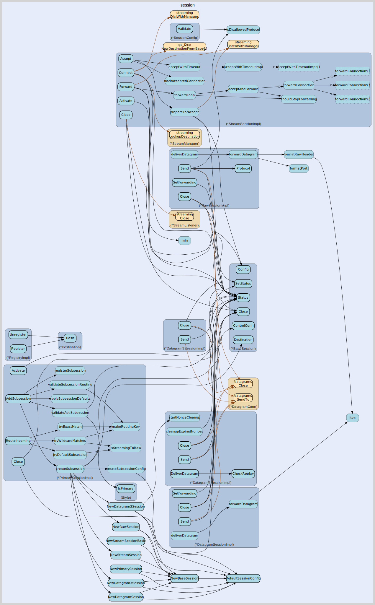

# session
--
    import "github.com/go-i2p/go-sam-bridge/lib/session"



Package session implements SAM v3.0-3.3 session management.

Package session implements SAM v3.0-3.3 session management.

Package session implements SAM v3.0-3.3 session management. This file implements
DatagramSessionImpl for DATAGRAM session handling per SAM 3.0 DATAGRAM
SEND/RECEIVED commands for repliable authenticated datagrams.

Package session implements SAM v3.0-3.3 session management. This file implements
Datagram2SessionImpl for DATAGRAM2 session handling per SAM 3.3 specification
for authenticated, repliable datagrams with replay protection and offline
signature support.

Package session implements SAM v3.0-3.3 session management. This file implements
Datagram3SessionImpl for DATAGRAM3 session handling per SAM 3.3 specification
for repliable but unauthenticated datagrams with hash-based source
identification.

Package session implements SAM v3.0-3.3 session management.

Package session implements SAM v3.0-3.3 session management. This file implements
PrimarySessionImpl for PRIMARY/MASTER session handling per SAM 3.3 specification
for multiplexed subsession support.

Package session implements SAM v3.0-3.3 session management. This file implements
RawSessionImpl for RAW session handling per SAM 3.1 RAW SEND/RECEIVED commands
for anonymous datagrams.

Package session implements SAM v3.0-3.3 session management.

Package session implements SAM v3.0-3.3 session management. Sessions are
long-lived entities that represent I2P destinations and provide communication
capabilities (STREAM, DATAGRAM, RAW, PRIMARY). See SAMv3.md for the complete
protocol specification.

Package session implements SAM v3.0-3.3 session management. This file implements
StreamSessionImpl for STREAM session handling per SAM 3.0 STREAM CONNECT,
ACCEPT, FORWARD commands.

## Usage

```go
const (
	// DefaultSignatureType is Ed25519 per SAM specification.
	DefaultSignatureType = 7

	// DefaultTunnelQuantity is balanced for Java I2P (2) and i2pd (5).
	DefaultTunnelQuantity = 3

	// DefaultTunnelLength provides reasonable anonymity.
	DefaultTunnelLength = 3

	// DefaultRawProtocol is 18 per SAMv3.md specification.
	DefaultRawProtocol = 18
)
```
Default values for session configuration.

```go
const Datagram3Base32HashSize = 52
```
Datagram3Base32HashSize is the base32-encoded size of a DATAGRAM3 source hash
(52 chars).

```go
const Datagram3Base64HashSize = 44
```
Datagram3Base64HashSize is the base64-encoded size of a DATAGRAM3 source hash
(44 bytes).

```go
const Datagram3HashSize = 32
```
Datagram3HashSize is the binary size of a DATAGRAM3 source hash (32 bytes).

```go
const DefaultDatagram2NonceExpiry = 10 * time.Minute
```
DefaultDatagram2NonceExpiry is the default time to keep nonces for replay
protection. Nonces older than this are cleaned up to prevent unbounded memory
growth.

```go
const ForwardConnectTimeout = 3 * time.Second
```
ForwardConnectTimeout is the maximum time allowed to connect to the forwarding
target when an incoming I2P connection arrives. Per SAMv3.md: "If it is accepted
in less than 3 seconds, SAM will accept the connection from I2P, otherwise it
rejects it."

```go
const MaxDatagram2Size = 31744
```
MaxDatagram2Size is the maximum payload size for DATAGRAM2. Same as DATAGRAM -
~31KB for reliability per SAM specification.

```go
const MaxDatagram3Size = 31744
```
MaxDatagram3Size is the maximum payload size for DATAGRAM3. Same as
DATAGRAM/DATAGRAM2 - ~31KB for reliability per SAM specification.

```go
const MaxDatagramSize = 31744
```
MaxDatagramSize is the maximum size for repliable datagrams per SAM
specification. Repliable datagrams can be up to 31744 bytes due to signature
overhead. For reliability, staying under 11KB is recommended.

```go
const MaxRawDatagramSize = 32768
```
MaxRawDatagramSize is the maximum size for raw datagrams per SAM specification.
Raw datagrams can be up to 32768 bytes, but 11KB is recommended for reliability.

```go
var (
	// ErrDatagram2SendNotImplemented indicates DATAGRAM2 SEND is not available
	// because no DatagramConn has been configured. The DatagramConn must be set
	// via SetDatagramConn() after the I2CP session is established.
	ErrDatagram2SendNotImplemented = errors.New("DATAGRAM2 SEND not available: DatagramConn not configured")

	// ErrEmptyPayload indicates the datagram payload is empty.
	ErrEmptyPayload = errors.New("datagram payload cannot be empty")

	// ErrPayloadTooLarge indicates the datagram payload exceeds maximum size.
	ErrPayloadTooLarge = errors.New("datagram payload exceeds maximum size")

	// ErrInvalidForwardingPort indicates an invalid forwarding port.
	ErrInvalidForwardingPort = errors.New("forwarding port must be 1-65535")
)
```
Error definitions for Datagram2Session.

```go
var (
	// ErrDatagram3SendNotImplemented indicates DATAGRAM3 SEND is not available
	// because no DatagramConn has been configured. The DatagramConn must be set
	// via SetDatagramConn() after the I2CP session is established.
	ErrDatagram3SendNotImplemented = errors.New("DATAGRAM3 SEND not available: DatagramConn not configured")

	// ErrInvalidHashLength indicates the hash is not the expected 44-byte base64 size.
	ErrInvalidHashLength = errors.New("invalid hash length: expected 44-byte base64 (32 bytes binary)")

	// ErrInvalidHashFormat indicates the hash could not be base64-decoded.
	ErrInvalidHashFormat = errors.New("invalid hash format: not valid base64")
)
```
Error definitions for Datagram3Session.

```go
var (
	// ErrInvalidPort indicates a port number is out of valid range (0-65535).
	ErrInvalidPort = errors.New("invalid port: must be 0-65535")

	// ErrInvalidProtocol indicates a protocol number is invalid.
	// For RAW sessions, protocols 6, 17, 19, 20 are disallowed.
	ErrInvalidProtocol = errors.New("invalid protocol: disallowed or out of range")

	// ErrInvalidTunnelConfig indicates tunnel configuration is invalid.
	ErrInvalidTunnelConfig = errors.New("invalid tunnel configuration")

	// ErrForwardActive indicates FORWARD is already active on the session.
	ErrForwardActive = errors.New("forward already active")

	// ErrAcceptActive indicates ACCEPT is already active on the session.
	ErrAcceptActive = errors.New("accept already active")

	// ErrSubsessionNotFound indicates a subsession was not found.
	ErrSubsessionNotFound = errors.New("subsession not found")

	// ErrNotPrimarySession indicates the operation requires a PRIMARY session.
	ErrNotPrimarySession = errors.New("operation requires PRIMARY session")

	// ErrSessionNotActive indicates the session is not in active state.
	ErrSessionNotActive = errors.New("session not active")
)
```
Session configuration validation errors.

```go
var (
	// ErrDuplicateSubsessionID indicates the subsession ID already exists.
	ErrDuplicateSubsessionID = fmt.Errorf("duplicate subsession ID")

	// ErrInvalidSubsessionStyle indicates an invalid style for subsession.
	ErrInvalidSubsessionStyle = fmt.Errorf("invalid subsession style: PRIMARY/MASTER not allowed")

	// ErrProtocol6Disallowed indicates LISTEN_PROTOCOL=6 is invalid for RAW.
	ErrProtocol6Disallowed = fmt.Errorf("LISTEN_PROTOCOL=6 (streaming) is disallowed for RAW subsessions")

	// ErrRoutingConflict indicates a LISTEN_PORT/LISTEN_PROTOCOL conflict.
	ErrRoutingConflict = fmt.Errorf("routing conflict: duplicate LISTEN_PORT/LISTEN_PROTOCOL")
)
```
Error definitions for PrimarySession.

```go
var DefaultEncryptionTypes = []int{4, 0}
```
DefaultEncryptionTypes specifies ECIES-X25519 with ElGamal fallback.

```go
var ErrDatagramSendNotImplemented = errors.New("DATAGRAM SEND not available: DatagramConn not configured")
```
ErrDatagramSendNotImplemented indicates DATAGRAM SEND is not available because
no DatagramConn has been configured. The DatagramConn must be set via
SetDatagramConn() after the I2CP session is established.

```go
var ErrRawSendNotImplemented = errors.New("RAW send not available: no DatagramConn configured - call SetDatagramConn()")
```
ErrRawSendNotImplemented indicates RAW SEND is not available. This error is
returned when Send() is called without a DatagramConn configured.

#### func  HashToB32Address

```go
func HashToB32Address(hash string) (string, error)
```
HashToB32Address converts a 44-byte base64-encoded hash (as received in
DATAGRAM3) to a .b32.i2p address suitable for NAMING LOOKUP.

Per SAMv3.md DATAGRAM3 specification:

    1. base64-decode the 44-byte string to 32 bytes binary
    2. base32-encode to 52 characters (lowercase, no padding)
    3. Append ".b32.i2p" suffix

Example:

    hash := "AAAAAAAAAAAAAAAAAAAAAAAAAAAAAAAAAAAAAAAAAAA="
    addr, err := HashToB32Address(hash)
    // addr = "aaaaaaaaaaaaaaaaaaaaaaaaaaaaaaaaaaaaaaaaaaaaaaaaaaaa.b32.i2p"

This address can then be used with NAMING LOOKUP to obtain the full destination
for replying to the datagram sender.

Returns error if:

    - Hash is not exactly 44 bytes
    - Hash cannot be base64-decoded
    - Decoded hash is not exactly 32 bytes

#### func  ValidateHash

```go
func ValidateHash(hash string) bool
```
ValidateHash checks if a string is a valid 44-byte base64-encoded hash as used
in DATAGRAM3 source identification.

Returns true if the hash:

    - Is exactly 44 bytes long
    - Can be base64-decoded to exactly 32 bytes

#### type AcceptOptions

```go
type AcceptOptions struct {
	// Silent suppresses the response confirmation if true.
	Silent bool
	// Timeout specifies the accept timeout duration.
	Timeout time.Duration
}
```

AcceptOptions holds options for STREAM ACCEPT operations. See SAMv3.md STREAM
ACCEPT command for details.

#### type BaseSession

```go
type BaseSession struct {
}
```

BaseSession provides common functionality for all session types. All session
implementations must embed *BaseSession per project guidelines. BaseSession is
thread-safe with RWMutex protection for all field access.

#### func  NewBaseSession

```go
func NewBaseSession(id string, style Style, dest *Destination, conn net.Conn, cfg *SessionConfig) *BaseSession
```
NewBaseSession creates a new BaseSession with the given parameters. The session
starts in StatusCreating state.

#### func (*BaseSession) Activate

```go
func (b *BaseSession) Activate() bool
```
Activate transitions the session from Creating to Active status. Returns false
if the session is not in Creating status.

#### func (*BaseSession) Close

```go
func (b *BaseSession) Close() error
```
Close terminates the session and releases all resources. Close is safe to call
multiple times; subsequent calls are no-ops. Implements the Session interface
Close method.

#### func (*BaseSession) Config

```go
func (b *BaseSession) Config() *SessionConfig
```
Config returns the session configuration.

#### func (*BaseSession) ControlConn

```go
func (b *BaseSession) ControlConn() net.Conn
```
ControlConn returns the control socket associated with this session. Session
dies when this socket closes per SAMv3.md.

#### func (*BaseSession) Destination

```go
func (b *BaseSession) Destination() *Destination
```
Destination returns the I2P destination associated with this session.

#### func (*BaseSession) I2CPSession

```go
func (b *BaseSession) I2CPSession() I2CPSessionHandle
```
I2CPSession returns the I2CP session handle, if set.

#### func (*BaseSession) ID

```go
func (b *BaseSession) ID() string
```
ID returns the unique session identifier (nickname). Session IDs must be
globally unique per SAMv3.md.

#### func (*BaseSession) IsActive

```go
func (b *BaseSession) IsActive() bool
```
IsActive returns true if the session is currently active.

#### func (*BaseSession) IsClosed

```go
func (b *BaseSession) IsClosed() bool
```
IsClosed returns true if the session has been closed.

#### func (*BaseSession) SetDestination

```go
func (b *BaseSession) SetDestination(dest *Destination)
```
SetDestination updates the session destination. This is used after key
generation during session creation.

#### func (*BaseSession) SetI2CPSession

```go
func (b *BaseSession) SetI2CPSession(i2cp I2CPSessionHandle)
```
SetI2CPSession sets the I2CP session handle. ISSUE-003: Allows handler to
associate I2CP session with SAM session.

#### func (*BaseSession) SetStatus

```go
func (b *BaseSession) SetStatus(s Status)
```
SetStatus updates the session status. This is used internally during session
lifecycle transitions.

#### func (*BaseSession) Status

```go
func (b *BaseSession) Status() Status
```
Status returns the current session status.

#### func (*BaseSession) Style

```go
func (b *BaseSession) Style() Style
```
Style returns the session style (STREAM, DATAGRAM, RAW, PRIMARY, etc.).

#### func (*BaseSession) WaitForTunnels

```go
func (b *BaseSession) WaitForTunnels(ctx context.Context) error
```
WaitForTunnels blocks until tunnels are built or context is cancelled. Per
SAMv3.md: "the router builds tunnels before responding with SESSION STATUS. This
could take several seconds." ISSUE-003: Use this to block SESSION STATUS
response until tunnels are ready. Returns nil immediately if no I2CP session is
set.

#### type ConnectOptions

```go
type ConnectOptions struct {
	// FromPort overrides session default source port (SAM 3.2+).
	FromPort int
	// ToPort overrides session default destination port (SAM 3.2+).
	ToPort int
	// Silent suppresses the response confirmation if true.
	Silent bool
	// Timeout specifies the connection timeout duration.
	Timeout time.Duration
}
```

ConnectOptions holds options for STREAM CONNECT operations. See SAMv3.md STREAM
CONNECT command for details.

#### type Datagram2SessionImpl

```go
type Datagram2SessionImpl struct {
	*BaseSession
}
```

Datagram2SessionImpl implements the DatagramSession interface for DATAGRAM2
style. It embeds *BaseSession and provides enhanced datagram functionality.

Per SAMv3.md and PLAN.md Phase 5:

    - Authenticated and repliable datagrams (like DATAGRAM)
    - Replay protection via nonce/timestamp tracking
    - Offline signature support for offline-signed destinations
    - Same SAM API as DATAGRAM - only I2CP format differs

DATAGRAM2 is intended to replace repliable datagrams for new applications that
don't require backward compatibility. The main advantages are:

    - Replay protection not present in DATAGRAM
    - Offline signature support (DATAGRAM does not support this)

#### func  NewDatagram2Session

```go
func NewDatagram2Session(
	id string,
	dest *Destination,
	conn net.Conn,
	cfg *SessionConfig,
) *Datagram2SessionImpl
```
NewDatagram2Session creates a new DATAGRAM2 session for authenticated, repliable
datagrams with replay protection.

Parameters:

    - id: Unique session identifier (nickname)
    - dest: I2P destination for this session
    - conn: Control connection (session dies when this closes)
    - cfg: Session configuration (port settings, etc.)

Per SAM specification, the session starts in Creating state and must be
activated after setup completes.

#### func (*Datagram2SessionImpl) CheckReplay

```go
func (d *Datagram2SessionImpl) CheckReplay(nonce uint64) bool
```
CheckReplay checks if a nonce has been seen before (replay attack). Returns true
if the nonce is a replay (should be rejected).

Per SAMv3.md, DATAGRAM2 provides replay protection not present in DATAGRAM.

#### func (*Datagram2SessionImpl) Close

```go
func (d *Datagram2SessionImpl) Close() error
```
Close terminates the session and releases all resources. Safe to call multiple
times.

#### func (*Datagram2SessionImpl) DatagramConn

```go
func (d *Datagram2SessionImpl) DatagramConn() *datagrams.DatagramConn
```
DatagramConn returns the go-datagrams connection, or nil if not configured.

#### func (*Datagram2SessionImpl) DeliverDatagram

```go
func (d *Datagram2SessionImpl) DeliverDatagram(dg ReceivedDatagram, nonce uint64) bool
```
DeliverDatagram handles an incoming datagram, checking for replay and delivering
to the receive channel or forwarding address.

Parameters:

    - dg: The received datagram
    - nonce: The nonce from the datagram (for replay protection)

Returns true if the datagram was delivered, false if it was a replay.

#### func (*Datagram2SessionImpl) ForwardingAddr

```go
func (d *Datagram2SessionImpl) ForwardingAddr() net.Addr
```
ForwardingAddr returns the UDP address for forwarding, if configured. Implements
DatagramSession.ForwardingAddr.

#### func (*Datagram2SessionImpl) IsForwarding

```go
func (d *Datagram2SessionImpl) IsForwarding() bool
```
IsForwarding returns true if forwarding is configured.

#### func (*Datagram2SessionImpl) OfflineSignature

```go
func (d *Datagram2SessionImpl) OfflineSignature() []byte
```
OfflineSignature returns the offline signature data, or nil if not set.

#### func (*Datagram2SessionImpl) Receive

```go
func (d *Datagram2SessionImpl) Receive() <-chan ReceivedDatagram
```
Receive returns a channel for incoming datagrams. Implements
DatagramSession.Receive.

Each received datagram includes source destination, ports, and data. Datagrams
with replayed nonces are automatically discarded.

#### func (*Datagram2SessionImpl) Send

```go
func (d *Datagram2SessionImpl) Send(dest string, data []byte, opts DatagramSendOptions) error
```
Send transmits an authenticated, repliable datagram to the specified
destination. Implements DatagramSession.Send per SAM specification.

Parameters:

    - dest: Base64-encoded I2P destination or .i2p hostname
    - data: Datagram payload (minimum 1 byte, max MaxDatagram2Size)
    - opts: Send options (FromPort, ToPort)

Returns error if:

    - Session is not active
    - Data is empty or too large
    - Destination lookup fails
    - Send operation fails

Note: From a SAM perspective, DATAGRAM2 SEND is identical to DATAGRAM SEND. The
difference is in the underlying I2CP format which includes a nonce for replay
protection and supports offline signatures.

#### func (*Datagram2SessionImpl) SetDatagramConn

```go
func (d *Datagram2SessionImpl) SetDatagramConn(conn *datagrams.DatagramConn)
```
SetDatagramConn sets the go-datagrams connection for sending datagrams. This
should be called during session setup after the I2CP session is established. The
DatagramConn should be created with ProtocolDatagram2 for DATAGRAM2 sessions.

#### func (*Datagram2SessionImpl) SetForwarding

```go
func (d *Datagram2SessionImpl) SetForwarding(host string, port int) error
```
SetForwarding configures incoming datagram forwarding to host:port. When
forwarding is set, incoming datagrams are sent to the specified UDP address
instead of being delivered to the Receive() channel.

Parameters:

    - host: Target hostname (default "127.0.0.1" if empty)
    - port: Target port (must be 1-65535)

Returns error if port is invalid.

#### func (*Datagram2SessionImpl) SetOfflineSignature

```go
func (d *Datagram2SessionImpl) SetOfflineSignature(sig []byte)
```
SetOfflineSignature sets the offline signature data for this session. Offline
signatures allow transient keys while keeping long-term identity keys offline.

Per SAMv3.md, DATAGRAM2 supports offline signatures (DATAGRAM does not).

#### type Datagram3SessionImpl

```go
type Datagram3SessionImpl struct {
	*BaseSession
}
```

Datagram3SessionImpl implements the DatagramSession interface for DATAGRAM3
style. It embeds *BaseSession and provides repliable but unauthenticated
datagram functionality.

Per SAMv3.md and PLAN.md Phase 5:

    - Repliable but NOT authenticated (unlike DATAGRAM/DATAGRAM2)
    - Source is a 32-byte hash, not a full destination
    - Delivered to client as 44-byte base64 hash
    - Client must do NAMING LOOKUP to get full destination for reply
    - No replay protection (unauthenticated)

Security Note: Application designers should use extreme caution and consider the
security implications of unauthenticated datagrams. DATAGRAM3 is suitable for
scenarios where authentication is not required or handled at application layer.

To reply to a DATAGRAM3 source:

    1. Receive the 44-byte base64 hash from SAM server
    2. base64-decode to 32 bytes binary
    3. base32-encode to 52 characters (lowercase, no padding)
    4. Append ".b32.i2p" suffix
    5. Use NAMING LOOKUP to get the full destination
    6. Cache the result to avoid repeated lookups

#### func  NewDatagram3Session

```go
func NewDatagram3Session(
	id string,
	dest *Destination,
	conn net.Conn,
	cfg *SessionConfig,
) *Datagram3SessionImpl
```
NewDatagram3Session creates a new DATAGRAM3 session for repliable but
unauthenticated datagrams with hash-based source identification.

Parameters:

    - id: Unique session identifier (nickname)
    - dest: I2P destination for this session
    - conn: Control connection (session dies when this closes)
    - cfg: Session configuration (port settings, etc.)

Per SAM specification, the session starts in Creating state and must be
activated after setup completes.

Unlike DATAGRAM2, DATAGRAM3 does not support:

    - Replay protection (unauthenticated)
    - Offline signatures

#### func (*Datagram3SessionImpl) Close

```go
func (d *Datagram3SessionImpl) Close() error
```
Close terminates the session and releases all resources. Safe to call multiple
times.

#### func (*Datagram3SessionImpl) DatagramConn

```go
func (d *Datagram3SessionImpl) DatagramConn() *datagrams.DatagramConn
```
DatagramConn returns the go-datagrams connection, or nil if not configured.

#### func (*Datagram3SessionImpl) DeliverDatagram

```go
func (d *Datagram3SessionImpl) DeliverDatagram(dg ReceivedDatagram) bool
```
DeliverDatagram handles an incoming datagram and delivers it to the receive
channel or forwarding address.

Unlike DATAGRAM2, no replay protection is performed (unauthenticated).

Parameters:

    - dg: The received datagram (Source is 44-byte base64 hash)

Returns true if the datagram was delivered, false if channel was full.

#### func (*Datagram3SessionImpl) ForwardingAddr

```go
func (d *Datagram3SessionImpl) ForwardingAddr() net.Addr
```
ForwardingAddr returns the UDP address for forwarding, if configured. Implements
DatagramSession.ForwardingAddr.

#### func (*Datagram3SessionImpl) IsForwarding

```go
func (d *Datagram3SessionImpl) IsForwarding() bool
```
IsForwarding returns true if forwarding is configured.

#### func (*Datagram3SessionImpl) Receive

```go
func (d *Datagram3SessionImpl) Receive() <-chan ReceivedDatagram
```
Receive returns a channel for incoming datagrams. Implements
DatagramSession.Receive.

Each received datagram includes source (as 44-byte base64 hash), ports, and
data. Unlike DATAGRAM/DATAGRAM2, the Source field is a 44-byte base64-encoded
hash, not a full destination. Use HashToB32Address to convert for NAMING LOOKUP.

#### func (*Datagram3SessionImpl) Send

```go
func (d *Datagram3SessionImpl) Send(dest string, data []byte, opts DatagramSendOptions) error
```
Send transmits a repliable but unauthenticated datagram to the specified
destination. Implements DatagramSession.Send per SAM specification.

Parameters:

    - dest: Base64-encoded I2P destination or .i2p hostname
    - data: Datagram payload (minimum 1 byte, max MaxDatagram3Size)
    - opts: Send options (FromPort, ToPort)

Returns error if:

    - Session is not active
    - Data is empty or too large
    - Destination lookup fails
    - Send operation fails

Note: From a SAM perspective, DATAGRAM3 SEND is similar to DATAGRAM SEND. The
difference is in the underlying I2CP format where the source is a hash rather
than a full destination, and no authentication is performed.

#### func (*Datagram3SessionImpl) SetDatagramConn

```go
func (d *Datagram3SessionImpl) SetDatagramConn(conn *datagrams.DatagramConn)
```
SetDatagramConn sets the go-datagrams connection for sending datagrams. This
should be called during session setup after the I2CP session is established. The
DatagramConn should be created with ProtocolDatagram3 for DATAGRAM3 sessions.

#### func (*Datagram3SessionImpl) SetForwarding

```go
func (d *Datagram3SessionImpl) SetForwarding(host string, port int) error
```
SetForwarding configures incoming datagram forwarding to host:port. When
forwarding is set, incoming datagrams are sent to the specified UDP address
instead of being delivered to the Receive() channel.

Parameters:

    - host: Target hostname (default "127.0.0.1" if empty)
    - port: Target port (must be 1-65535)

Returns error if port is invalid.

#### type DatagramSendOptions

```go
type DatagramSendOptions struct {
	// FromPort overrides session default source port (SAM 3.2+).
	FromPort int
	// ToPort overrides session default destination port (SAM 3.2+).
	ToPort int

	// SendTags specifies the number of session tags to send (SAM 3.3+).
	// Overrides crypto.tagsToSend I2CP session option.
	// Default is router-dependent (40 for Java router).
	// Value range: 0-15 (4 bits in I2CP flags).
	SendTags int
	// TagThreshold specifies the low session tag threshold (SAM 3.3+).
	// Overrides crypto.lowTagThreshold I2CP session option.
	// Default is router-dependent (30 for Java router).
	// Value range: 0-15 (4 bits in I2CP flags).
	TagThreshold int
	// Expires specifies expiration from now in seconds (SAM 3.3+).
	// Overrides clientMessageTimeout I2CP session option.
	// Default is router-dependent (60 for Java router).
	// Value 0 means use default.
	Expires int
	// SendLeaseset specifies whether to bundle our leaseset (SAM 3.3+).
	// Overrides shouldBundleReplyInfo I2CP session option.
	// Default is true.
	SendLeaseset bool
	// SendLeasesetSet indicates whether SendLeaseset was explicitly set.
	// This allows distinguishing between "false" and "not specified".
	SendLeasesetSet bool
}
```

DatagramSendOptions holds options for DATAGRAM SEND operations. See SAMv3.md
DATAGRAM SEND command for details.

#### type DatagramSession

```go
type DatagramSession interface {
	Session

	// Send transmits a repliable datagram to the specified destination.
	// Implements SAM DATAGRAM SEND command.
	Send(dest string, data []byte, opts DatagramSendOptions) error

	// Receive returns a channel for incoming datagrams.
	// Each received datagram includes source destination and data.
	Receive() <-chan ReceivedDatagram

	// ForwardingAddr returns the UDP address for forwarding, if configured.
	ForwardingAddr() net.Addr
}
```

DatagramSession extends Session with DATAGRAM-specific operations. Implements
SAM 3.0 DATAGRAM sessions with repliable/authenticated datagrams.

#### type DatagramSessionImpl

```go
type DatagramSessionImpl struct {
	*BaseSession
}
```

DatagramSessionImpl implements the DatagramSession interface. It embeds
*BaseSession and provides repliable datagram functionality.

Per PLAN.md Phase 4 and SAM 3.0 specification:

    - Supports DATAGRAM SEND for sending repliable datagrams
    - Supports receiving repliable datagrams via channel or forwarding
    - Repliable datagrams include sender's destination and signature
    - FROM_PORT/TO_PORT options supported per SAM 3.2+
    - Uses UDP port 7655 for datagram transmission

Repliable datagrams (DATAGRAM) differ from anonymous datagrams (RAW) in that
they include the sender's destination and are signed, enabling replies.

#### func  NewDatagramSession

```go
func NewDatagramSession(
	id string,
	dest *Destination,
	conn net.Conn,
	cfg *SessionConfig,
) *DatagramSessionImpl
```
NewDatagramSession creates a new DATAGRAM session for repliable datagrams.

Parameters:

    - id: Unique session identifier (nickname)
    - dest: I2P destination for this session
    - conn: Control connection (session dies when this closes)
    - cfg: Session configuration (port settings, etc.)

Per SAM 3.0 specification, the session starts in Creating state and must be
activated after setup completes.

#### func (*DatagramSessionImpl) Close

```go
func (d *DatagramSessionImpl) Close() error
```
Close terminates the session and releases all resources. Overrides
BaseSession.Close to perform DATAGRAM-specific cleanup.

#### func (*DatagramSessionImpl) DatagramConn

```go
func (d *DatagramSessionImpl) DatagramConn() *datagrams.DatagramConn
```
DatagramConn returns the go-datagrams connection, or nil if not configured.

#### func (*DatagramSessionImpl) ForwardingAddr

```go
func (d *DatagramSessionImpl) ForwardingAddr() net.Addr
```
ForwardingAddr returns the UDP address for forwarding, if configured. Returns
nil if forwarding is not configured.

#### func (*DatagramSessionImpl) IsForwarding

```go
func (d *DatagramSessionImpl) IsForwarding() bool
```
IsForwarding returns true if forwarding is configured.

#### func (*DatagramSessionImpl) Receive

```go
func (d *DatagramSessionImpl) Receive() <-chan ReceivedDatagram
```
Receive returns a channel for incoming repliable datagrams. Each received
datagram includes source destination, ports, and data. Implements
DatagramSession.Receive() per SAM 3.0 specification.

The channel is buffered and will drop datagrams if not consumed. The channel is
closed when the session is closed.

#### func (*DatagramSessionImpl) Send

```go
func (d *DatagramSessionImpl) Send(dest string, data []byte, opts DatagramSendOptions) error
```
Send transmits a repliable datagram to the specified destination. Implements SAM
DATAGRAM SEND command per SAM 3.0 specification.

Parameters:

    - dest: Base64-encoded I2P destination or .i2p hostname
    - data: Datagram payload (minimum 1 byte, max ~31KB for reliability)
    - opts: Send options (FromPort, ToPort, and SAM 3.3 options)

Returns error if:

    - Session is not active
    - Data is empty or too large
    - Destination lookup fails
    - Send operation fails

Per SAM specification, DATAGRAM SEND on bridge socket is supported. As of SAM
3.2, FROM_PORT and TO_PORT options are supported. As of SAM 3.3, SEND_TAGS,
TAG_THRESHOLD, EXPIRES, SEND_LEASESET options are supported and passed via opts.
When go-i2cp integration is complete, these will be passed to
SendMessageExpires() with BuildSendMessageFlags().

#### func (*DatagramSessionImpl) SetDatagramConn

```go
func (d *DatagramSessionImpl) SetDatagramConn(conn *datagrams.DatagramConn)
```
SetDatagramConn sets the go-datagrams connection for sending datagrams. This
should be called during session setup after the I2CP session is established. The
DatagramConn should be created with ProtocolDatagram1 for DATAGRAM sessions.

#### func (*DatagramSessionImpl) SetForwarding

```go
func (d *DatagramSessionImpl) SetForwarding(host string, port int) error
```
SetForwarding configures UDP forwarding for incoming datagrams. When set,
incoming datagrams are forwarded to host:port instead of being delivered through
the Receive() channel.

Parameters:

    - host: Hostname or IP to forward datagrams to (default "127.0.0.1")
    - port: Port to forward datagrams to

Per SAM specification, when PORT is set in SESSION CREATE, datagrams are
forwarded. Forwarded datagrams are prepended with:

    $destination\n
    [datagram data]

#### func (*DatagramSessionImpl) SetUDPConn

```go
func (d *DatagramSessionImpl) SetUDPConn(conn net.PacketConn)
```
SetUDPConn sets the UDP connection for forwarding. This should be called during
session setup when forwarding is enabled.

#### type Destination

```go
type Destination struct {
	// PublicKey stores the Base64-encoded I2P destination (public portion).
	// This is the format used in SAM protocol responses (e.g., NAMING REPLY VALUE=...).
	// Use string(dest.PublicKey) to get the Base64 destination string.
	PublicKey []byte
	// PrivateKey stores the Base64-encoded full private key for signing.
	// This is the format returned in SESSION STATUS DESTINATION=... responses.
	PrivateKey []byte
	// SignatureType is the signature algorithm (e.g., 7 for Ed25519).
	SignatureType int
	// OfflineSignature contains parsed offline signature data, if present.
	// Offline signatures allow using a transient key while keeping the
	// long-term identity key offline for security. Per SAMv3.md, offline
	// signatures are only supported for STREAM and RAW sessions.
	OfflineSignature *ParsedOfflineSignature
}
```

Destination represents an I2P destination with public and private keys. This
struct is used throughout the SAM bridge to represent session destinations.

IMPORTANT: The PublicKey and PrivateKey fields store Base64-encoded I2P
destination strings, not raw cryptographic key bytes. This matches SAM protocol
conventions where destinations are exchanged as Base64 strings. To get the
destination as a string for SAM responses, use string(dest.PublicKey).

#### func (*Destination) HasOfflineSignature

```go
func (d *Destination) HasOfflineSignature() bool
```
HasOfflineSignature returns true if the destination has an offline signature.

#### func (*Destination) Hash

```go
func (d *Destination) Hash() string
```
Hash returns a unique identifier for the destination as a hex-encoded string.
Uses the first 32 bytes of the public key encoded as hexadecimal. This provides
a consistent, valid string identifier for destination uniqueness checking.
Returns empty string for nil or empty destinations.

#### type ForwardOptions

```go
type ForwardOptions struct {
	// Port is the local port to forward incoming connections to.
	Port int
	// Host is the local host to forward incoming connections to.
	// Defaults to "127.0.0.1".
	Host string
	// Silent suppresses the response confirmation if true.
	Silent bool
	// SSLEnabled enables TLS/SSL for the forwarded connection.
	SSLEnabled bool
}
```

ForwardOptions holds options for STREAM FORWARD operations. See SAMv3.md STREAM
FORWARD command for details.

#### type I2CPSessionHandle

```go
type I2CPSessionHandle interface {
	// WaitForTunnels blocks until tunnels are built or context is cancelled.
	// Per SAMv3.md: "the router builds tunnels before responding with SESSION STATUS.
	// This could take several seconds."
	WaitForTunnels(ctx context.Context) error

	// IsTunnelReady returns true if tunnels are built and ready.
	IsTunnelReady() bool

	// Close closes the I2CP session.
	Close() error

	// DestinationBase64 returns the base64-encoded destination.
	DestinationBase64() string
}
```

I2CPSessionHandle represents a handle to an I2CP session. This interface
abstracts the underlying I2CP session to avoid circular imports between session
and i2cp packages. ISSUE-003: Provides tunnel waiting capability for SESSION
CREATE.

#### type I2CPSessionProvider

```go
type I2CPSessionProvider interface {
	// CreateSessionForSAM creates an I2CP session for a SAM session.
	// The session will have tunnels allocated but may not be ready yet.
	// Use the returned handle's WaitForTunnels() to block until ready.
	CreateSessionForSAM(ctx context.Context, samSessionID string, config *SessionConfig) (I2CPSessionHandle, error)

	// IsConnected returns true if the provider is connected to the I2P router.
	IsConnected() bool
}
```

I2CPSessionProvider creates I2CP sessions for SAM sessions. This interface is
implemented by lib/i2cp.Client. ISSUE-003: Enables session handler to create
I2CP sessions and wait for tunnels.

#### type OfflineSignature

```go
type OfflineSignature struct {
	// Expires is the Unix timestamp when the offline signature expires.
	Expires int64
	// TransientType is the signature type of the transient key.
	TransientType int
	// TransientPublicKey is the transient public signing key.
	TransientPublicKey []byte
	// Signature is the signature from the long-term key.
	Signature []byte
}
```

OfflineSignature represents offline signing capability per SAM 3.3. This allows
a session to use a transient signing key while keeping the long-term identity
key offline for security.

#### type ParsedOfflineSignature

```go
type ParsedOfflineSignature struct {
	// Expires is the Unix timestamp when the offline signature expires.
	Expires int64
	// TransientSigType is the signature type of the transient key.
	TransientSigType int
	// TransientPublicKey is the transient signing public key.
	TransientPublicKey []byte
	// Signature is the signature from the long-term (offline) key.
	Signature []byte
	// TransientPrivateKey is the transient signing private key.
	TransientPrivateKey []byte
}
```

ParsedOfflineSignature mirrors destination.ParsedOfflineSignature for session
package use. This avoids circular imports between session and destination
packages.

#### type PrimarySession

```go
type PrimarySession interface {
	Session

	// AddSubsession creates a new subsession with the given style and options.
	// Implements SAM 3.3 SESSION ADD command.
	// Subsession IDs must be globally unique.
	AddSubsession(id string, style Style, opts SubsessionOptions) (Session, error)

	// RemoveSubsession terminates and removes a subsession by ID.
	// Implements SAM 3.3 SESSION REMOVE command.
	RemoveSubsession(id string) error

	// Subsession returns a subsession by ID, or nil if not found.
	Subsession(id string) Session

	// Subsessions returns all active subsession IDs.
	Subsessions() []string
}
```

PrimarySession extends Session with PRIMARY/MASTER session operations.
Implements SAM 3.3 multiplexed subsession support.

#### type PrimarySessionImpl

```go
type PrimarySessionImpl struct {
	*BaseSession
}
```

PrimarySessionImpl implements the PrimarySession interface for PRIMARY/MASTER
style. It embeds *BaseSession and provides multiplexed subsession support.

Per SAMv3.md and PLAN.md Phase 5.2:

    - Multiple subsessions share a single destination
    - Routing of incoming traffic is based on port/protocol
    - Subsession IDs must be globally unique
    - All subsessions closed when primary is closed

A PRIMARY session connects to the router and builds tunnels. Once ready,
subsessions can be added that share the tunnels. This enables a single
application to support multiple protocols (STREAM, DATAGRAM, RAW) on one
destination.

Key concepts:

    - LISTEN_PORT: Port to listen on for inbound traffic
    - LISTEN_PROTOCOL: Protocol for RAW inbound routing
    - Default subsession: Handles unmatched inbound traffic

#### func  NewPrimarySession

```go
func NewPrimarySession(
	id string,
	dest *Destination,
	conn net.Conn,
	cfg *SessionConfig,
) *PrimarySessionImpl
```
NewPrimarySession creates a new PRIMARY session for multiplexed subsession
support.

Parameters:

    - id: Unique session identifier (nickname)
    - dest: I2P destination for this session (shared by all subsessions)
    - conn: Control connection (session dies when this closes)
    - cfg: Session configuration (tunnel settings)

Per SAM 3.3 specification, the primary session starts in Creating state. After
tunnels are built and status becomes Active, subsessions can be added.

Note: Use STYLE=MASTER for pre-0.9.47 compatibility, STYLE=PRIMARY for 0.9.47+

#### func (*PrimarySessionImpl) Activate

```go
func (p *PrimarySessionImpl) Activate()
```
Activate transitions the primary session from Creating to Active status. Call
this after I2CP tunnels are built and the session is ready for subsessions.

#### func (*PrimarySessionImpl) AddSubsession

```go
func (p *PrimarySessionImpl) AddSubsession(id string, style Style, opts SubsessionOptions) (Session, error)
```
AddSubsession creates a new subsession with the given style and options.
Implements SAM 3.3 SESSION ADD command.

Parameters:

    - id: Unique subsession identifier (must be globally unique)
    - style: Subsession style (STREAM, DATAGRAM, RAW, DATAGRAM2, DATAGRAM3)
    - opts: Subsession options (ports, protocol, forwarding)

Returns error if:

    - Primary session is not active
    - Subsession ID already exists
    - Routing conflict with existing subsession
    - Invalid style or options

Per SAM spec, subsessions use the same destination as the primary session.
Multiple subsessions must have unique LISTEN_PORT/LISTEN_PROTOCOL combinations.

#### func (*PrimarySessionImpl) Close

```go
func (p *PrimarySessionImpl) Close() error
```
Close terminates the primary session and all subsessions. Safe to call multiple
times.

#### func (*PrimarySessionImpl) RemoveSubsession

```go
func (p *PrimarySessionImpl) RemoveSubsession(id string) error
```
RemoveSubsession terminates and removes a subsession by ID. Implements SAM 3.3
SESSION REMOVE command.

Returns error if:

    - Subsession not found

After removal, the subsession is closed and cannot be used.

#### func (*PrimarySessionImpl) RouteIncoming

```go
func (p *PrimarySessionImpl) RouteIncoming(port, protocol int) string
```
RouteIncoming returns the subsession ID for incoming data based on
port/protocol. Used for routing incoming traffic to the correct subsession.

Routing rules per SAMv3.md:

    1. Exact match on (port, protocol) if exists
    2. Wildcard match on (port, 0) if exists
    3. Wildcard match on (0, protocol) if exists
    4. Default subsession (0, 0) if exists
    5. Empty string if no match (data dropped)

Note: Streaming traffic (protocol 6) never routes to RAW subsessions.

#### func (*PrimarySessionImpl) Subsession

```go
func (p *PrimarySessionImpl) Subsession(id string) Session
```
Subsession returns a subsession by ID, or nil if not found.

#### func (*PrimarySessionImpl) SubsessionCount

```go
func (p *PrimarySessionImpl) SubsessionCount() int
```
SubsessionCount returns the number of active subsessions.

#### func (*PrimarySessionImpl) Subsessions

```go
func (p *PrimarySessionImpl) Subsessions() []string
```
Subsessions returns all active subsession IDs.

#### type RawSendOptions

```go
type RawSendOptions struct {
	// FromPort overrides session default source port (SAM 3.2+).
	FromPort int
	// ToPort overrides session default destination port (SAM 3.2+).
	ToPort int
	// Protocol overrides session default I2CP protocol (SAM 3.2+).
	Protocol int

	// SendTags specifies the number of session tags to send (SAM 3.3+).
	// Overrides crypto.tagsToSend I2CP session option.
	// Default is router-dependent (40 for Java router).
	// Value range: 0-15 (4 bits in I2CP flags).
	SendTags int
	// TagThreshold specifies the low session tag threshold (SAM 3.3+).
	// Overrides crypto.lowTagThreshold I2CP session option.
	// Default is router-dependent (30 for Java router).
	// Value range: 0-15 (4 bits in I2CP flags).
	TagThreshold int
	// Expires specifies expiration from now in seconds (SAM 3.3+).
	// Overrides clientMessageTimeout I2CP session option.
	// Default is router-dependent (60 for Java router).
	// Value 0 means use default.
	Expires int
	// SendLeaseset specifies whether to bundle our leaseset (SAM 3.3+).
	// Overrides shouldBundleReplyInfo I2CP session option.
	// Default is true.
	SendLeaseset bool
	// SendLeasesetSet indicates whether SendLeaseset was explicitly set.
	// This allows distinguishing between "false" and "not specified".
	SendLeasesetSet bool
}
```

RawSendOptions holds options for RAW SEND operations. See SAMv3.md RAW SEND
command for details.

#### type RawSession

```go
type RawSession interface {
	Session

	// Send transmits an anonymous raw datagram to the specified destination.
	// Implements SAM RAW SEND command.
	Send(dest string, data []byte, opts RawSendOptions) error

	// Receive returns a channel for incoming raw datagrams.
	Receive() <-chan ReceivedRawDatagram

	// Protocol returns the I2CP protocol number for this RAW session.
	// Default is 18; range 0-255 excluding 6, 17, 19, 20.
	Protocol() int

	// HeaderEnabled returns true if HEADER=true was specified.
	// When true, forwarded datagrams include FROM_PORT/TO_PORT/PROTOCOL header.
	HeaderEnabled() bool
}
```

RawSession extends Session with RAW-specific operations. Implements SAM 3.1 RAW
sessions with anonymous datagrams.

#### type RawSessionImpl

```go
type RawSessionImpl struct {
	*BaseSession
}
```

RawSessionImpl implements the RawSession interface. It embeds *BaseSession and
provides anonymous datagram (RAW) functionality.

Per PLAN.md Phase 3 and SAM 3.1 specification:

    - Supports RAW SEND for sending anonymous datagrams
    - Supports receiving anonymous datagrams via channel or forwarding
    - PROTOCOL option (default 18, range 0-255 excluding 6, 17, 19, 20)
    - HEADER option enables FROM_PORT/TO_PORT/PROTOCOL header on forwarding
    - Uses UDP port 7655 for datagram transmission

Anonymous datagrams (RAW) differ from repliable datagrams (DATAGRAM) in that
they do not include the sender's destination or signature, providing anonymity
at the cost of non-repliability.

#### func  NewRawSession

```go
func NewRawSession(
	id string,
	dest *Destination,
	conn net.Conn,
	cfg *SessionConfig,
) *RawSessionImpl
```
NewRawSession creates a new RAW session for anonymous datagrams.

Parameters:

    - id: Unique session identifier (nickname)
    - dest: I2P destination for this session
    - conn: Control connection (session dies when this closes)
    - cfg: Session configuration (protocol, header settings, etc.)

Per SAM 3.1 specification, the session starts in Creating state and must be
activated after setup completes.

#### func (*RawSessionImpl) Close

```go
func (r *RawSessionImpl) Close() error
```
Close terminates the session and releases all resources. Overrides
BaseSession.Close to perform RAW-specific cleanup.

#### func (*RawSessionImpl) DatagramConn

```go
func (r *RawSessionImpl) DatagramConn() *datagrams.DatagramConn
```
DatagramConn returns the go-datagrams DatagramConn for I2CP datagram operations.
Returns nil if not configured.

#### func (*RawSessionImpl) ForwardingAddr

```go
func (r *RawSessionImpl) ForwardingAddr() net.Addr
```
ForwardingAddr returns the UDP address for forwarding, if configured. Returns
nil if forwarding is not configured.

#### func (*RawSessionImpl) HeaderEnabled

```go
func (r *RawSessionImpl) HeaderEnabled() bool
```
HeaderEnabled returns true if HEADER=true was specified. When true, forwarded
datagrams include FROM_PORT/TO_PORT/PROTOCOL header. Implements
RawSession.HeaderEnabled() per SAM 3.2 specification.

#### func (*RawSessionImpl) IsForwarding

```go
func (r *RawSessionImpl) IsForwarding() bool
```
IsForwarding returns true if forwarding is configured.

#### func (*RawSessionImpl) Protocol

```go
func (r *RawSessionImpl) Protocol() int
```
Protocol returns the I2CP protocol number for this RAW session. Default is 18;
valid range 0-255 excluding 6, 17, 19, 20. Implements RawSession.Protocol() per
SAM 3.1 specification.

#### func (*RawSessionImpl) Receive

```go
func (r *RawSessionImpl) Receive() <-chan ReceivedRawDatagram
```
Receive returns a channel for incoming raw datagrams. Each received datagram
includes FromPort, ToPort, Protocol, and Data. Implements RawSession.Receive()
per SAM 3.1 specification.

The channel is buffered and will drop datagrams if not consumed. The channel is
closed when the session is closed.

#### func (*RawSessionImpl) Send

```go
func (r *RawSessionImpl) Send(dest string, data []byte, opts RawSendOptions) error
```
Send transmits an anonymous raw datagram to the specified destination.
Implements SAM RAW SEND command per SAM 3.1 specification.

Parameters:

    - dest: Base64-encoded I2P destination or .i2p hostname
    - data: Datagram payload (minimum 1 byte, max ~11KB recommended for reliability)
    - opts: Send options (FromPort, ToPort, Protocol override, and SAM 3.3 options)

Returns error if:

    - Session is not active
    - Data is empty or too large
    - Destination lookup fails
    - Send operation fails

Per SAM specification, RAW SEND on bridge socket was added in SAM 3.1. As of SAM
3.2, FROM_PORT, TO_PORT, and PROTOCOL options are supported. As of SAM 3.3,
SEND_TAGS, TAG_THRESHOLD, EXPIRES, SEND_LEASESET options are supported and
passed via opts. When go-i2cp integration is complete, these will be passed to
SendMessageExpires() with BuildSendMessageFlags().

#### func (*RawSessionImpl) SetDatagramConn

```go
func (r *RawSessionImpl) SetDatagramConn(conn *datagrams.DatagramConn)
```
SetDatagramConn sets the go-datagrams DatagramConn for I2CP datagram operations.
This must be called before Send() can be used. The DatagramConn should be
created using datagrams.NewDatagramConnWithProtocol() with protocol
datagrams.ProtocolRaw (18).

#### func (*RawSessionImpl) SetForwarding

```go
func (r *RawSessionImpl) SetForwarding(host string, port int) error
```
SetForwarding configures UDP forwarding for incoming datagrams. When set,
incoming datagrams are forwarded to host:port instead of being delivered through
the Receive() channel.

Parameters:

    - host: Hostname or IP to forward datagrams to (default "127.0.0.1")
    - port: Port to forward datagrams to

Per SAM specification, when PORT is set in SESSION CREATE, datagrams are
forwarded. When HEADER=true, forwarded datagrams are prepended with:

    FROM_PORT=nnn TO_PORT=nnn PROTOCOL=nnn\n

#### func (*RawSessionImpl) SetUDPConn

```go
func (r *RawSessionImpl) SetUDPConn(conn net.PacketConn)
```
SetUDPConn sets the UDP connection for forwarding. This should be called during
session setup when forwarding is enabled.

#### type ReceivedDatagram

```go
type ReceivedDatagram struct {
	// Source is the I2P destination that sent the datagram.
	Source string
	// FromPort is the source port (SAM 3.2+).
	FromPort int
	// ToPort is the destination port (SAM 3.2+).
	ToPort int
	// Data is the datagram payload.
	Data []byte
}
```

ReceivedDatagram represents a received datagram with source information.

#### type ReceivedRawDatagram

```go
type ReceivedRawDatagram struct {
	// FromPort is the source port (SAM 3.2+).
	FromPort int
	// ToPort is the destination port (SAM 3.2+).
	ToPort int
	// Protocol is the I2CP protocol number.
	Protocol int
	// Data is the datagram payload.
	Data []byte
}
```

ReceivedRawDatagram represents a received raw datagram with header info.

#### type Registry

```go
type Registry interface {
	// Register adds a session to the registry.
	// Returns ErrDuplicateID if session ID already exists.
	// Returns ErrDuplicateDest if destination already in use.
	Register(s Session) error

	// Unregister removes a session from the registry by ID.
	// Returns ErrSessionNotFound if the session does not exist.
	Unregister(id string) error

	// Get returns a session by ID, or nil if not found.
	Get(id string) Session

	// GetByDestination returns a session by destination hash, or nil if not found.
	GetByDestination(destHash string) Session

	// MostRecentByStyle returns the most recently created session of the given style.
	// Per SAMv3.md: "DATAGRAM SEND/RAW SEND sends to the most recently created
	// DATAGRAM- or RAW-style session, as appropriate."
	// Returns nil if no session of that style exists.
	MostRecentByStyle(style Style) Session

	// All returns all registered session IDs.
	All() []string

	// Count returns the number of active sessions.
	Count() int

	// Close terminates all sessions and clears the registry.
	Close() error
}
```

Registry manages all active sessions with global uniqueness enforcement.
Thread-safe for concurrent access per SAM 3.2 requirements.

#### type RegistryImpl

```go
type RegistryImpl struct {
}
```

RegistryImpl is the concrete implementation of Registry. It enforces global
uniqueness of session IDs and destinations.

#### func  NewRegistry

```go
func NewRegistry() *RegistryImpl
```
NewRegistry creates a new session registry.

#### func (*RegistryImpl) All

```go
func (r *RegistryImpl) All() []string
```
All returns all registered session IDs.

#### func (*RegistryImpl) Close

```go
func (r *RegistryImpl) Close() error
```
Close terminates all sessions and clears the registry. Sessions are collected
first and the lock is released before closing them to prevent deadlocks if
session close callbacks attempt to unregister. Errors from individual session
closes are ignored.

#### func (*RegistryImpl) Count

```go
func (r *RegistryImpl) Count() int
```
Count returns the number of active sessions.

#### func (*RegistryImpl) Get

```go
func (r *RegistryImpl) Get(id string) Session
```
Get returns a session by ID, or nil if not found.

#### func (*RegistryImpl) GetByDestination

```go
func (r *RegistryImpl) GetByDestination(destHash string) Session
```
GetByDestination returns a session by destination hash, or nil if not found.

#### func (*RegistryImpl) Has

```go
func (r *RegistryImpl) Has(id string) bool
```
Has returns true if a session with the given ID exists.

#### func (*RegistryImpl) HasDestination

```go
func (r *RegistryImpl) HasDestination(destHash string) bool
```
HasDestination returns true if a session with the given destination hash exists.

#### func (*RegistryImpl) MostRecentByStyle

```go
func (r *RegistryImpl) MostRecentByStyle(style Style) Session
```
MostRecentByStyle returns the most recently created session of the given style.
Per SAMv3.md: "DATAGRAM SEND/RAW SEND sends to the most recently created
DATAGRAM- or RAW-style session, as appropriate." Returns nil if no session of
that style exists.

#### func (*RegistryImpl) Register

```go
func (r *RegistryImpl) Register(s Session) error
```
Register adds a session to the registry. Returns util.ErrDuplicateID if session
ID already exists. Returns util.ErrDuplicateDest if destination already in use.

#### func (*RegistryImpl) Unregister

```go
func (r *RegistryImpl) Unregister(id string) error
```
Unregister removes a session from the registry by ID. Returns
util.ErrSessionNotFound if the session does not exist.

#### type Session

```go
type Session interface {
	// ID returns the unique session identifier (nickname).
	// Session IDs must be globally unique per SAMv3.md.
	ID() string

	// Style returns the session style (STREAM, DATAGRAM, RAW, PRIMARY, etc.).
	Style() Style

	// Destination returns the I2P destination associated with this session.
	// Returns the full private key for SESSION STATUS responses.
	Destination() *Destination

	// Status returns the current session status.
	Status() Status

	// Close terminates the session and releases all resources.
	// Must be safe to call multiple times.
	Close() error

	// ControlConn returns the control socket associated with this session.
	// Session dies when this socket closes per SAMv3.md.
	ControlConn() net.Conn
}
```

Session defines the base interface for all SAM session types. All session
implementations must embed *BaseSession per SAM 3.0 specification.

#### type SessionConfig

```go
type SessionConfig struct {
	// SignatureType specifies the signature algorithm for the destination.
	// Default is 7 (Ed25519) per SAM specification recommendation.
	// Valid values: 0=DSA_SHA1 (deprecated), 1-6=ECDSA/RSA, 7=Ed25519, 8=Ed25519ph.
	SignatureType int

	// EncryptionTypes specifies the encryption algorithms.
	// Default is [4, 0] (ECIES-X25519 with ElGamal fallback).
	EncryptionTypes []int

	// InboundQuantity is the number of inbound tunnels.
	// Default is 3 for balanced performance between Java I2P and i2pd.
	InboundQuantity int

	// OutboundQuantity is the number of outbound tunnels.
	// Default is 3 for balanced performance between Java I2P and i2pd.
	OutboundQuantity int

	// InboundLength is the number of hops for inbound tunnels.
	// Default is 3 for reasonable anonymity.
	InboundLength int

	// OutboundLength is the number of hops for outbound tunnels.
	// Default is 3 for reasonable anonymity.
	OutboundLength int

	// InboundBackupQuantity is the number of backup inbound tunnels.
	InboundBackupQuantity int

	// OutboundBackupQuantity is the number of backup outbound tunnels.
	OutboundBackupQuantity int

	// FromPort is the default source port for outbound traffic (SAM 3.2+).
	// Valid range: 0-65535, default 0.
	FromPort int

	// ToPort is the default destination port for outbound traffic (SAM 3.2+).
	// Valid range: 0-65535, default 0.
	ToPort int

	// Protocol is the I2CP protocol number for RAW sessions.
	// Valid range: 0-255 excluding 6, 17, 19, 20. Default is 18.
	Protocol int

	// HeaderEnabled enables header prepending for RAW forwarding (SAM 3.2+).
	// When true, forwarded datagrams include FROM_PORT/TO_PORT/PROTOCOL.
	HeaderEnabled bool

	// ListenPort is the port to listen on for inbound traffic (SAM 3.3+).
	// Default is the FromPort value.
	ListenPort int

	// ListenProtocol is the protocol to listen on for RAW sessions (SAM 3.3+).
	// Subsession feature to receive on different protocols.
	ListenProtocol int

	// ReduceIdleTime enables tunnel reduction when idle (seconds).
	// 0 means disabled.
	ReduceIdleTime int

	// ReduceIdleQuantity is the number of tunnels to keep when idle.
	ReduceIdleQuantity int

	// CloseIdleTime closes the session after idle for this duration (seconds).
	// 0 means disabled.
	CloseIdleTime int

	// FastReceive enables fast receive mode for I2CP.
	// When true, messages are delivered immediately without batching.
	// Default is true for better performance per i2cp.fastReceive option.
	FastReceive bool

	// SamUDPHost is the hostname for UDP datagram binding (sam.udp.host option).
	// Per SAMv3.md: Java I2P specific option for datagram sessions.
	// Default is empty (use system default).
	SamUDPHost string

	// SamUDPPort is the port for UDP datagram binding (sam.udp.port option).
	// Per SAMv3.md: Java I2P specific option for datagram sessions.
	// Default is 0 (use default 7655).
	SamUDPPort int

	// OfflineSignature contains offline signature data if provided.
	// Allows transient keys while keeping long-term identity offline.
	OfflineSignature *OfflineSignature

	// I2CPOptions contains arbitrary i2cp.* and streaming.* options that are not
	// explicitly parsed. These options are stored for passthrough to the I2CP layer
	// when connecting to the I2P router. Per SAMv3.md: "Additional options given
	// are passed to the I2P session configuration (see I2CP options)."
	//
	// Keys are stored without prefix normalization (e.g., "i2cp.leaseSetEncType").
	// Common options include:
	//   - i2cp.leaseSetEncType: Encryption types (e.g., "4,0")
	//   - i2cp.reduceOnIdle: Reduce tunnels when idle
	//   - streaming.maxConnsPerMinute: Connection rate limiting
	I2CPOptions map[string]string
}
```

SessionConfig holds configuration options for SAM sessions. These options are
set during SESSION CREATE and affect tunnel behavior. See SAMv3.md section on
SESSION CREATE for full option details.

#### func  DefaultSessionConfig

```go
func DefaultSessionConfig() *SessionConfig
```
DefaultSessionConfig returns a SessionConfig with recommended defaults. Uses
Ed25519 signatures, ECIES encryption, and 3 tunnels for compatibility.

#### func (*SessionConfig) Clone

```go
func (c *SessionConfig) Clone() *SessionConfig
```
Clone creates a deep copy of the configuration.

#### func (*SessionConfig) Validate

```go
func (c *SessionConfig) Validate() error
```
Validate checks that the session configuration is valid per SAM specification.
Returns an error if any option is out of valid range.

#### func (*SessionConfig) WithEncryptionTypes

```go
func (c *SessionConfig) WithEncryptionTypes(types []int) *SessionConfig
```
WithEncryptionTypes sets the encryption types for the session.

#### func (*SessionConfig) WithFromPort

```go
func (c *SessionConfig) WithFromPort(port int) *SessionConfig
```
WithFromPort sets the FromPort and returns the config for chaining.

#### func (*SessionConfig) WithI2CPOption

```go
func (c *SessionConfig) WithI2CPOption(key, value string) *SessionConfig
```
WithI2CPOption sets a single I2CP option for passthrough to the I2P router. Keys
should include the full option name (e.g., "i2cp.leaseSetEncType").

#### func (*SessionConfig) WithI2CPOptions

```go
func (c *SessionConfig) WithI2CPOptions(options map[string]string) *SessionConfig
```
WithI2CPOptions sets multiple I2CP options for passthrough to the I2P router.
Replaces any existing I2CP options.

#### func (*SessionConfig) WithSignatureType

```go
func (c *SessionConfig) WithSignatureType(sigType int) *SessionConfig
```
WithSignatureType sets the signature type for destination generation.

#### func (*SessionConfig) WithToPort

```go
func (c *SessionConfig) WithToPort(port int) *SessionConfig
```
WithToPort sets the ToPort and returns the config for chaining.

#### func (*SessionConfig) WithTunnelLength

```go
func (c *SessionConfig) WithTunnelLength(length int) *SessionConfig
```
WithTunnelLength sets both inbound and outbound tunnel lengths.

#### func (*SessionConfig) WithTunnelQuantity

```go
func (c *SessionConfig) WithTunnelQuantity(quantity int) *SessionConfig
```
WithTunnelQuantity sets both inbound and outbound tunnel quantities.

#### type Status

```go
type Status int
```

Status represents the current state of a session per SAM lifecycle.

```go
const (
	// StatusCreating indicates the session is being created.
	StatusCreating Status = iota
	// StatusActive indicates the session is active and operational.
	StatusActive
	// StatusClosing indicates the session is being closed.
	StatusClosing
	// StatusClosed indicates the session has been closed.
	StatusClosed
)
```

#### func (Status) String

```go
func (s Status) String() string
```
String returns a human-readable representation of the status.

#### type StreamSession

```go
type StreamSession interface {
	Session

	// Connect establishes an outbound stream to the specified destination.
	// Implements SAM 3.0 STREAM CONNECT command.
	// The returned net.Conn is used for bidirectional data transfer.
	Connect(dest string, opts ConnectOptions) (net.Conn, error)

	// Accept waits for and accepts an incoming stream connection.
	// Implements SAM 3.0 STREAM ACCEPT command.
	// Concurrent ACCEPTs are supported as of SAM 3.2.
	Accept(opts AcceptOptions) (net.Conn, string, error)

	// Forward sets up forwarding of incoming connections to host:port.
	// Implements SAM 3.0 STREAM FORWARD command.
	// FORWARD and ACCEPT are mutually exclusive.
	Forward(host string, port int, opts ForwardOptions) error

	// IsForwarding returns true if FORWARD is active on this session.
	IsForwarding() bool

	// PendingAcceptCount returns the number of pending STREAM ACCEPT operations.
	// Used for enforcing pre-SAM 3.2 concurrent accept restrictions.
	PendingAcceptCount() int

	// IncrementPendingAccepts increments the pending accept counter.
	// Called when a STREAM ACCEPT operation begins.
	IncrementPendingAccepts()

	// DecrementPendingAccepts decrements the pending accept counter.
	// Called when a STREAM ACCEPT operation completes or fails.
	DecrementPendingAccepts()
}
```

StreamSession extends Session with STREAM-specific operations. Implements SAM
3.0 STREAM CONNECT, ACCEPT, FORWARD commands.

#### type StreamSessionImpl

```go
type StreamSessionImpl struct {
	*BaseSession
}
```

StreamSessionImpl implements the StreamSession interface. It embeds *BaseSession
and integrates with go-streaming for I2P stream handling.

Per PLAN.md section 1.7 and SAM 3.0 specification:

    - Supports STREAM CONNECT for outbound connections
    - Supports STREAM ACCEPT for inbound connections (concurrent ACCEPTs per SAM 3.2)
    - Supports STREAM FORWARD for forwarding to host:port
    - FORWARD and ACCEPT are mutually exclusive

#### func  NewStreamSession

```go
func NewStreamSession(
	id string,
	dest *Destination,
	conn net.Conn,
	cfg *SessionConfig,
	i2cpSession *go_i2cp.Session,
	manager *streaming.StreamManager,
) *StreamSessionImpl
```
NewStreamSession creates a new STREAM session.

Parameters:

    - id: Unique session identifier (nickname)
    - dest: I2P destination for this session
    - conn: Control connection (session dies when this closes)
    - cfg: Session configuration
    - i2cpSession: Underlying I2CP session
    - manager: Stream manager for packet routing

Per SAM 3.0 specification, the session starts in Creating state and must be
activated after setup completes.

#### func  NewStreamSessionBasic

```go
func NewStreamSessionBasic(
	id string,
	dest *Destination,
	conn net.Conn,
	cfg *SessionConfig,
) *StreamSessionImpl
```
NewStreamSessionBasic creates a new STREAM session without I2CP components. This
is used by the session handler when I2CP integration is not yet wired. Call
SetI2CPSession and SetStreamManager to add I2CP functionality later.

The session is created in StatusCreating state. Call Activate() after I2CP
components are configured.

Per SAM 3.0 specification, STREAM sessions support:

    - STREAM CONNECT for outbound connections
    - STREAM ACCEPT for inbound connections
    - STREAM FORWARD for forwarding to host:port

#### func (*StreamSessionImpl) Accept

```go
func (s *StreamSessionImpl) Accept(opts AcceptOptions) (net.Conn, string, error)
```
Accept waits for and accepts an incoming stream connection. Implements SAM 3.0
STREAM ACCEPT command.

Concurrent ACCEPTs are supported as of SAM 3.2.

Parameters:

    - opts: Accept options (SILENT mode, timeout)

Returns:

    - conn: The accepted connection for bidirectional data transfer
    - peerDest: Base64-encoded destination of the connecting peer
    - err: Error if accept failed

Per SAM specification, on success returns:

    STREAM STATUS RESULT=OK

Followed by peer destination unless SILENT=true.

#### func (*StreamSessionImpl) Activate

```go
func (s *StreamSessionImpl) Activate()
```
Activate transitions the session from Creating to Active status. Call this after
all I2CP components are configured.

#### func (*StreamSessionImpl) Close

```go
func (s *StreamSessionImpl) Close() error
```
Close terminates the session and releases all resources. Overrides
BaseSession.Close to perform stream-specific cleanup.

#### func (*StreamSessionImpl) Connect

```go
func (s *StreamSessionImpl) Connect(dest string, opts ConnectOptions) (net.Conn, error)
```
Connect establishes an outbound stream to the specified destination. Implements
SAM 3.0 STREAM CONNECT command.

Parameters:

    - dest: Base64-encoded I2P destination or .i2p hostname
    - opts: Connection options (timeout, ports, etc.)

Returns the established connection for bidirectional data transfer. The caller
is responsible for closing the connection.

Per SAM specification, on success returns:

    STREAM STATUS RESULT=OK

On failure returns one of:

    STREAM STATUS RESULT=CANT_REACH_PEER
    STREAM STATUS RESULT=I2P_ERROR MESSAGE="..."
    STREAM STATUS RESULT=INVALID_KEY
    STREAM STATUS RESULT=TIMEOUT

#### func (*StreamSessionImpl) DecrementPendingAccepts

```go
func (s *StreamSessionImpl) DecrementPendingAccepts()
```
DecrementPendingAccepts atomically decrements the pending accept counter. Should
be called when an ACCEPT completes (success or failure).

#### func (*StreamSessionImpl) Forward

```go
func (s *StreamSessionImpl) Forward(host string, port int, opts ForwardOptions) error
```
Forward sets up forwarding of incoming connections to host:port. Implements SAM
3.0 STREAM FORWARD command.

FORWARD and ACCEPT are mutually exclusive per SAM specification.

Parameters:

    - host: Target host for forwarding
    - port: Target port for forwarding
    - opts: Forwarding options (SILENT mode)

The forwarding runs in background goroutines. Each incoming connection spawns a
goroutine that forwards data bidirectionally.

#### func (*StreamSessionImpl) ForwardConfig

```go
func (s *StreamSessionImpl) ForwardConfig() (host string, port int)
```
ForwardConfig returns the configured forwarding host and port. Returns empty
string and 0 if no forwarding is configured.

#### func (*StreamSessionImpl) I2CPSession

```go
func (s *StreamSessionImpl) I2CPSession() *go_i2cp.Session
```
I2CPSession returns the underlying I2CP session.

#### func (*StreamSessionImpl) IncrementPendingAccepts

```go
func (s *StreamSessionImpl) IncrementPendingAccepts()
```
IncrementPendingAccepts atomically increments the pending accept counter. Used
by the handler to track concurrent ACCEPT operations. Per SAM spec: Prior to
3.2, only one concurrent ACCEPT is allowed.

#### func (*StreamSessionImpl) IsForwarding

```go
func (s *StreamSessionImpl) IsForwarding() bool
```
IsForwarding returns true if FORWARD is active on this session.

#### func (*StreamSessionImpl) PendingAcceptCount

```go
func (s *StreamSessionImpl) PendingAcceptCount() int
```
PendingAcceptCount returns the current number of pending ACCEPT operations. Used
to enforce pre-3.2 single-accept restriction.

#### func (*StreamSessionImpl) SetForwardConfig

```go
func (s *StreamSessionImpl) SetForwardConfig(host string, port int) error
```
SetForwardConfig stores the forwarding host and port for later use. This is
called during SESSION CREATE when PORT/HOST options are provided. The actual
forwarding is started when STREAM FORWARD is called.

Per SAM 3.0 specification, FORWARD and ACCEPT are mutually exclusive.

#### func (*StreamSessionImpl) SetI2CPSession

```go
func (s *StreamSessionImpl) SetI2CPSession(i2cpSession *go_i2cp.Session)
```
SetI2CPSession sets the I2CP session for stream operations. This must be called
before Connect/Accept/Forward operations.

#### func (*StreamSessionImpl) SetStreamManager

```go
func (s *StreamSessionImpl) SetStreamManager(manager *streaming.StreamManager)
```
SetStreamManager sets the stream manager for packet routing. This must be called
before Connect/Accept operations.

#### func (*StreamSessionImpl) StreamManager

```go
func (s *StreamSessionImpl) StreamManager() *streaming.StreamManager
```
StreamManager returns the stream manager.

#### type Style

```go
type Style string
```

Style represents the SAM session style per SAM 3.0-3.3 specification.

```go
const (
	// StyleStream represents TCP-like virtual streams (SAM 3.0).
	StyleStream Style = "STREAM"
	// StyleDatagram represents repliable authenticated datagrams (SAM 3.0).
	StyleDatagram Style = "DATAGRAM"
	// StyleRaw represents anonymous datagrams (SAM 3.1).
	StyleRaw Style = "RAW"
	// StyleDatagram2 represents DATAGRAM with additional features.
	StyleDatagram2 Style = "DATAGRAM2"
	// StyleDatagram3 represents DATAGRAM with even more features.
	StyleDatagram3 Style = "DATAGRAM3"
	// StylePrimary represents multiplexed subsession support (SAM 3.3).
	StylePrimary Style = "PRIMARY"
	// StyleMaster is deprecated alias for PRIMARY (pre-0.9.47).
	StyleMaster Style = "MASTER"
)
```

#### func (Style) IsPrimary

```go
func (s Style) IsPrimary() bool
```
IsPrimary returns true if this is a PRIMARY or MASTER session style.

#### func (Style) IsValid

```go
func (s Style) IsValid() bool
```
IsValid returns true if the style is a recognized SAM session style.

#### type SubsessionOptions

```go
type SubsessionOptions struct {
	// FromPort is the default source port for outbound traffic.
	FromPort int
	// ToPort is the default destination port for outbound traffic.
	ToPort int
	// Protocol is the I2CP protocol for RAW subsessions.
	Protocol int
	// ListenPort is the port to listen on for inbound traffic.
	ListenPort int
	// ListenProtocol is the protocol to listen on for RAW subsessions.
	ListenProtocol int
	// HeaderEnabled enables header prepending for RAW forwarding.
	HeaderEnabled bool

	// Host is the forwarding host for DATAGRAM/RAW subsessions.
	Host string
	// Port is the forwarding port for DATAGRAM/RAW subsessions.
	Port int
}
```

SubsessionOptions holds options for SESSION ADD operations on PRIMARY sessions.
See SAMv3.md SESSION ADD command for details.


session 

github.com/go-i2p/go-sam-bridge/lib/session

[go-i2p template file](/template.md)
