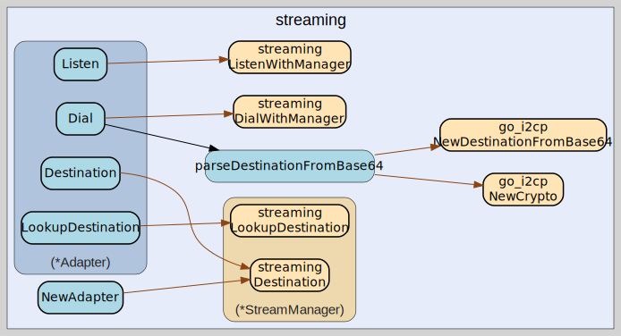

# streaming
--
    import "github.com/go-i2p/go-sam-bridge/lib/streaming"



Package streaming provides adapters between go-streaming and go-sam-bridge. This
file implements the StreamManager interface from lib/handler/stream_impl.go
using the actual go-streaming library.

Per SAMv3.md: STREAM sessions provide virtual TCP-like connections over I2P.

## Usage

#### type Adapter

```go
type Adapter struct {
}
```

Adapter wraps go-streaming's StreamManager to implement handler.StreamManager.
This bridges the gap between the abstract interface used by SAM handlers and the
concrete go-streaming implementation.

Usage:

    client := go_i2cp.NewClient(...)
    client.Connect(ctx)
    manager, _ := streaming.NewStreamManager(client)
    manager.StartSession(ctx)
    adapter := NewAdapter(manager)
    streamingConnector.RegisterManager(sessionID, adapter)

#### func  NewAdapter

```go
func NewAdapter(manager *streaming.StreamManager) (*Adapter, error)
```
NewAdapter creates a new streaming adapter wrapping the given StreamManager. The
manager must already have an active session (StartSession called).

#### func (*Adapter) Close

```go
func (a *Adapter) Close() error
```
Close closes the stream manager and releases resources. After Close, no more
connections can be established.

#### func (*Adapter) Destination

```go
func (a *Adapter) Destination() interface{}
```
Destination returns the local I2P destination for this session. Returns
interface{} to match the handler.StreamManager interface.

#### func (*Adapter) Dial

```go
func (a *Adapter) Dial(dest interface{}, port uint16, mtu int) (net.Conn, error)
```
Dial establishes an outbound stream connection to the destination. Returns a
net.Conn for bidirectional communication.

Per SAMv3.md: STREAM CONNECT establishes a virtual streaming connection.

The dest parameter must be either:

    - A *go_i2cp.Destination (from LookupDestination)
    - A string (Base64-encoded destination, for direct connection)

#### func (*Adapter) Listen

```go
func (a *Adapter) Listen(port uint16, mtu int) (net.Listener, error)
```
Listen creates a StreamListener on the specified port. Returns a net.Listener
for accepting incoming connections.

Per SAMv3.md: STREAM ACCEPT waits for and accepts incoming connections.

#### func (*Adapter) LookupDestination

```go
func (a *Adapter) LookupDestination(ctx context.Context, hostname string) (interface{}, error)
```
LookupDestination resolves a hostname or B32 address to an I2P destination.
Returns the destination as interface{} to match the handler.StreamManager
interface.

Per SAMv3.md: Java I2P supports hostnames and b32 addresses for the
$destination.

The resolution is performed via I2CP HostLookupMessage to the router's naming
service.

#### func (*Adapter) Manager

```go
func (a *Adapter) Manager() *streaming.StreamManager
```
Manager returns the underlying go-streaming StreamManager. This can be used when
direct access is needed for advanced operations.


streaming 

github.com/go-i2p/go-sam-bridge/lib/streaming

[go-i2p template file](/template.md)
